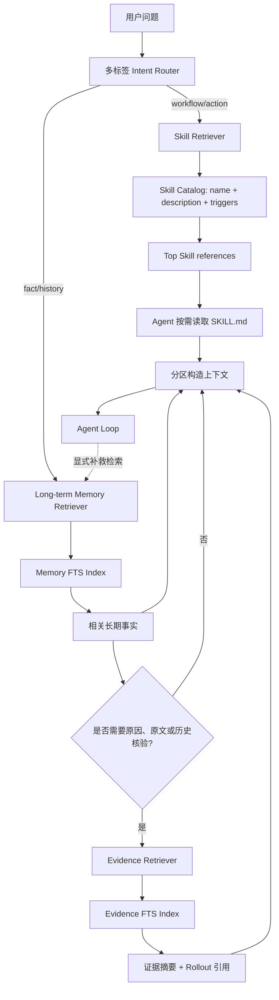
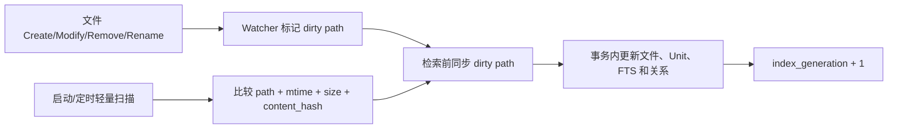

# Memory Retrieval V2 设计
## 1. 文档定位
本文描述在现有 Agent Runtime 上整合 Codex 分层记忆与 Grok 检索能力的 V2 方案。它是后续改造设计，不是当前 Grok Build、Claude Code 或 Codex 的现状说明。

Session 原始运行记录不另建 Memory 专用事件流。[Agent Loop V2](./09-agent-loop-v2-design.md) 定义的 `rollout.jsonl` 是唯一 append-only 事实事件流；Memory Phase 1 只消费该日志，SQLite Memory Index、Evidence、transcript 和 session snapshot 都是派生数据。Rollout 的 `seq`、版本化信封、写前脱敏、blob 外置、尾部半行恢复和活跃 Session 恢复保留规则以 Agent Loop V2 的存储契约为准；原始 Rollout 过期后怎样更新 Evidence 的 `rollout_available` 和删除级联，仍由本文定义。

目标是同时解决两个问题：

```latex
离线：哪些历史信息值得长期保留，如何合并、去重和追溯
在线：当前问题需要哪些长期事实、工作流程和历史证据
```

第一版不追求复杂评分。所有规则必须可解释、可单测，并能通过离线回放 Eval 判断召回是否真正帮助后续任务。

## 2. 核心结论
### 2.1 Skill、Memory、Evidence 必须分路
三者解决的问题和消费方式不同：

| 类型 | 要回答的问题 | 命中后的动作 |
| --- | --- | --- |
| Skill | 当前意图应该使用哪套能力和流程 | 提示 Agent 读取 `SKILL.md` 入口 |
| Long-term Memory | 当前问题涉及哪些稳定事实、约定和决策 | 注入相关事实片段 |
| Evidence | 某个结论来自哪里，当时发生了什么 | 返回证据摘要、时间和 Rollout 引用 |


它们可以物理存放在同一个 SQLite 文件中，但不能共享候选池、Top N、相关性公式和上下文预算。

### 2.2 来源不参与相关性加权
V1 不使用 `score × source_weight` 或来源加权和。FTS BM25、向量相似度和来源系数的分布不同，没有 Eval 时设置 `0.9`、`0.8` 等权重不可验证。

来源只控制：

+ 候选是否有资格进入当前检索；
+ 每条检索管线的最大配额；
+ 是否需要当前环境验证；
+ 是否允许直接注入，还是只能作为历史证据展示。

配额不能强制填满。V1 不使用 BM25 绝对分数阈值，而是先用可解释的 term coverage 规则判断候选是否有资格占用槽位，再用 BM25 对合格候选做组内排序。

### 2.3 V1 使用 FTS-only
V1 默认只使用 SQLite FTS5：

+ 不让 Workspace 记忆默认发送到远端 Embedding API；
+ 不引入本地模型分发和推理依赖；
+ 不在缺少 Eval 时提前引入词法分与向量分融合参数；
+ 保持索引重建成本低且行为可解释。

Vector 进入 V2 后续阶段的前提是：回放 Eval 证明 FTS 对同义表达、跨语言或抽象概念存在明确召回缺口。

### 2.4 长期记忆必须记录 Evidence 消化关系
Phase 2 consolidation 生成或改写长期记忆时，必须同时输出结构化 provenance，记录：

```latex
哪个长期记忆单元
消化了哪些 Evidence
哪些旧 Evidence 已经被新结论取代
```

否则旧方案与新方案会在在线检索中同时以高相关性出现，模型只能在两个自信陈述之间猜测。

### 2.5 默认参数先继承 Grok Build
V1 不凭经验重新发明检索参数。凡是与分路架构兼容的数值，默认沿用当前 Grok Build 的 `MemoryIndexConfig`、`MemorySearchConfig` 和实际搜索管线：

| 参数 | V1 默认值 | 使用方式 |
| --- | ---: | --- |
| `max_results` | 6 | Skill 之外，Long-term Memory、Global UserPreference 和 Evidence 单轮合计最多注入 6 条 |
| `candidate_multiplier` | 3 | 每条 Memory/Evidence 管线先取其可用输出配额的 3 倍候选，再执行资格门禁和组内排序 |
| `max_chunk_chars` | 1600 | 结构化 Unit 超过该字符数才进入子块切分 |
| `chunk_overlap_chars` | 320 | 仅用于超长 Unit 的相邻子块重叠，完整 Unit 不制造重叠副本 |
| `embedding.provider` | `api` | 保留 Grok 配置默认值，但 `model=None` 时不发生远端调用 |
| `embedding.model` | `None` | Vector 默认关闭，与 V1 FTS-only 一致 |
| `embedding.dimensions` | 1024 | 后续启用 Embedding 时的兼容维度，不在 V1 建立空向量列 |
| `min_score` | 0.35 | 作为后续归一化混合检索的兼容默认值；V1 原始 BM25 不使用该绝对阈值 |
| `vector_weight` | 0.7 | V1 Vector 关闭，保留为后续受 Eval 驱动启用时的初始基线 |
| `text_weight` | 0.3 | 同上；FTS-only 时有效文本权重为 1.0 |
| `temporal_decay.enabled` | true | V1 记录 Session Evidence 的衰减元数据和 stale 诊断；不把衰减系数直接乘到原始 BM25 |
| `temporal_decay.half_life_days` | 7 | Session Evidence 的默认半衰期；启用归一化混合分数后沿用 Grok 的指数衰减公式 |
| `recency_decay` | 0.95 | 仅保留旧配置兼容；`temporal_decay.enabled=true` 时忽略 |
| `source_weights` | 全部 1.0 | V1 不通过来源权重改变排序，来源只影响配额和资格 |
| `mmr.enabled` | false | V1 默认不做 MMR 重排 |
| `mmr.lambda` | 0.7 | 仅在后续 Eval 证明需要 MMR 时作为起始值 |
| `initial_injection.enabled` | true | 首轮启用前置 Router 和检索能力，但仍允许 Router 对明确自包含请求硬跳过 |
| `initial_injection.min_score` | `None`，历史有效值 0.0 | V1 由 term coverage 门禁替代；保留该值用于兼容回放 Grok 原始行为 |


参数事实源是 Grok Build 源码中的：

```latex
grok-build/crates/codegen/xai-grok-config-types/src/memory.rs
grok-build/crates/codegen/xai-grok-memory/src/search.rs
```

这里的“继承”是默认值兼容，不是照搬旧的单池排序语义。三路检索、独立配额、term coverage 和 provenance 规则仍以本文为准。后续只有 Eval 给出证据时才能调整这些默认值，并必须记录参数版本，保证离线回放可复现。

V1 当前直接生效的是 `max_results`、候选倍率、chunk 参数和首轮检索开关。`min_score`、Vector 权重和 MMR 参数是兼容配置但不参与 V1 FTS-only 排序；时间衰减只产生年龄、半衰期和 stale 诊断字段。进入归一化混合检索阶段后，才允许启用 `min_score=0.35`、`vector_weight=0.7`、`text_weight=0.3` 和指数时间衰减。这样既保留 Grok 默认值作为首轮实验基线，也不把只对归一化分数有意义的参数错误套到原始 BM25 上。

## 3. 为什么融合 Codex 与 Grok
### 3.1 不是替换，而是重新划分职责
Codex 和 Grok 解决的是同一个长期记忆问题，但各自优化的阶段不同：

```latex
Codex 更强的部分
  原始 Rollout -> Phase 1 提取 -> Phase 2 consolidation -> MEMORY.md/summary/evidence
  重点是：哪些内容值得留下、如何从运行记录提炼、如何逐层压缩

Grok 更强的部分
  Markdown -> 增量切块 -> SQLite FTS/Vector -> 自动注入/memory_search/memory_get
  重点是：文件变化后怎样建立索引、当前问题怎样快速找到相关片段

本方案增加的控制层
  分路 Router + 独立配额 + 稳定 Unit ID + provenance 状态 + Eval
  重点是：为什么检索、为什么命中、是否已过期、怎样证明它确实有用
```

因此本方案的核心不是“把 Codex 和 Grok 的所有功能相加”，而是：

```latex
用 Codex 风格的分阶段提炼管理写入质量
+ 用 Grok 风格的本地索引管理在线召回
+ 用可观测、可回放的控制层约束两者
```

当前 Session 的完整恢复、Agent Loop 内的 compaction 和原始 Rollout 持久化仍是独立能力。Memory 只保存跨任务可复用的信息，不能替代 resume，也不能把摘要冒充完整运行记录。

本章判断基于当前本地源码快照，主要事实入口如下，便于实现前再次核验：

```latex
Codex
  codex-rs/memories/README.md
  codex-rs/memories/write/src/phase1.rs
  codex-rs/memories/write/src/phase2.rs
  codex-rs/ext/memories/templates/memories/read_path.md
  codex-rs/ext/memories/src/local/search.rs
  codex-rs/state/src/runtime/memories.rs

Grok Build
  grok-build/crates/codegen/xai-grok-memory/src/search.rs
  grok-build/crates/codegen/xai-grok-memory/src/index.rs
  grok-build/crates/codegen/xai-grok-memory/src/storage.rs
  grok-build/crates/codegen/xai-grok-memory/src/dream.rs
  grok-build/crates/codegen/xai-grok-shell/src/session/acp_session_impl/memory_dream.rs
```

### 3.2 解决 Codex 记忆机制的哪些问题
Codex 已经具备重要基础：原始 Rollout 是证据；Phase 1 按 Rollout 提取 `raw_memory` 和 `rollout_summary`；Phase 2 串行 consolidation；`MEMORY.md` 保存可复用知识；`memory_summary.md` 提供高密度入口；需要细节时再读取 Rollout summary 或原始 Rollout。本文保留这些思想，不把它们描述成缺陷。

在此基础上，本方案主要解决以下问题。

#### 3.2.1 从“模型按说明找文件”变成可观测的自动召回
Codex 的 `memory_summary.md` 会随 Memory developer instruction 一起提供给模型。需要 Memory 时，模型再根据 summary 提取关键词、搜索 `MEMORY.md`，必要时继续读取 rollout summary 或原始 Rollout。这种方式灵活，但检索是否发生、关键词是否正确以及在哪一步漏掉内容，都依赖模型遵循多步说明。

本方案改为：前置 Router 先做可记录的多标签决定，Memory Retriever 自动完成 FTS 候选召回和资格门禁，Agent 仍保留显式 `memory_search` 作为补救入口。

收益：

+ 不再把“模型忘了搜索”和“索引没有命中”混成同一种失败；
+ 常见查询不需要模型先读 summary、再发起多次文件搜索，减少工具轮次和延迟；
+ Router 决策、候选数和合格数都有日志，可以分别优化路由和检索；
+ `memory_summary.md` 不再承担唯一在线入口，长期增长时不会只能依赖越来越密集的 prompt-loaded 索引。

为什么这么做：漏召回的代价通常高于一次本地空检索，而确定性 Router 加负缓存能把额外成本控制在可预测范围内。

#### 3.2.2 从文件内字面搜索升级为可重建的相关性索引
Codex 的本地 Memory 搜索能力擅长在已知关键词和文件范围内做确定性匹配，但结果主要按路径和行号组织。它适合“已经知道要找什么”，不等同于跨全部 Memory Unit 的相关性排名。

本方案对 `MEMORY.md` 和 Evidence 建立独立 FTS5 投影，先以 term coverage 判断候选资格，再以 BM25 做组内排序，并保留 `memory_get/read` 式定点读取。

收益：

+ 面对多个工作区、任务组和历史摘要时，先返回相关片段，不要求 Agent 广泛扫描文件；
+ SQLite 损坏后可以从 Markdown 重建，不改变 Codex 文件事实源的可审计性；
+ 精确路径读取仍然存在，索引只负责找入口，不取代原文。

为什么 V1 只使用 FTS：先建立可解释基线，避免在没有 Eval 时用向量模型和融合权重掩盖切块、路由或关键词质量问题。

#### 3.2.3 把 citation 从“读取记录”提升为可治理的 provenance
Codex 能在回答中产生 Memory citation，并能把 `MEMORY.md`、rollout summary 和 Rollout ID 关联起来。但文件引用主要说明“这次读了什么”；它不天然等于长期记忆单元与多份证据之间的结构化生命周期关系。

本方案为 Memory/Evidence 分配稳定 ID，并持久化 `supports`、`derived_from`、`supersedes`、`conflicts_with` 关系。

收益：

+ 可以回答一条长期结论由哪些历史证据支持；
+ 新结论产生时可以把旧 Evidence 标为 `superseded`，避免新旧方案同时无条件注入；
+ 用户改标题或移动 Section 后，只要 ID 注释仍在，关系边不会因路径变化而丢失；
+ Rollout 过期后仍能明确区分“摘要存在”和“原始证据已经不可用”。

为什么这么做：文件路径和行号是位置，不是身份；只靠 citation 无法稳定表达跨重写、跨合并的证据关系。

#### 3.2.4 把 Scope 从内容约定提升为检索硬边界
Codex 的 consolidation 会在 `MEMORY.md` 中写 `applies_to`、cwd 和复用边界，这对人工阅读有效，但最终仍依赖生成内容正确表达并由 Agent 正确解释。

本方案把 `scope` 和 `kind` 放入 Unit 元数据和检索资格规则，并为 Global UserPreference 设置独立条件槽。

收益：

+ 相似仓库或不同 checkout 的事实不容易串用；
+ Workspace 事实不会把稳定的全局用户偏好完全挤出预算；
+ 仓库内容只能提升 Workspace 事实可信度，不能越权生成 Global UserPreference。

为什么这么做：作用域错误不是普通相关性误差，而是数据边界错误，应该由结构化规则阻止，而不是交给模型阅读后自行判断。

#### 3.2.5 限制 usage_count 的自增强偏差
Codex 会记录 Memory 引用对应 Rollout 的 `usage_count` 和 `last_usage`，并在 Phase 2 输入选择时优先考虑使用更多、最近使用的 Stage 1 输出。这对保留活跃 Memory 有价值，但“被更多展示或引用”不等于“对任务成功贡献更大”。

本方案保留 usage 和 last-used 作为 retention、stale 与诊断信号，但不让正向访问次数直接提高在线相关性排名。显式用户纠正、验证失败和 `superseded` 才作为更强的负向治理信号。

收益：避免高曝光 Memory 因为高曝光继续获得更高排名，给低频但关键的事实保留被召回的机会。

为什么这么做：没有可靠 credit assignment 时，正向使用次数只能证明“被使用”，不能证明“使用正确”。

### 3.3 解决 Grok 记忆机制的哪些问题
Grok 已经具备另一组重要基础：Markdown 是事实源，SQLite 是可重建索引；启动和文件变化后可以增量切块；FTS 始终可用，Vector 可选；第一轮能够自动注入；Agent 可以通过 `memory_search` 和 `memory_get` 下钻。本文保留这条本地检索主链路和它的默认参数。

在此基础上，本方案主要解决以下问题。

#### 3.3.1 拆开长期事实与历史会话证据
Grok 的 Global、Workspace 和 Session chunk 最终进入同一个 Memory 搜索管线。来源权重和 evergreen 补召回可以缓解竞争，但它们仍共享候选、分数和 Top N。旧 Session 中高度匹配的失败方案可能与已经整理过的 `MEMORY.md` 结论同时出现。

本方案把 Long-term Memory 和 Evidence 分成独立索引、独立配额和不同启用条件；普通事实查询默认只读取 active Memory，需要历史原因或原文时才开启 Evidence。

收益：

+ 已整理事实不会被大量历史日志挤出；
+ 查询“现在怎么做”和“以前为什么失败”得到不同类型的上下文；
+ Evidence 可以保留历史价值，而不必为了避免污染把旧 Session 全部删除。

为什么这么做：长期事实和历史证据的消费动作不同，一个用于直接行动，一个用于解释与核验，不能只靠同一个分数决定谁进入上下文。

#### 3.3.2 用硬状态解决新旧结论冲突
Grok 的时间衰减只作用于 Session 来源，Global/Workspace 被视为 evergreen；但 evergreen 不代表永远正确。Dream 重写 `MEMORY.md` 后，旧 Session Evidence 仍可能通过词面或向量相关性命中，更新时间只能提示 Agent 判断，不能表达“X 已明确被 Y 取代”。

本方案在 Phase 2 免费产生 `superseded_by` 和 provenance 边，普通召回硬排除 superseded Evidence，历史演变查询才允许读取。

收益：减少过时方案与当前方案同时注入造成的冲突，且仍保留完整演变链供审计。

为什么这么做：时效衰减适合表达“可能旧”，`superseded` 适合表达“已被替代”，两者语义不同。

#### 3.3.3 降低混合评分的不可解释性
Grok 的完整 Hybrid 管线包含 FTS/Vector 归一化、文本/向量权重、来源权重、Session 时间衰减、访问 boost、阈值和可选 MMR。它功能完整，但任一结果变化都可能来自多个自由参数；没有回放 Eval 时，很难知道复杂度是否真的提升任务效果。

本方案 V1 只保留 FTS、term coverage、分路配额和硬状态。Grok 的 `0.35`、`0.7/0.3`、7 天半衰期和 MMR 参数作为兼容基线保存，但只有 Eval 证明增益后才逐项启用。

收益：

+ 每次漏召回可以归因到 Router、资格门禁或 BM25 排序；
+ 不会因远端 Embedding 不可用而改变 V1 的核心行为；
+ Vector 上线的理由来自同义、跨语言等真实失败集，而不是主观认为语义检索更先进。

为什么这么做：先建立能被证伪的简单基线，才能判断下一层复杂度带来的是真增益还是分数噪声。

#### 3.3.4 避免第一轮结果长期冻结和后续漏调工具
Grok 首轮自动注入后，同一 conversation 通常复用已有 `<memory-context>`，有利于 KV cache 稳定；后续问题若主题变化，则依赖 Agent 主动调用 `memory_search`。这会产生一个取舍：固定上下文稳定但可能不再相关，动态搜索相关但可能被模型漏掉。

本方案使用每轮前置保守 Router 决定是否执行轻量检索，并用 Session 负缓存避免同一查询重复搜索；显式工具只负责补救和深挖。

收益：长会话切换任务时可以得到与当前问题相关的 Memory，同时重复空查询不会持续浪费 IO 和 token。

为什么这么做：检索触发属于 Runtime 策略，不应完全依赖模型记得调用工具。代价是每轮可能增加一次本地检索，因此必须记录延迟并让明确自包含请求硬跳过。

#### 3.3.5 让切块身份跨人工编辑保持稳定
Grok 当前 chunk 主要由 path、位置和内容切分结果识别。对普通可重建搜索足够，但一旦要建立“某条 Memory 消化了哪些 Evidence”的长期关系，标题移动、内容拆分或人工重写会导致身份漂移。

本方案把稳定 Unit ID 写入紧邻标题的 HTML 注释，SQLite 只保存位置投影；消失的有关系 Unit 转为 `orphaned`，不静默级联删除边。

收益：人工编辑 Markdown 仍然是一等能力，同时 provenance、诊断和历史关系不依赖脆弱的标题锚点。

为什么这么做：可重建全文索引可以接受 ID churn，知识图中的关系不能接受。

#### 3.3.6 给 Dream consolidation 增加事务语义
Grok Dream 会读取 Session logs 和现有 Workspace `MEMORY.md`，通过模型合并后重写文件并清理已处理日志。这条路径解决了长期整理，但文件改写、索引更新、Evidence 状态迁移和并发人工编辑不能天然共享一个事务。

本方案要求 Phase 2 输出 manifest，并通过 lease、input hash、临时文件原子 rename、SQLite transaction 和持久化 journal 提交。

收益：

+ consolidation 期间用户编辑文件时不会被静默覆盖；
+ 文件已经替换但数据库尚未迁移时可以启动恢复；
+ 多 Session 不会同时重写同一 Workspace Memory；
+ 清理 Evidence 前能先记录它被哪条长期记忆消化。

为什么这么做：SQLite 事务只能保护数据库，无法同时保护 Markdown；跨存储一致性必须显式设计恢复协议。

### 3.4 同时补上两者共同缺少的能力
#### 可回放 Eval
两套机制都有大量合理设计，但仅凭 `usage_count`、检索分数或主观体验，无法证明 Memory 让后续任务变好。本方案先保存参数快照和路由/检索诊断，再离线回放真实后续任务，对比无检索、FTS 和未来 Vector。

收益不是“得到一个总分”，而是能回答：

```latex
没有触发检索，是 Router 的问题
触发但没有候选，是索引或 query term 的问题
有候选但被门禁淘汰，是资格规则的问题
合格但没进 Top K，是排序或预算的问题
成功注入但任务更差，是 Memory 内容质量或冲突治理的问题
```

#### Skill 与 Memory 分路
Codex 可以从 Memory workspace 生成 Skills，Grok 也有独立 Skill 能力；但在线发现时，Skill 仍不能与历史事实共享 Top N。方案为 Skill 建立只包含 `name + description + triggers` 的独立目录和预算。

收益：工作流选择不会被相似历史记录挤掉，事实查询也不会被大段 Skill 正文污染。为什么只索引元数据：Skill 命中后的动作是读取入口文件，不是把搜索片段当事实注入。

#### 运行诊断和可恢复一致性
Router reason code、index generation、orphan、rollout availability、journal 状态和并发 fencing token 共同组成 Memory 控制面。它们不直接提高召回分数，但让静默错误变成可以定位和恢复的状态。

### 3.5 总体收益
| 收益 | 来自哪项设计 | 如何验证 |
| --- | --- | --- |
| 更少无关上下文 | 三路分离、独立配额、总上限 6 | 无关注入 token、Precision@K |
| 更少漏掉历史约定 | 保守前置 Router、自动 FTS | Router 漏判率、端到端 Recall@K |
| 更少使用过时方案 | `superseded_by`、冲突边、scope | superseded 误注入率、冲突任务失败率 |
| 更低且稳定的基础成本 | FTS-only、负缓存、定点读取 | P50/P95 延迟、重复空检索次数 |
| 更好的隐私边界 | 默认不启用 Embedding、Rollout TTL | 出网字节数、过期 Evidence 下钻行为 |
| 更强的可审计性 | 稳定 ID、citation、provenance | 任一 Memory 到 Evidence/Rollout 的可达率 |
| 更安全的并发更新 | WAL、lease、journal、hash CAS | 并发和崩溃恢复测试 |
| 可证明的演进 | 回放 Eval、参数快照 | FTS/Vector 相对增益和回归趋势 |


#### 3.5.1 关键设计决策的收益闭环
| 设计决策 | 解决的问题 | 为什么这样选 | 直接收益 | 验证指标 |
| --- | --- | --- | --- | --- |
| Skill、Memory、Evidence 三路检索 | 不同对象竞争同一 Top N | 三者下游动作和预算语义不同 | 工作流入口、当前事实和历史证据互不挤占 | Skill Top-1、Memory Precision@K、Evidence 命中率 |
| V1 FTS-only | 混合权重无 Eval 时不可解释 | 先建立可证伪的确定性基线 | 漏召回能归因，隐私和部署成本更低 | Recall@K、查询延迟、出网字节数 |
| 前置保守 Router + 显式补检索 | 完全依赖模型主动搜索会静默漏调 | 漏检代价高于本地空检索 | 自动覆盖常见问题，同时保留 Agent 补救能力 | Router 漏判率、空检索率、补检索率 |
| 稳定 Unit ID + provenance | 标题移动后 citation 和证据边断裂 | 身份不能依赖位置 | 人工编辑与长期审计可以共存 | orphan 率、关系边保持率 |
| `superseded` 硬状态 | 新旧高相关结论同时注入 | “已经被替代”不是普通时效分数 | 降低旧方案污染，保留演变链 | superseded 误注入率 |
| usage 不参与在线加分 | 高曝光记忆形成自增强偏差 | 使用次数不能证明正确贡献 | 低频关键事实仍有公平召回机会 | 曝光集中度、纠错后排名变化 |
| Journal + manifest 原子提交 | Markdown 与 SQLite 无法共享事务 | 显式恢复协议比隐式写入顺序可靠 | 并发编辑不被覆盖，崩溃后可恢复 | 故障注入恢复率、冲突保护率 |
| Eval 先于 Vector/MMR | 复杂机制可能静默降低质量 | 每层复杂度必须证明增量 | 防止复杂度先于价值落地 | 相对无检索/FTS 的任务成功增益 |


### 3.6 代价与边界
这套方案并不天然优于 Codex 或 Grok，只有 Eval 证明后才能得出该结论。它引入了以下成本：

+ 稳定 ID、关系表、journal 和诊断状态增加实现与迁移复杂度；
+ 前置 Router 可能产生额外空检索，也可能因硬规则不完整而漏判；
+ FTS-only 对同义表达、跨语言和抽象概念的召回能力有限；
+ `conflicts_with` 由 Phase 2 离线产生，新的冲突在 consolidation 前存在识别延迟；
+ 每轮动态检索可能增加延迟并降低部分 prompt cache 稳定性，需要通过预算和指标控制；
+ Markdown 内嵌 ID 提升关系稳定性，但会给人工编辑的文件增加少量机器元数据。

因此落地原则仍然是：先实现最小可解释闭环，再用真实回放数据决定是否启用 Vector、MMR、自动反馈或更复杂状态机。任何不能在 Eval 上证明增益的复杂机制，都不应因为 Codex 或 Grok 已经存在就默认保留。

## 4. 总体架构


Intent Router 是多标签路由，不把请求强制划分为 Skill 或 Memory 二选一：

```latex
“准备发布正式版本”
  -> Skill=true, Memory=false

“上次发布为什么失败”
  -> Skill=false, Memory=true, Evidence=true

“按上次失败的教训重新发布”
  -> Skill=true, Memory=true, Evidence=true
```

### 4.1 路由位置
V1 明确选择**前置硬规则路由**：路由发生在构造本轮模型上下文之前，不依赖主 Agent 先看到问题后再决定是否调用检索工具，也不新增独立路由模型调用。

主 Agent 的 `memory_search` 只作为运行中的补救入口，例如初次回答后发现信息不足、工具执行遇到历史问题或用户明确要求重查；它不是主路由机制。

### 4.2 保守决策规则
Router 是多标签、确定性规则系统，默认策略是“漏检代价高于一次空检索”：

+ 只有时间、简单翻译、单句改写、纯格式化等明确自包含请求可以设置 `Memory=false`；
+ 请求涉及工作区、模块、路径、历史、偏好、约定、架构或非平凡任务时设置 `Memory=true`；
+ 无法确定是否需要历史信息时设置 `Memory=true`；
+ 请求包含动作意图、显式 Skill 名称或命中 Skill trigger 时设置 `Skill=true`；
+ 请求包含“上次、之前、当时、为什么失败、原文、证据、演变”等历史核验信号时设置 `Evidence=true`；
+ `Evidence=true` 隐含 `Memory=true`，但不隐含 `Skill=true`。

负缓存会压低重复空检索成本，因此 Router 不通过激进跳过来优化延迟。

### 4.3 可观测性和归因
每次路由必须记录结构化诊断事件：

```latex
request_id
query_fingerprint
skill_enabled / memory_enabled / evidence_enabled
reason_codes
hard_skip_reason
index_generation
retriever_started
candidate_count
qualified_count
```

日志默认只保存 query fingerprint 和 reason code，不复制用户原文。Eval 将“路由漏判”和“路由已开启但 Retriever 未命中”分别统计，禁止用一个端到端 Recall@K 掩盖失败位置。

## 5. 三条检索管线
### 5.1 Skill Retriever
Skill 匹配的本质是：

```latex
用户意图 -> 能力/工作流选择
```

索引内容只包括可发现性元数据：

```latex
skill_id
name
description
when_to_use / triggers
scope
enabled
required_capabilities
entry_path
content_hash
```

V1 不索引 `SKILL.md` 全文。正文包含执行细节、模板和示例，全文词面会让 Skill 在事实类问题上产生大量误召回。

排序只考虑 Skill 管线内部信号：

```latex
意图匹配
显式名称/触发词匹配
作用域匹配
当前 Tool/MCP 能力是否可用
是否启用
描述的特异性
```

默认最多返回 2 个候选，通常只激活 Top 1。结果只提供引用：

```xml
<available-skill path="skills/release/SKILL.md">
  Release a formal version of the current project.
</available-skill>

```

Agent 确认使用后再读取入口文件。

Skill 创建、安装和更新时必须运行元数据 lint：

+ `name` 在当前作用域唯一；
+ `description` 至少包含一个明确动作意图，且不能只是名词或复述名称；
+ `description` 达到可配置的最小有效长度；
+ `when_to_use/triggers` 至少提供一条可判定触发条件；
+ trigger 不能全部是过宽的通用词；
+ `entry_path` 存在且仍位于 Skill 根目录内。

动作词检查使用可配置的多语言词表；无法可靠判断时给出 warning 并要求人工确认，不擅自补写含义。

诊断指标至少包括：

```latex
eligible_count
retrieved_count
activated_count
last_retrieved_at
lint_warning_count
```

“已启用且多次具备召回机会、但从未进入候选”的 Skill 进入诊断列表。上述计数只用于发现 description/triggers 质量问题，不参与在线排名。

### 5.2 Long-term Memory Retriever
Long-term Memory 处理经过 consolidation 的稳定知识单元：

```latex
项目事实
用户偏好
架构决策
已验证流程
长期约束
已确认的问题与解决方案
```

每个单元必须有稳定 ID，而不能只依赖标题文字。ID 的事实源写在 Markdown HTML 注释中，SQLite 只保存投影：

```markdown
<!-- memory-unit: {"id":"mem_release_workflow","kind":"fact","scope":"workspace","status":"active"} -->
## Release workflow

发布前需要运行 lint、build 和 workspace tests。
```

注释必须紧邻所属标题，并在用户移动或改写标题时随内容保留。`section` 是索引时派生的展示定位，不是身份。

索引降级规则：

1. Section 有合法 ID：沿用该 ID；
2. Section 没有 ID：分配 UUID/ULID，并在文件 hash 未变化时通过临时文件加原子 rename 写回注释；
3. 写回前文件已变化：放弃本次写回并重新解析，不覆盖用户编辑；
4. ID 随 Section 移动：更新 path/section 投影，关系边保持不变；
5. 发现重复 ID：优先保留已登记位置对应的 Unit，其他副本分配新 ID并产生诊断；
6. 数据库中的 ID 在文件中消失：将 Unit 标记为 `orphaned`，停止召回但保留关系边和诊断记录，不静默删除。

V1 使用 FTS5 对合格候选做组内排序，Long-term Memory 普通槽最多返回 4 条。候选阶段默认最多读取 `4 × 3 = 12` 条，再执行资格门禁。命中内容可以直接注入，但必须携带来源、更新时间和稳定 ID。

### 5.2.1 BM25 资格门禁
BM25 分数随查询词 IDF、词数和文档长度变化，不能使用跨查询固定绝对阈值。V1 将“是否可进入结果”和“进入后如何排序”分开：

```latex
资格：term coverage 硬规则
排序：合格候选内部按 BM25
```

资格规则：

+ 使用与 FTS 相同的 tokenizer 提取 distinct query terms；
+ 不做同义扩展，不为了提高 coverage 改写查询；
+ 引号短语和代码标识符属于 required term，候选必须命中；
+ 其他查询至少命中 `ceil(distinct_terms / 2)`，且不少于 1 个 term；
+ 查询只有一个有效 term 时必须命中该 term；
+ 没有候选通过结构门禁则返回空结果，不用低分候选填满配额。

Term coverage、命中的 required terms 和 BM25 rank 一并写入诊断，便于 Eval 判断是路由、词项资格还是排序导致漏召回。

### 5.3 Evidence Retriever
Evidence 用于回答：

```latex
上次发生了什么
为什么得出这个结论
当时的准确命令或错误是什么
方案如何从 X 演变到 Y
```

默认不与 Long-term Memory 并行竞争。只有以下条件之一满足时启用：

+ 用户明确询问历史、原因、原文或时间；
+ Long-term Memory 指向 Evidence；
+ 记忆可能过期且需要核验；
+ Agent 遇到冲突或需要精确命令、错误文本。

Evidence 最多返回 2 条，候选阶段默认最多读取 `2 × 3 = 6` 条。默认检索只允许 `active` 证据；历史演变查询可以包含 `superseded`，但必须显式标注其已被取代。

Evidence 保留 `rollout_available` 状态。原始 Rollout 因 TTL 删除后不删除 Evidence 摘要，而是更新为：

```latex
rollout_available=false
rollout_expired_at=<timestamp>
```

检索结果必须显示“原始证据已过保留期”，不得等到 Agent 下钻读取时才以文件 404 暴露。

## 6. 上下文预算和分区呈现
三条管线使用独立预算：

```latex
Skill
  最多 2 个引用
  通常只读取 Top 1 的 SKILL.md

Long-term Memory
  Workspace/Project 普通槽最多 4 个知识单元
  Global UserPreference 独立条件保底槽最多 1 个
  只有通过 term coverage 的候选才进入上下文

Evidence
  最多 2 个摘要
  只在需要历史或核验时启用

Memory 上下文总上限
  Long-term Memory + Global UserPreference + Evidence 合计最多 6 条
  各分路未用完的槽位可以释放，但任何分路都不能突破自己的上限
```

Global UserPreference 不与 Workspace 事实竞争普通 4 个槽位。若存在通过资格门禁的 `scope=global, kind=preference` 候选，最多占用独立的 1 个条件保底槽；没有合格偏好时该槽保持为空。

总上限 `6` 继承 Grok Build 的 `max_results`。合并时先为合格的 Global UserPreference 保留 1 条条件槽；若 Router 开启 Evidence，再为 Evidence 保留最多 2 条；Long-term Memory 使用剩余槽位且自身最多 4 条。某一路没有足够合格结果时，其空槽可由其他已开启管线在各自上限内使用。Skill 只注入入口引用，不计入 Memory 的 6 条上限；读取 `SKILL.md` 后产生的上下文使用独立 Skill 预算。

结果必须分区，避免主 Agent 混淆“执行规程”和“历史事实”：

```xml
<active-skill>
  <path>skills/release/SKILL.md</path>
</active-skill>
<memory-context>
  当前发布流程要求先执行 lint、build 和 workspace tests。
</memory-context>
<historical-evidence status="superseded">
  旧流程曾使用方案 X；该方案已被 mem_release_workflow 取代。
</historical-evidence>

```

## 7. Phase 1 固定输出模板
Rollout summary 不允许依赖任意 LLM 标题进行切块。Phase 1 必须按固定问题单元生成：

```markdown
<!-- evidence-unit: {"id":"ev_docx_preview_failure_019","rollout_id":"019...","scope":"workspace","status":"active"} -->
## Evidence Unit: docx-preview-failure
Rollout-ID: 019...
Occurred-At: 2026-07-29T14:02:57Z
Scope: workspace
Status: active

### Problem
DOCX 文件打开后没有正文显示。

### Diagnosis
资源加载链路未完成，而普通文本文件走的是另一条读取路径。

### Resolution
修复资源加载协议并保留错误状态展示。

### Verification
手动打开 test.docx 后正文可以显示。
```

每个 `Evidence Unit` 是 Phase 1 摘要中的一个问题单元，不是已经 consolidation 的 Long-term Memory。每个问题单元必须带紧邻标题的 `evidence-unit` HTML 注释；`evidence_units.id`、`rollout_id`、scope 和初始状态以该注释为事实源，SQLite 只保存投影。人类可读的 `Rollout-ID` 等字段必须与注释一致，不一致时停止索引并产生诊断，不能静默选择其中一个。

Evidence ID 的生命周期规则与 Memory Unit 相同：移动或改写标题时沿用注释中的 ID；缺失 ID 时通过 hash compare-and-swap 和原子 rename 写回新 ID；重复 ID 必须拆分并告警；文件消失或 ID 被移除时，保留 provenance 的 Evidence 转为 `orphaned`。

索引单元默认是一个完整 `Evidence Unit`。只有单元超过 Grok 默认硬上限 `1600` 字符时，才按照固定的 `Problem/Diagnosis/Resolution/Verification` 子节拆分；无法按子节满足上限时再使用 `320` 字符重叠的滑动切分。每个子块必须重复 Evidence Unit ID、Rollout ID 和时间信息，并增加稳定的 `subchunk_index`，使同一 Unit 的多个 FTS 行可确定性重建。

## 8. Superseded 和 Provenance
### 8.1 数据关系
```latex
memory_units
  id
  path
  section
  kind
  scope
  status
  updated_at

evidence_units
  id
  rollout_id
  path
  occurred_at
  status
  superseded_by
  superseded_at
  rollout_available
  rollout_expired_at

memory_evidence_edges
  memory_id
  evidence_id
  relation
```

`relation` 至少支持：

```latex
supports
derived_from
supersedes
conflicts_with
```

### 8.2 Phase 2 输出契约
Phase 2 不能只输出 Markdown，还必须输出结构化 manifest：

```json
{
  "memory_unit_id": "mem_release_workflow",
  "section": "MEMORY.md#release-workflow",
  "consumed_evidence_ids": ["ev_release_a", "ev_release_f"],
  "superseded_evidence_ids": ["ev_release_a"]
}
```

只有 manifest 校验成功后，才提交 `MEMORY.md` 改写和状态迁移。否则保留旧状态并将本次 consolidation 记为失败，避免 Markdown 已更新但 Evidence 状态未更新。

`conflicts_with` 只由 Phase 2 consolidation 产生。在线检索只消费已有冲突边，不根据一次查询临时创建或持久化冲突关系。因此新 Evidence 与现有 Memory 的冲突在下一次 Phase 2 前可能尚未被标记，这是 V1 明确接受的延迟边界。

### 8.3 跨文件和 SQLite 的提交协议
文件系统与 SQLite 无法共享一个原子事务。Phase 2 使用持久化 journal 和幂等前向恢复：

1. 获取 Workspace consolidation lease；
2. 读取目标 Memory 文件并记录每个输入文件的 `expected_input_hash`；
3. 在 `.transactions/<tx_id>/` 写入候选文件、manifest、目标 hash 和备份计划，`fsync` 后原子写入 `PREPARED` journal；
4. 提交前重新计算当前目标文件 hash；任一 hash 与 `expected_input_hash` 不同，说明用户或其他 Session 并发编辑，立即标记 `CONFLICTED` 并放弃提交；
5. 对每个目标先保存 backup，再通过同目录临时文件加 rename 原子替换，并逐个记录已应用文件；
6. 在一个 SQLite transaction 中应用 Unit、Evidence、关系边和 `index_generation + 1`，同时将数据库 transaction 状态改为 `DB_APPLIED`；
7. 将文件 journal 标记为 `COMPLETED`，再清理临时文件和 backup。

启动恢复规则：

+ 当前文件仍为 input hash：继续应用 staged output；
+ 当前文件已经是 output hash、数据库未迁移：幂等执行 SQLite transaction；
+ 数据库已迁移但 journal 未完成：验证结果后完成 journal；
+ 当前文件既不是 input hash 也不是 output hash：视为外部编辑冲突，不覆盖当前文件；
+ 部分文件已替换时，只能在当前文件仍等于本事务 output hash 时使用 backup 回滚，否则保留用户版本并进入人工诊断。

Manifest、候选文件、input/output hash 和 SQLite 迁移必须共享同一个 `tx_id`，保证恢复过程能够判定每一步是否已执行。

### 8.4 检索规则
+ `active` Long-term Memory 正常参与事实召回；
+ `superseded` Evidence 不参与普通事实召回；
+ 历史演变查询可以召回 `superseded` Evidence；
+ 返回 `superseded` Evidence 时必须同时返回替代它的 Memory Unit；
+ `conflicts_with` 未解决时禁止将任一方作为无条件高可信事实注入。
+ `orphaned` Memory Unit 不参与召回，但保留 provenance 供诊断和人工修复；
+ `orphaned` Evidence Unit 不参与在线召回，但保留摘要投影和 provenance，供诊断、关系修复或事实源恢复；
+ `rollout_available=false` 的 Evidence 可以返回摘要，但必须标注无法继续下钻原始 Rollout。

## 9. SQLite 与索引设计
文件仍然是事实源，SQLite 是可删除、可重建的派生索引和关系投影。

可以使用同一个数据库文件，但逻辑表必须分离：

```latex
agent_knowledge.sqlite
├─ skill_catalog
├─ skill_fts
├─ memory_units
├─ memory_fts
├─ evidence_units
├─ evidence_fts
├─ memory_evidence_edges
├─ indexed_files
├─ consolidation_transactions
└─ index_meta
```

`indexed_files` 是增量正确性的基础：

```latex
path
source_kind
mtime
size
content_hash
index_generation
last_indexed_at
```

每个 chunk/unit 必须保存 `path`，形成稳定的 `path -> unit_ids` 反向关系。删除文件时按 path 删除 FTS 派生行；有 provenance 关系的 Unit 先转为 `orphaned`，不能直接级联删除关系边。

Memory Unit 和 Evidence Unit ID 均以各自 Markdown 注释为准；`memory_units`、`evidence_units` 中的 ID、path、section、hash 和状态只是结构化投影。重建索引时必须从注释恢复原 ID。

## 10. 增量索引与一致性
Watcher 只作为低延迟加速，不能作为唯一正确性来源：



需要覆盖编辑器原子保存行为：临时文件写入后 rename 到目标文件，可能不会产生普通 modify 事件。

一致性规则：

1. 启动时扫描路径和轻量元数据；
2. mtime/size 未变时跳过内容读取；
3. 元数据变化时计算 content hash；
4. hash 未变时只刷新元数据；
5. hash 变化时增量替换该 path 的 Unit；
6. 文件消失时按 path 删除 `indexed_files` 和 FTS 等可重建投影；没有 provenance 的普通派生 Unit 可以删除，有 provenance 关系的 Memory/Evidence Unit 必须转为 `orphaned` 并保留关系边和诊断记录；
7. 定时 reconciliation 修复 watcher 丢事件；
8. Schema 或解析器版本变化时提升 generation，并执行受控重建。

全量重建是异常恢复手段，不是日常同步策略。

### 10.1 并发协议
同一 Workspace 多 Session 并发是正常运行模式，V1 统一采用以下约束：

+ SQLite 开启 WAL、`foreign_keys=ON` 和可配置 `busy_timeout`；
+ 文件解析、hash 和 FTS 输入准备在事务外完成；
+ 索引变更使用短 `BEGIN IMMEDIATE` transaction，锁冲突采用有上限的指数退避和 jitter；
+ `index_generation` 必须与索引变更在同一 transaction 中原子递增；
+ dirty path 使用集合合并，同一路径的重复 watcher 事件只触发一次同步；
+ 检索读取使用 SQLite snapshot，不持有读事务等待 Embedding、文件 IO 或 Agent 调用；
+ Phase 2 使用 Workspace 级 lease，同一 Workspace 同时最多一个 consolidation；
+ Phase 1 按 `thread_id + source_updated_at` 幂等 upsert，旧结果不能覆盖新结果；
+ 多 Session 可能写同一 Evidence/summary 文件时使用 per-path 文件锁；append 必须在锁内完成，整体重写必须使用 hash compare-and-swap 加原子 rename；
+ lease 超时只能由持有 fencing token 的新 owner 接管，旧 owner 后续写入必须被拒绝。

WAL 和 busy timeout 只解决数据库竞争，不解决文件并发；文件写入仍必须遵循 journal、lease、per-path lock 和 hash 校验。

## 11. Session 级负缓存
同一长会话中，Agent 可能重复搜索同一个问题并反复得到空结果。Session state 记录：

```latex
retriever_kind
normalized_query
index_generation
result_fingerprint
result_count
consumed
created_at
```

规则：

+ V1 的 `normalized_query` 只做连续空白折叠和首尾去空白；Retriever 明确使用大小写不敏感匹配时才做 Unicode lowercase；
+ 不做停用词删除、词干化、同义扩展或语序重排，避免不同问题错误共享负缓存；
+ 同一 retriever、同一 normalized query、同一 index generation 的空结果直接复用；
+ 相同结果指纹不重复注入；
+ 索引 generation 变化后缓存失效；
+ 用户显式要求重查时绕过缓存；
+ compaction 后允许重新注入已经离开上下文的结果；
+ `consumed=false` 只用于诊断，不参与正向排名加分；
+ 负缓存不跨 Session 持久化。

## 12. Embedding 决策
V1 不启用 Vector。进入后续阶段时必须显式选择：

### 12.1 本地 Embedding
优势：Memory 不出网，索引可以离线重建。

代价：需要模型分发、平台兼容、推理资源和版本管理。

### 12.2 远端 Embedding
优势：接入简单，模型质量和升级由服务提供方维护。

代价：Workspace 专有事实出网；全量重建会重新发送全部内容；还涉及认证、限流、成本和合规。

若支持远端模式，必须：

+ 默认关闭；
+ 用户显式同意；
+ 展示 Provider、Endpoint 和数据范围；
+ 支持按 source/scope 禁止向量化；
+ 禁止处理密钥、Token 和原始高敏 Rollout；
+ 在索引记录 embedding model、dimensions 和版本；
+ 模型变化时只重建向量派生层。

## 13. Eval 先于复杂召回
在增加 Vector、连续权重或自动反馈前，建立离线回放 Eval：

```latex
输入：历史会话截至时间 T 的 Memory 快照
查询：T 之后真实用户任务
标注：后续任务实际需要的 Skill、事实和 Evidence
输出：各 Retriever 的候选和注入结果
```

数据冷启动使用工具自身产生的 rollout，而不是先等待人工构造大型基准集。V1/Phase 2 交付一个抽样 CLI，可按 Workspace、Session、时间范围、Router 决策、空检索和用户纠正抽取时间切片，生成带脱敏规则和参数版本的样本 manifest。初始弱标签来自后续真实用户问题、显式 Memory/Skill 读取、Tool 验证、用户纠正和任务结果，再做人工抽样复核。

该 CLI、rollout reader、时间切片、脱敏、样本 manifest、回放执行器和指标存储与 [上下文管理 V2 的 Compaction Eval](./11-context-management-v2-design.md#233-离线回放-eval) 共用；Memory 和 Compaction 只实现各自的 task adapter 与指标，不能各建一套无法对齐的数据管线。

至少衡量：

+ Router 对 Skill/Memory/Evidence 的漏判率；
+ Router 不必要开启率和额外空检索成本；
+ Retriever 在“路由已正确开启”条件下的 Recall@K；
+ 端到端 Recall@K，并能归因到 Router、term coverage 或组内排序；
+ Skill Top-1 / Top-2 命中率；
+ Skill description/triggers lint 失败率；
+ 已启用但从未被召回的 Skill 数量；
+ Memory Recall@K、Precision@K；
+ Evidence Recall@K；
+ superseded 内容误注入率；
+ 无关内容注入 Token；
+ 空检索重复次数；
+ 检索后任务成功率变化；
+ P50/P95 延迟。

正向 `usage_count` 不进入在线相关性排序。它最多用于保留和 stale 判断；显式用户纠正、验证失败和 superseded 关系可以作为负向治理信号。

## 14. 分阶段落地
### V1：可解释基线
1. 固定 Phase 1 Memory Unit 模板；
2. 将 Memory Unit 稳定 ID 写入 Markdown 注释并实现 orphan 诊断；
3. Skill、Memory、Evidence 三路分离；
4. 实现前置保守 Router、决策日志和显式补救工具；
5. SQLite FTS5、term coverage 门禁和条件配额；
6. 实现 Skill 元数据 lint 和召回诊断指标；
7. Phase 2 输出 provenance manifest 和跨存储 journal；
8. 实现 `superseded_by`、`conflicts_with` 和 Rollout TTL 状态；
9. 实现 watcher + reconciliation + path 反向删除；
10. 实现 WAL、lease、文件锁和 generation 并发协议；
11. 实现 Session 级负缓存；
12. 建立可分解 Router/Retriever 失败的回放 Eval harness，并交付与 Context Eval 共用的 rollout 抽样 CLI、样本 manifest 和回放执行器。

### V2：有证据的增强
只有 Eval 证明增益后再加入：

1. 本地 Vector 召回；
2. FTS/Vector 组内融合；
3. 查询扩展和跨语言召回；
4. 更细的冲突检测；
5. 基于显式负信号的治理。

### 暂不实现
+ Skill、Memory、Evidence 共用 Top N；
+ 来源连续权重；
+ 无 Eval 的访问次数排名增益；
+ 默认远端 Embedding；
+ 原始 Rollout 全量向量化；
+ watcher 作为唯一同步机制；
+ 自动把“任务成功”归因给所有召回记忆。

## 15. 验收标准
V1 完成必须满足：

1. 发布意图不会被历史发布 Evidence 挤掉 release Skill；
2. “上次发布为什么失败”不会被 release Skill 正文占用 Memory 配额；
3. 普通事实检索不会返回 `superseded` Evidence；
4. 历史演变查询能同时看到旧 Evidence 和替代它的新 Memory；
5. 删除、rename 和原子保存后索引最终一致；
6. 同一 Session 的相同空查询不会重复执行；
7. 关闭 Vector 和远端网络时完整功能仍可运行；
8. 每个召回结果可定位到事实源路径、Unit ID 和可用的 Rollout ID；
9. Eval 可以比较“无检索、V1 FTS、后续 Vector”三种模式；
10. 任一索引损坏后可从事实源重建，不丢失长期记忆；
11. 路由漏判可从日志归因：每次未触发检索的请求都有决策和 reason code；
12. 用户手工重排或改写 `MEMORY.md` 标题后，HTML 注释中的 Unit ID 和 Evidence 关系边不丢失；
13. Phase 2 文件替换或 SQLite 迁移之间崩溃后，启动恢复不会产生半提交状态；
14. 两个 Session 同时检索、结束和触发索引同步时，不丢写、不重复 generation、不出现永久锁；
15. Rollout 过期后 Evidence 仍可召回摘要，并明确标注原始证据不可用；
16. Skill description 不合格时安装/创建流程给出可操作诊断，从未召回的 Skill 可被统计发现；
17. 用户手工重排或改写 Phase 1 摘要标题后，`evidence-unit` 注释中的 ID 和已有 provenance 关系边不丢失；
18. 未提供自定义配置时，参数快照与本文记录的 Grok Build 默认值一致，并在每次 Eval 输出中记录参数版本和实际生效项。
