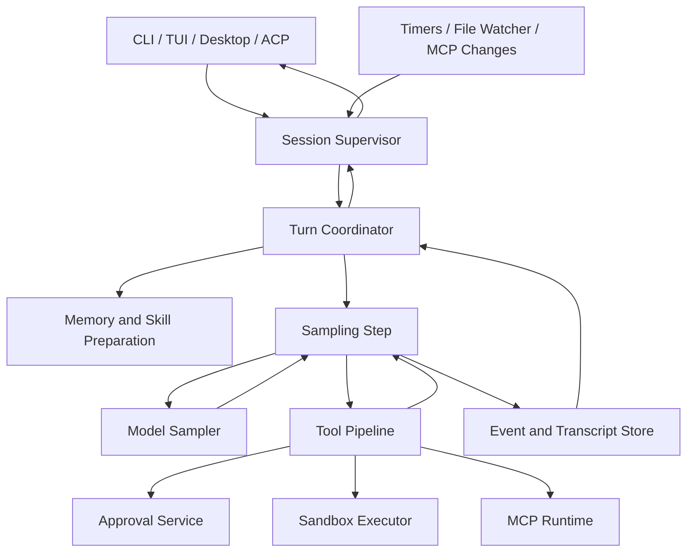
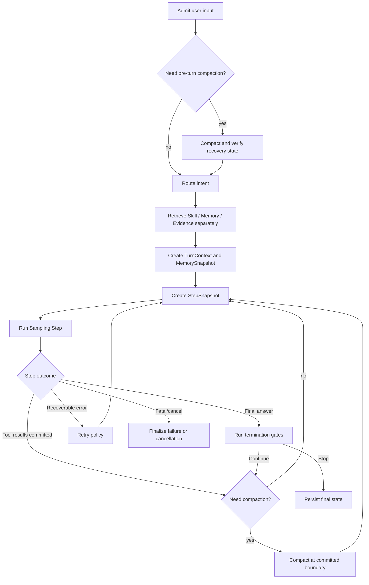
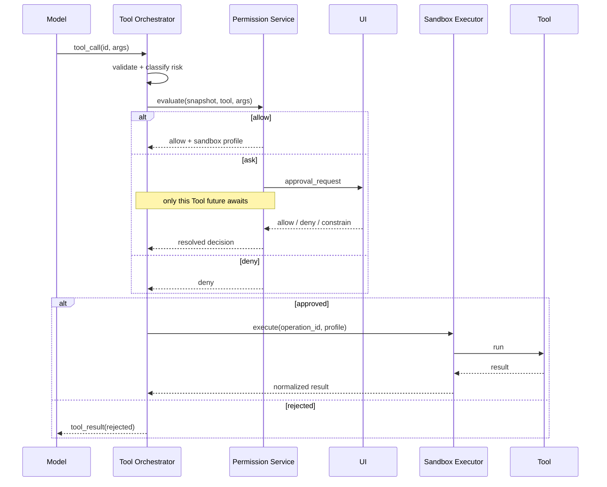

# Agent Loop V2 设计
## 1. 文档定位
本文设计一套可落地的新 Agent Loop。它吸收 Grok Build 的 Session Actor、多事件调度和运行保护，也吸收 Codex 的 Step Context、确定性 Tool Result 提交和细粒度并发控制。

这是一份后续改造方案，不是当前任一项目的实现说明。当前实现事实和源码入口见 [Agent Loop 对比](./05-agent-loop.md)，Memory 检索约束见 [Memory Retrieval V2 设计](./08-memory-retrieval-v2-design.md)。

目标读者不需要读过源码。只需要先理解：模型每次只给出“回答”或“下一批工具调用”，Runtime 负责循环、权限、副作用、持久化、恢复和停止。

## 2. 要解决的问题
简单的 Agent Loop 通常写成：

```latex
while true:
  response = model(messages)
  if response has no tool call:
    break
  results = execute(response.tool_calls)
  messages.append(results)
```

这能展示核心原理，但不足以支撑真实产品。实际运行还必须回答：

+ 用户在 Tool 执行期间取消、追问或修改目标时，谁决定状态迁移；
+ MCP、Skill、权限配置在采样期间变化时，本次 Tool Call 应使用新配置还是旧配置；
+ 多个 Tool 并发结束后，哪个结果先写入对话；
+ 一个 Tool 等待审批时，是否会阻塞整个 Session；
+ compaction、重试或进程崩溃后，怎样避免重复执行有副作用的 Tool；
+ Memory 应该每次模型采样都重新检索，还是在一次任务内保持稳定；
+ 后台 Sub-agent 完成是否意味着主 Agent 已经读取其结果；
+ 如何判断 Loop 变快、变稳了，而不是只增加状态和复杂度。

现有两种实现各有优势，但直接照搬任一侧仍有缺口：

| 现有能力 | 优点 | 单独使用时的不足 |
| --- | --- | --- |
| Grok Session Supervisor | 外部命令、Turn 完成、Memory 定时器、配置变化可在一个 `select` 控制面内处理 | Turn 内一次采样所依据的动态配置缺少统一、显式的不可漂移快照 |
| Grok Tool 调度 | prepare/审批与执行分离，获批 Tool 可并行，同路径写入可加锁 | prepare/审批偏串行；结果按完成顺序处理会让 transcript 更容易受时序影响 |
| Codex Step Context | Tool 使用模型产生调用时看到的 Tool、MCP、权限快照 | 需要一个长期存活的会话控制面来统一承接桌面端、后台任务和动态事件 |
| Codex Tool 并发 | parallel-safe Tool 并行，非并发 Tool 独占，结果按调用顺序提交 | 只解决 Tool 批次还不够，审批、Memory、compaction 和恢复也需要进入统一状态机 |


因此，新设计不是把两套函数拼起来，而是重新划分三层职责。

## 3. 设计目标与非目标
### 3.1 目标
1. **状态可解释。** 任意时刻都能回答 Session、Turn、Step 和 Tool Call 分别处于什么状态。
2. **执行可复现。** 同一模型输出即使 Tool 完成时序不同，持久化 transcript 仍保持确定性。
3. **动态配置不漂移。** 一次 Tool Call 永远使用产生它时的 Tool、MCP、权限与沙箱语义。
4. **等待不冻结控制面。** 审批、Tool、Sub-agent 或模型流在等待时，Session 仍能接收取消和状态查询。
5. **副作用可治理。** 审批先于执行，重试有幂等边界，取消有明确清理语义。
6. **上下文稳定。** 同一用户目标内默认复用 Memory 快照与 Capability 基线，只有显式例外才改变 leading context，兼顾新鲜度、Token 和 Prompt Cache。
7. **可恢复、可评估。** 关键状态落盘，并能通过事件日志和回放测试定位问题。

### 3.2 非目标
+ 不让多个主 Agent 同时修改同一 Session transcript；
+ 不承诺任意外部命令都能强制终止，部分进程只能先终止子进程再等待清理；
+ 不在 V1 引入分布式消息队列，单进程内 channel 足以实现控制面；
+ 不把 Memory、Skill、MCP 合并为一个检索池；
+ 不让模型自行决定绕过权限、沙箱或持久化协议。

## 4. 核心设计：三层 Loop


### 4.1 Session Supervisor
长期存活的会话控制面。它串行提交 Session 级状态变化，处理用户输入、取消、审批响应、配置变化、后台任务通知和关闭请求。

### 4.2 Turn Coordinator
管理一次用户目标从进入到完成。它准备 Memory/Skill 上下文，反复启动 Sampling Step，协调 compaction、pending input、终止门禁和最终结果。

### 4.3 Sampling Step
一次“构造请求 -> 调模型 -> 执行这次响应产生的 Tool 批次 -> 提交结果”的最小可恢复单元。每个 Step 捕获不可漂移的 `StepSnapshot`。

其中 Model Sampler 的 canonical request、wire codec、流式状态机、重试、token 结算和模型切换由 [Provider / Model 适配层 V2](./14-provider-model-adapter-v2-design.md) 定义；Loop 只消费统一事件，不直接判断 Responses、Chat Completions 或 Messages。Read、Edit、Exec 的具体模型契约和结果信封由 [内置 Tool 本体 V2](./15-built-in-tools-v2-design.md) 定义。

三层拆分解决了一个关键问题：Session 可以继续响应外部事件，但同一 Turn 的模型推理仍然按 Step 串行推进；Tool 批次内部则在安全边界内并行。

## 5. 状态模型
### 5.1 标识符
| 标识符 | 含义 |
| --- | --- |
| `SessionId` | 一个长期会话 |
| `TurnId` | 一次用户目标，包括其内部多次模型采样 |
| `StepId` | Turn 内的一次模型采样及其 Tool 批次 |
| `StepGeneration` | compaction/recovery 后重建 Step 时递增，隔离迟到事件 |
| `StepSnapshotId` | 本 Step 使用的不可变配置快照 |
| `MemorySnapshotId` | 本 Turn 使用的 Memory 检索结果版本 |
| `ToolCallId` | 模型产生的工具调用 ID |
| `CommitSequence` | Tool Call 在模型响应中的顺序，用于确定性提交 |
| `OperationId` | 有副作用操作的幂等标识，用于恢复和去重 |


### 5.2 Session 状态
```latex
Initializing -> Idle -> Running -> Idle
                  \       |
                   \      +-> ShuttingDown -> Closed
                    +-------------------------> Closed
```

+ `Initializing`：加载 transcript、恢复 journal、连接 MCP、构造 Runtime；
+ `Idle`：可以接收一个新 Turn；
+ `Running`：存在前台 Turn，仍可处理取消、审批和后台事件；
+ `ShuttingDown`：停止接收新 Turn，取消或收敛现有任务；
+ `Closed`：资源释放完成。

### 5.3 Turn 状态
```latex
Admitted -> Preparing -> Sampling -> AwaitingTools
                         ^              |
                         |--------------+
                         |
                         +-> Compacting -+

Sampling/AwaitingTools -> Finalizing -> Completed
                       -> Cancelled
                       -> Failed
```

### 5.4 Tool Call 状态
```latex
Parsed -> Validated -> AwaitingApproval -> Approved -> Running -> Completed
   |          |               |               |          |
   +----------+---------------+---------------+----------+-> Failed
                              +-> Rejected
                              +-> Cancelled
```

状态必须由事件驱动迁移，不能只从 UI 上是否显示 loading 推断。

## 6. Session Supervisor
Supervisor 独占 `SessionState` 的写权限。其他任务不能直接修改会话状态，只能发送带 ID 和 generation 的事件：

```latex
SessionCommand
  StartTurn(user_input)
  Steer(turn_id, input)
  CancelTurn(turn_id)
  ApprovalResolved(tool_call_id, decision)
  RefreshMcp(config_generation)
  RefreshSkills(skill_generation)
  UpdatePolicy(policy_generation)
  Shutdown

RuntimeEvent
  StepProgress
  StepCompleted
  StepFailed
  BackgroundTaskCompleted
  FileChanged
  FlushTimer
  DreamTimer
```

事件循环可以使用 `tokio::select!`，但“多个分支同时 ready”不等于允许并发写状态。每个分支最终都回到 Supervisor 串行执行 reducer：

```latex
event -> validate IDs/generation -> reduce SessionState -> persist event -> emit UI event
```

这样保留 Grok Actor 的优势：CLI、桌面端、ACP 或其他前端只依赖协议，不需要和 Runtime 共享内存。

Supervisor 还负责：

+ 限制同一 Session 同时只有一个前台 Turn；
+ 把新输入判定为新 Turn、pending input 或 steer；
+ 拒绝已经完成或 generation 过期的审批结果；
+ 为 Session、Turn 和后台任务维护分层 cancellation token；
+ 在关闭前等待必须完成的 journal、子进程回收和 transcript flush。

## 7. Turn Coordinator
Turn Coordinator 只负责一个 `TurnId`。推荐流程如下：



初始检索放在 pre-turn compaction 之后，避免使用即将被替换的 transcript 视图做路由。Router 至少依赖当前用户输入、workspace scope 和 compaction 后的活跃目标；若某种部署把 Router 限制为只读取当前用户输入，也必须在 trace 中记录该输入边界。后续 Step 边界的 compaction 默认沿用已有 `MemoryContextSnapshot`，不会重新经过初始检索。

`TurnContext` 保存：

+ 原始用户目标和后续 steer/pending input；
+ `MemoryContextSnapshot` 与三路检索诊断；
+ 当前 Turn 的 Token 预算、重试预算和最大 Step 数；
+ 已执行 Tool Call 指纹，用于重复调用检测；
+ cancellation token；
+ 当前 compaction generation；
+ termination gate 状态，例如 Todo 是否完成、结构化输出是否有效。

同一主 Agent 的 Sampling Step 串行执行。模型不能在上一批必需 Tool Result 尚未提交时开始下一次采样，因为那会让模型在缺失因果输入的情况下继续推理。

## 8. Turn 基线与 StepSnapshot：冻结模型看到的世界
Turn 开始时先捕获 `TurnCapabilityBase`，固定本用户目标的 Tool Specs、Skill Catalog、MCP Binding 和授权上界。每次调用模型前再从该基线派生不可变 `StepSnapshot`：

```rust
struct StepSnapshot {
    id: StepSnapshotId,
    step_id: StepId,
    generation: StepGeneration,
    model: ModelSnapshot,
    capabilities: StepCapabilitySnapshot,
    memory: MemoryContextSnapshot,
    environment: EnvironmentSnapshot,
    prompt_schema_version: String,
}
```

`StepCapabilitySnapshot` 包含 ToolRouter、SkillCatalogSnapshot、McpBinding、最小 PolicyBinding/SandboxBinding、Turn promotion overlay 和 revocation epoch。这里冻结的是本 Step 的语义，不一定复制所有大对象。实现可以使用版本号加 `Arc` 指向不可变对象。

必须遵守：

+ 模型只能调用 `capabilities.tool_router` 中已经公开给它的 Tool；
+ Tool Call 使用同一 Snapshot 中的 Tool Runtime、权限上界、沙箱和 MCP 连接语义；
+ Tool、Skill 和 MCP 普通热更新由管理面立即发布，但默认只在下一 Turn 采纳；
+ Turn 内只有 Deferred Tool 被模型主动命中、安全策略收紧、当前调用因 stale 被拒后受控重采样三类例外可以改变后续 Step；
+ 安全策略放宽只影响后续 Snapshot，且新增模型可见 Tool 时仍等到下一 Turn；安全策略收紧通过实时 revocation fence 立即约束尚未产生副作用的旧 Snapshot；
+ 当前 Snapshot 对应的 MCP client 即使被替换，也要存活到所有 Tool future 结束；
+ 重试如果改变了模型可见上下文或工具集合，必须创建新 generation，不能冒充原 Step 的透明重试。

默认 Turn 稳定同时保护 Prompt Cache：Tool Specs 位于 leading context，普通 MCP reconnect 或新 Skill discovery 不应让每个后续 Step 的前缀失效。运行时变化用版本化合成消息告知并 staged 到下一 Turn；例如模型看到 `server__deploy` 后 MCP 被刷新，Runtime 仍使用原 Binding，若原调用已不兼容则明确返回 stale，再创建新 generation 受控重采样，绝不把调用发给同名新 Tool。

## 9. Sampling Step
一个 Step 的执行顺序固定为：

1. 从持久化 transcript 和 `TurnContext` 构造 Prompt；
2. 记录 `StepStarted(snapshot_id, input_hash)`；
3. 启动模型流并逐步发送 UI 增量事件；
4. 将完整 assistant response 持久化为未闭合 Step；
5. 解析全部 Tool Call，分配 `CommitSequence`；
6. 启动 Tool Pipeline；
7. 等待本 Step 所需结果全部进入 commit buffer；
8. 按 `CommitSequence` 写入 Tool Result；
9. 记录 `StepCommitted`，之后才允许下一次采样；
10. 没有 Tool Call 时进入 termination gates，而不是直接无条件结束。

模型流中的 Tool Call 可以在参数完整后提前准备甚至执行，以降低延迟。但必须满足两个条件：

+ assistant response 最终能被协议合法持久化；
+ Tool Result 不能越过对应 assistant Tool Call 提前写入 transcript。

如果流最终损坏，而 Tool 已经产生副作用，Runtime 必须把它记录为 `executed_uncommitted` 并进入恢复流程，不能静默重试。

### 9.1 Termination Gate 的输入协议
Termination gate 不是隐藏的布尔判断。每次判定必须产生 `TerminationGateEvaluated` 事件，记录 gate 名称、输入状态、决定和模板版本：

+ `Stop`：没有 pending input 且所有强制 gate 通过，Turn 才能结束；
+ `Continue`：Runtime 生成一条可见于模型的合成控制消息，例如未完成 Todo 或结构化输出修复要求；
+ pending input 优先于 `Stop`：队列非空时强制 `Continue`，把真实用户输入按到达顺序投影为下一 Step 的 user message，不能吞掉或另开无关 Turn。

合成控制消息在内部的作者是 `runtime`，持久化字段包括 `gate_id`、`reason_code`、`template_version` 和结构化参数。模型协议适配器再确定性映射为 developer/system control message；它进入 transcript 和下一次 `input_hash`，保证回放一致。模板正文不能由当时的 UI 临时拼接。

所有 gate 触发的续跑都消耗正常 Step 预算，并受重复 gate 次数和 `max_steps` 限制。不存在“因为是 Runtime 要求继续，所以不计预算”的例外。

## 10. Tool Pipeline
### 10.1 分阶段处理
```latex
Parse
  -> Schema validation
  -> Static policy check
  -> PreTool hook
  -> Permission decision
  -> Resource scheduling
  -> Sandbox/MCP execution
  -> PostTool hook
  -> Result normalization
  -> Commit buffer
```

Tool 本身提供工具级元数据和策略能力，例如输入 Schema、声明的副作用、可选资源键和权限描述。统一 Orchestrator 负责按固定顺序调用这些能力。它接近显式中间件/AOP，但不依赖继承、装饰器或动态代理。

`Static policy check` 和 `Permission decision` 的规则语法、命令分段、资源匹配、冲突裁决及 Session Grant 见 [Capability V2 §20](./10-tool-skill-mcp-v2-design.md#20-permission-policy-language-v2)。Loop 不允许 Tool handler 各自发明另一套 allow/ask/deny 优先级。

Tool 元数据只是调度提示，不是并发安全的最终依据。特别是 Bash 无法可靠静态解析 `make`、重定向、管道或安装命令会触碰哪些路径，不能靠命令文本推导完整资源集合。

### 10.2 并发规则
不是“所有 Tool 串行”或“所有 Tool 并行”，而是分阶段并发：

+ 参数解析和纯静态校验可以并行；
+ 多个审批请求可以同时产生，但前端默认 FIFO 展示；
+ **实际沙箱 profile 是并发等级的权威依据**：文件系统只读且没有外部写网络能力的 Bash/Tool 天然可作为 parallel-safe 候选，因为系统边界保证其不能产生写副作用；
+ 工作区写沙箱中的 Bash 默认获取 workspace 写锁，不能因为命令看起来像只读就放宽；
+ 文件系统只读但拥有不受限网络写能力的 Bash 仍按外部副作用调度，不能把“磁盘只读”误当成“操作只读”；
+ 无沙箱或拥有工作区外副作用的 Tool 默认获取全局副作用锁；
+ 结构化 File Tool 可以在沙箱等级之下按规范化路径进一步细分资源锁，提高无冲突写入的并发度；
+ Tool 声明、权限决定与最终沙箱 profile 不一致时，按限制最严格的一方调度；
+ MCP Server 可声明自身并发上限；
+ 全局使用 semaphore 限制并发数，防止一次模型响应耗尽进程资源；
+ 结果进入 commit buffer 后，按模型调用顺序提交，而不是按完成顺序提交。

```latex
模型调用顺序：A, B, C
实际完成顺序：B, C, A
持久化顺序：  A, B, C
```

这保留并发带来的速度，又避免网络和磁盘时序随机改变后续上下文。

| 实际执行 profile | 默认调度等级 | 典型例子 |
| --- | --- | --- |
| `pure_read`（文件只读、无外部写网络） | 并行候选，再受全局 semaphore 限制 | `rg`、读取文件、受限只读 Bash |
| `workspace_write` | workspace 独占；结构化 Tool 可按资源键细分 | `npm install`、`make`、一般 Bash 写操作 |
| `resource_scoped_write` | 对规范化资源键加写锁 | `write_file(path)`、受控 patch |
| `external_side_effect` / `unsandboxed` | 全局副作用锁，除非 Tool 有经过验证的专用调度器 | 网络写入、部署、外部系统写入 |


### 10.3 结果提交
每个 Tool future 完成后写入内存 commit buffer，并先持久化带结果的 `ToolExecutionFinished` 事件。只有当序号前面的结果都已就绪时，Committer 才连续提交 transcript。

对于长时间审批的 A，如果 B、C 已经完成，UI 可以展示其运行状态和临时结果，但 transcript 仍等待 A。产品层可以提供“取消 A 并提交其 cancelled 结果”，不能直接跳过 A 留下悬空 Tool Call。

## 11. 权限审批与沙箱联动
审批是“是否允许这次意图”，沙箱是“即使允许，操作在什么系统边界内执行”。两者必须串联，不能相互替代。



关键规则：

1. `await approval` 只挂起对应 Tool future，不阻塞 Tokio 线程或 Session Supervisor；
2. UI 队列负责展示顺序，oneshot/Promise 负责恢复具体 future；
3. 审批通过前不能启动会产生副作用的执行；
4. 审批结果绑定 `ToolCallId + CapabilityId + capability_revision + args_hash + policy_generation`，Schema、参数或策略版本改变后旧审批失效；
5. “本次允许”只签发一次性 capability；“会话允许”更新策略后只对后续 Snapshot 生效；
6. 沙箱 profile 在进程启动前构造；若用户批准了当前 profile 无法支持的权限，应启动受控的新执行进程，而不是假设运行中的 Seatbelt 可以任意放宽；
7. Snapshot 冻结的是授权上界，不是对后续撤销的豁免；执行产生副作用前必须检查单调递增的 `LiveRevocationFence`；
8. 用户撤销“会话允许”、managed policy 收紧或 kill-switch 立即进入 fence，拒绝尚未产生副作用的旧 Snapshot 调用；
9. 对已经运行的调用，Supervisor 同时触发 cancellation；长流程 Tool 在可中断副作用边界重查 fence，已完成副作用只记录和补偿，不伪装成可回滚；
10. 权限放宽不能追溯修改已经 prepare 的调用，也不能绕过新的审批；
11. deny、timeout 和 cancel 都必须生成协议完整的 Tool Result。

### 11.1 拒绝的批次语义
用户拒绝一个调用通常意味着当前计划需要调整，而不只是某个 future 返回错误。默认规则是：

1. 被拒 Tool 回填 `rejected`；
2. 同批尚未启动的非只读 Tool 不再启动，回填 `cancelled_due_to_batch_rejection`；
3. 同批正在运行的有副作用 Tool 按 Interjection 尝试取消并等待清理，若已完成则如实提交结果；
4. 已完成或正在运行的只读 Tool 可以收敛结果，但不能越过保序提交规则；
5. 用户选择“拒绝并说明”时，说明作为真实用户输入产生 `SteerRequested`，在当前批次全部得到终态后进入新 Step generation。

Runtime 不把拒绝传播成整 Turn 的隐式失败。模型在下一 Step 同时看到被拒结果、同批取消结果和用户说明，才能重新规划。

### 11.2 用户收窄执行范围
UI 的“修改范围”只允许两类确定语义：

+ **授权范围收窄但 Tool 参数不变**：例如把 capability 从会话级改成本次允许。原 `ToolCallId` 和 `args_hash` 不变；
+ **Tool 声明支持的约束变换**：例如将请求路径集合收窄为其子集。Runtime 创建 `EffectiveToolCallRevision`，同时保存 `requested_args`、`effective_args`、`transform_kind`、用户身份和新的 `effective_args_hash`，重新执行 Schema、权限、资源锁和沙箱判定。

第二类仍属于原 `ToolCallId`，但有独立 revision。Tool Result 必须明确包含“按用户收窄后的参数执行”和实际 `effective_args`，使下一次采样知道真正发生了什么。transcript 保留模型原始 Tool Call，不伪造模型请求；执行修订通过结构化 Tool Result 和事件日志表达。

任意自由编辑参数、扩大范围、替换 Tool 或改变操作含义都不属于 `constrain`。这种情况必须拒绝原调用，把用户修改作为 steer 交给模型产生新的 Tool Call，不能由 UI 代替模型发起新副作用。

## 12. Memory、Skill 与 MCP 接入
### 12.1 Memory 按 Turn 稳定
新用户问题进入时执行：

```latex
Intent Router
  -> Skill Retrieval
  -> Long-term Memory Retrieval
  -> Evidence Retrieval
  -> MemoryContextSnapshot
```

三路检索并行但配额独立，遵守 Memory V2 的 FTS-only、作用域、provenance 和负缓存规则。

`MemoryContextSnapshot` 默认在同一用户目标内复用，不在每次 Tool 执行后重新检索。只有以下事件允许刷新：

+ 用户 steer 实质改变问题；
+ Agent 显式调用 `memory_search`；
+ compaction recovery 需要重建缺失上下文；
+ 进入新 Turn；
+ index generation 变化且配置明确要求当前 Turn 刷新。

这样同时避免两个极端：首轮注入后永远冻结的记忆可能过时；每次采样都检索则浪费 Token、增加延迟并破坏 Prompt Cache。

刷新 Memory 时创建新的 `MemorySnapshotId` 和 `StepGeneration`，日志记录触发原因。旧 Tool Call 仍使用旧 StepSnapshot。

### 12.2 Skill 是能力入口，不是事实正文
Skill 只根据 name、description 和 triggers 召回，命中后由统一 `skills.read` 路径延迟读取入口文件。Skill 不和 Memory 竞争 Top N。当前 Turn 的 Skill Catalog 默认稳定；当前 Catalog 中已有 Skill 被显式选择时可以追加正文，但运行中发现的新 Skill staged 到下一 Turn。

文件访问发现新 Skill 时，Runtime 可以追加版本化合成消息告知“下一 Turn 可用”，但必须复用 §9.1 的协议：`author=runtime`，保存 `reason_code + template_version + structured_args` 并进入下一次 `input_hash`，不能临时拼接 reminder 或原地改 leading catalog。

### 12.3 MCP 按 Turn 冻结
MCP Server 的连接、`tools/list` 结果和适配后的 Tool 描述进入 Turn 级 `McpBinding`。`tools/list_changed` 可以让管理面立即发布新 generation，但当前 Turn 默认继续使用原 Binding，下一 Turn 才采纳新目录。

若旧 Client 或 Tool revision 已不兼容，当前调用返回明确 stale Tool Result；Runtime 记录原因、创建新 Step generation、捕获新 Binding 并重新采样。这是 Turn 内提前采纳新 generation 的受控例外，不允许按相同名称静默调用新定义。

### 12.4 Deferred Tool promotion
Tool Search 是固定 `Direct` 的内置 Core Tool，只搜索当前 Turn 允许发现的 Deferred descriptors。命中结果写入 `TurnContext.promoted_capabilities[CapabilityId] = capability_revision`，下一 Step 叠加该 overlay，不修改全局 generation。

promotion 写入 `CapabilityPromoted` 事件，并钉住命中时 revision；下一 Step 组装时 revision 已改变则进入 stale 流程。这样既允许模型主动扩展工具面，又能解释为什么某个 Step 的 leading Tool Specs 相比 Turn 基线发生了变化。

## 13. Steer、Interjection 与 Pending Input
三者需要明确区分：

| 类型 | 语义 | 处理方式 |
| --- | --- | --- |
| `Steer` | 用户修改当前目标或优先级 | 取消尚未产生副作用的工作，在安全边界创建新 Step generation，并重新判断 Memory |
| `Interjection` | 紧急中断，如停止某个长 Tool | 触发对应 cancellation token，等待清理后提交 cancelled result |
| `Pending Input` | 不打断当前原子操作，当前 Step 后继续处理 | 进入 Turn 队列，当前 Step commit 后合并为下一次采样输入 |


不能把新输入直接塞进正在流式采样的 request，也不能删除已经持久化的 assistant Tool Call。所有改变都在 Step 边界发生。

若 Tool 已经产生不可逆副作用，steer 只能改变后续计划，不能把历史伪装成“未执行”。Runtime 应把实际结果回填，并提示主 Agent 根据新目标补偿。

### 13.1 Steer 到达模型流期间
V1 的默认协议是立即中止当前 sampler，而不是等待长响应自然结束：

1. 记录 `SteerRequested` 并取消 model cancellation token；
2. 已输出的 partial response 记录为 `AssistantResponseAborted`，仅用于审计和 UI，不进入下一次模型请求的 transcript 投影；
3. 尚未形成完整、已持久化 assistant Tool Call 的流式调用全部标为 cancelled，禁止启动；
4. 等 sampler 确认结束后递增 `StepGeneration`，把 steer 作为真实 user message 开始新 Step；
5. 若后续 Phase 4 已启用 Streaming Tool Execution，已经启动的 Tool 按 Interjection 收敛，实际结果和副作用摘要必须进入新 generation 可见的恢复上下文。

因此，“改变只在 Step 边界生效”指状态提交边界，不代表 Runtime 必须等待模型把整个响应生成完。aborted partial 不冒充 assistant 正式回答，也不参与后续 `input_hash`；`SteerRequested` 和新 user message 参与。

## 14. Compaction 与上下文恢复
compaction 是 Turn 内的状态迁移，不是另起一段无关会话。

触发点：

+ 采样前预算预测超过阈值；
+ Tool Result 过大，提交后下一次采样会超限；
+ 模型返回上下文超限并允许恢复；
+ 用户显式请求 compact。

流程：

1. 等待当前 Step 达到一致性边界；
2. 确保不存在没有 Tool Result 的已提交 Tool Call；
3. 给 memory flush 设置短超时；成功则使用提炼结果，失败则记录降级并继续；
4. 生成 compaction summary，保留活跃目标、未完成 Todo、权限决定、关键 Tool 结果引用和 pending input；
5. 原子写入 compaction checkpoint；
6. 递增 generation，重建下一份 StepSnapshot；
7. 默认沿用 Turn 的 `MemoryContextSnapshot`，除非恢复策略明确要求刷新。

Memory flush 失败不能卡死 compaction。推荐采用“超时后 best-effort 快照 + 原 transcript 仍可恢复”的降级路径。

## 15. Sub-agent 与后台任务
Sub-agent 是独立 child session 或 child turn，拥有自己的上下文、预算、Tool Snapshot 和 cancellation token。主 Agent 通过 Agent/Task Tool 创建它，而不是把主 transcript 全量共享出去。

本节定义 Agent Loop 必须遵守的委派安全边界；Agent 身份、TaskRun 状态机、mailbox、结果库、调度、驻留、worktree 和恢复协议的完整设计见 [Sub-agent 管理机制对比与 V2 设计](./12-subagent-management-v2-design.md)。

### 15.1 权限继承上界
child 的权限、Tool 集合、workspace scope、网络策略和沙箱能力必须是 parent 创建委派时 Snapshot 的**等于或收窄**，不能扩大：

```latex
child_effective_policy
  = intersect(parent_snapshot_policy, task_policy, runtime_global_policy)
```

child 即使加载了不同 Skill 或 MCP，也不能借此获得 parent 当时不可用的能力。parent 后续扩大权限不会自动更新已经运行的 child；收紧全局安全策略则通过 cancellation 或新 policy fence 立即阻止后续副作用。该规则使委派不能成为权限逃逸通道。

创建 child 时必须持久化 `DelegationEnvelope`，而不是只在内存里计算一次：

```latex
DelegationEnvelope
  parent_session_id
  parent_turn_id
  parent_step_snapshot_id
  task_id / child_session_id
  execution_mode = foreground | background
  tool_allowlist
  workspace_roots
  filesystem_ceiling
  network_ceiling
  sandbox_ceiling_hash
  policy_ceiling_hash
  approval_route
```

child 每次创建 `StepSnapshot` 都必须重新与该 envelope 求交，并把 envelope hash 写入 Snapshot 和 Tool 执行事件。`tool_allowlist` 使用不含版本号的稳定 `CapabilityId`；child 在自己的 Turn 边界捕获新 MCP/Skill generation 后，新出现但不在 allowlist 的能力一律排除，已允许能力的 revision 变化仍要重新经过 stale/审批规则。这样 Phase 4 才能实现 Sub-agent，但 Phase 1 的事件与 Snapshot schema 已经预留安全上界，不需要届时迁移核心协议。

### 15.2 审批路由
所有 child 事件先带 `parent_session_id + task_id + child_session_id` 发给 parent Supervisor，再由其投影到前端。

+ 前台 child 可以请求 `ask`；审批 UI 必须显著标注任务来源、父 Turn、Tool 和参数，审批响应再路由回对应 child future；
+ **V1 后台 child 不允许交互式 **`ask`。策略为 allow 时执行，为 deny 时拒绝，为 ask 时直接返回 `approval_required_in_background`，不弹出可能与当前前台任务错位的审批框；
+ 后台任务如果确实需要权限，主 Agent 必须把它提升为前台等待任务，或用户显式调整后续任务策略后重新发起；
+ child 的审批只能在既有权限上界内决定 allow/deny，不能通过 UI 扩大 parent 上界。

前台委派：

+ 当前 Tool future 等待 child result；
+ child 完成后，结构化摘要作为 Tool Result 回填；
+ 主 Agent 下一次采样读取该结果。

后台委派：

+ Agent/Task Tool 立即返回 `task_id`、状态和结果库位置；
+ child 独立运行，不阻塞主 Loop；
+ 完成事件只向 Supervisor 发通知；
+ 通知只说明“结果可用”，不等于主 Agent 已读取完整结果；
+ 主 Agent 必须通过 `task_get`、`task_wait` 或文件读取工具显式消费结果。

任务结果库至少保存状态、摘要、完整输出引用、错误、创建/完成时间和父子关系。大结果不直接塞入通知，避免后台任务意外污染当前上下文。

## 16. 错误、重试、取消与幂等
### 16.1 错误分类
| 错误 | 默认动作 |
| --- | --- |
| 模型瞬时网络错误 | 在预算内退避重试同一请求 |
| 认证失效 | 刷新认证；成功后重试，失败则终止并返回可操作错误 |
| 结构化输出无效 | 有限次数修复采样，不执行未验证的 Tool Call |
| MCP 连接断开 | 当前 Snapshot 返回明确 stale/connection Tool error；管理面可刷新，但当前 Turn 只有受控重采样才能提前采纳新 Binding |
| Tool 业务失败 | 作为 Tool Result 回填，由模型决定补救 |
| Sandbox/权限拒绝 | 回填 rejected，不自动绕过 |
| transcript 持久化失败 | 停止进入下一 Step，防止内存状态领先于可恢复状态 |
| 内部不变量破坏 | fail closed，保存诊断包，不继续猜测状态 |


### 16.2 幂等边界
+ 纯读取 Tool 可按相同 `ToolCallId` 安全重试；
+ 写入 Tool 必须使用 `OperationId` 或先查询实际状态；
+ 进程崩溃后发现 `Running` 但无最终结果，不能无条件重放；
+ Tool journal 记录 `prepared`、`execution_started`、`execution_finished`、`committed`；其中 `execution_finished` 必须原子持久化状态、结果 payload 或 `blob_ref`、结果 hash、实际参数 revision 和副作用摘要，不能只写“已完成”；
+ 对无法判断是否已执行的外部操作，恢复为 `unknown_outcome` 并要求验证或人工处理。

进程在 B 已执行完成、A 仍等待审批时崩溃，恢复器可以从 B 的 `ToolExecutionFinished` 重建 commit buffer，继续等待、取消 A 或按顺序提交，而不需要把 B 无谓降级为 `unknown_outcome`。只有缺失 finish 事件且外部状态不可查询的操作才进入未知结果。

### 16.3 取消层级
```latex
Session cancellation
  -> Turn cancellation
      -> Step cancellation
          -> Tool / Model / Sub-agent cancellation
```

父 token 取消会传播到子 token；取消单个后台任务不应取消主 Turn。Runtime 发送取消后仍需等待必须完成的资源回收，只有收到清理完成事件才能把状态标为 `Cancelled`。

## 17. 持久化与恢复
### 17.1 唯一事实事件流
V1 不新建第二套 `events.jsonl`。Memory V2 使用的 Session `rollout.jsonl` **就是 Agent Runtime 的 append-only event log**；本文事件是同一信封的 schema 扩展。Memory Phase 1、transcript、session snapshot、任务结果索引和诊断视图都是它的消费者或投影。

```latex
rollout.jsonl
  事实：状态迁移、输入、审批、Tool journal、commit、cancel

transcript
  模型可消费的确定性消息投影

session snapshot
  加速启动的派生状态，可从事件重建
```

每行使用版本化事件信封：

```json
{
  "schema_version": 1,
  "seq": 1042,
  "event_id": "evt_...",
  "recorded_at": "...",
  "session_id": "...",
  "turn_id": "...",
  "step_id": "...",
  "step_generation": 3,
  "parent_session_id": null,
  "task_id": null,
  "child_session_id": null,
  "tool_call_id": null,
  "operation_id": null,
  "event_type": "StepCommitted",
  "sensitivity": "workspace",
  "payload": {},
  "payload_ref": null
}
```

沿用 Rollout 存储契约：

+ `seq` 在单 Session 内单调递增，append 与分配序号由同一个 writer 串行完成；
+ 写入前按字段分类脱敏，密钥和禁止持久化内容不能先写后删；
+ 大模型正文、Tool 输出和二进制内容外置为内容寻址 blob，事件保存 `blob_ref + hash + size`；blob 先临时写、校验并原子 rename，之后才能 append 引用事件；
+ 启动扫描遇到文件末尾半行时只截断该不完整尾行；中间行损坏、seq 回退或 hash 不匹配必须停止恢复并报诊断；
+ 未知 `schema_version/event_type` 必须保留原始行并按兼容策略处理，不能静默丢弃；
+ Runtime 在本文中拥有物理 Rollout 的恢复保留规则：活跃 Session 及恢复保留期内不能执行 TTL 删除；作为 Agent tree 控制面且仍存在未 `Closed` AgentNode 的 root Session 同样视为活跃，即使当前没有运行中的 root Turn；只有全部 AgentNode 关闭、TaskRun 终态已提交且 Session 超过恢复保留期后才有资格删除，具体引用 [Sub-agent Management V2 §22.3](./12-subagent-management-v2-design.md#223-root-rollout-保留资格)；
+ Memory V2 拥有删除后的 Evidence 级联语义：删除原始 Rollout 时更新 `rollout_available=false` 和过期时间，不把仍有价值的 Evidence 摘要静默删除。

SQLite 可以为事件建立 offset、类型和 ID 索引，但只是可重建投影，不是第二事实源。

### 17.2 事件与恢复
关键事件：

```latex
TurnAdmitted
MemorySnapshotCreated
TurnCapabilityBaseCreated
StepStarted
AssistantResponsePersisted
CapabilitySourceChanged / CapabilityPublished
CapabilityPromoted
CapabilityCallRejectedStale
SkillTrustRequested / SkillTrustResolved
ToolCallPrepared
ApprovalRequested / ApprovalResolved
PolicyRevoked
EffectiveToolCallRevisionCreated
ToolExecutionStarted / ToolExecutionFinished
AppActionInvoked
ToolResultCommitted
AssistantResponseAborted / SteerRequested
TerminationGateEvaluated
StepCommitted
CompactionCommitted
TurnCompleted / TurnFailed / TurnCancelled
```

恢复时：

1. 读取最近完成的 snapshot；
2. 重放其后的事件；
3. 校验 transcript 中每个 Tool Call 都有最终结果或明确恢复状态；
4. 处理未完成 Tool journal；
5. 递增运行 generation，使旧进程的迟到事件失效；同一 generation 内再按 `ToolCallId/OperationId` 检查调用是否仍处于可接收该事件的状态；
6. 恢复到 `Idle`、可继续的 `Preparing`，或明确的 `FailedRecovery`，不能直接假装任务完成。

## 18. 关键不变量
这些规则优先级高于性能优化：

1. 同一 Session 的控制状态只能由 Supervisor 串行提交。
2. 同一主 Agent 在任意时刻最多有一个 Sampling Step 推进 transcript。
3. 模型只能调用当前 `StepSnapshot` 中公开的 Tool。
4. Tool 必须使用产生该调用时的 Tool Runtime、授权上界、沙箱、MCP Binding 和 capability revision。
5. 权限通过前不能产生副作用。
6. Tool Result 以模型调用顺序提交，不以完成顺序改变 transcript。
7. Tool Result 持久化成功后才能进入下一次 sampling。
8. cancellation 必须等待要求清理的 Runtime 完成，不能只改 UI 状态。
9. compaction 不能留下悬空 Tool Call。
10. `MemoryContextSnapshot` 在同一用户目标内默认稳定，刷新必须有原因和新版本。
11. 后台任务完成通知不等于主 Agent 已读取完整结果。
12. child 的有效权限必须是 parent 创建委派时权限上界的等于或收窄，委派不能提升权限。
13. `rollout.jsonl` 是 Session 事件的唯一事实源；transcript、snapshot 和 SQLite 都是可重建投影。
14. 任何迟到事件都必须通过 `SessionId + TurnId + StepGeneration + ToolCallId/OperationId` 的适用字段校验后才能生效。
15. Tool、Skill 和 MCP 目录在同一 Turn 内默认稳定；只有 Deferred promotion、安全收紧和 stale 后受控重采样能改变后续 Step。
16. Snapshot 中的授权只能被后续 revocation 收紧，不能因后续策略放宽而自动扩大。
17. AppOnly 调用不进入 transcript，但必须经过 Policy、revocation、sandbox 和 operation journal，并进入同一 rollout 事实流。

## 19. 可观测性与 Eval
### 19.1 运行指标
+ 每个 Turn 的 Step 数、模型调用数、Tool Call 数；
+ 首 Token、完整采样、审批等待、Tool 执行和结果提交耗时；
+ 并发 Tool 的实际并发度、资源锁等待时间；
+ retry、compaction、cancel 和 recovery 次数；
+ 每次 Snapshot 的 Turn capability base、Tool/MCP/Policy/Memory generation；
+ 同一 Turn 的 leading Tool Specs hash、Prompt Cache hit/miss 和提前采纳 generation 的原因；
+ staged capability update、Deferred promotion、stale rejection 和 live revocation 次数；
+ Memory Router 决策、召回结果和刷新原因；
+ 重复 Tool Call、Todo Gate、最大 Step 等停止原因；
+ 后台任务完成到主 Agent 实际读取之间的延迟。

### 19.2 Trace 结构
Trace 至少按以下父子关系组织：

```latex
Session span
  Turn span
    Memory/Skill retrieval spans
    Step span
      Model span
      Tool call spans
        Approval span
        Sandbox/MCP execution span
      Commit span
    Compaction span
  Background task span
```

日志默认脱敏。Tool 参数、输出、Memory 和模型正文不能未经策略检查直接进入遥测。

### 19.3 回放 Eval
不能只用单元测试判断 Loop 是否更好。需要保存脱敏 fixture，回放以下场景：

+ 相同 Tool 不同完成顺序，最终 transcript 是否完全一致；
+ 审批期间取消、拒绝、超时和 UI 断连；
+ MCP/权限在采样后、执行前发生变化；
+ Tool 已产生副作用但进程在 commit 前崩溃；
+ compaction 前 memory flush 超时；
+ steer 到达模型流、审批、Tool 执行等不同阶段；
+ 多个后台 Sub-agent 完成但主 Agent 只读取其中一个；
+ 相同任务在 Memory 命中、漏判和显式补检索下的任务成功率与成本。

除固定 fixture 外，Phase 1 必须提供随机化并发调度测试（可使用 Loom，或为 channel、锁、取消和持久化建立确定性调度器），系统性覆盖事件跨 generation、审批与取消竞争、finish 与 commit 交错等情况。回放 Eval 验证已知业务场景，随机化调度测试寻找尚未被人工枚举的状态交错，两者不能互相替代。

核心指标不是 Loop 跑了多少步，而是任务成功率、错误副作用率、不可恢复率、P50/P95 延迟和 Token/Tool 成本。

## 20. 分阶段落地
### Phase 1：状态和确定性
+ 引入 `TurnId`、`StepId`、generation 和显式状态机；
+ 建立三层 Loop 骨架；
+ 实现 `TurnCapabilityBase + TurnCapabilityOverlay + StepSnapshot`，普通能力刷新默认下一 Turn 采纳；
+ 在 `StepSnapshot` 中加入最小 PolicyBinding/SandboxBinding、policy generation 和实时 revocation fence；
+ Tool Call 和审批从第一阶段就绑定稳定 CapabilityId、capability revision、args hash 与 policy generation；
+ 定义基于实际沙箱 profile 的并发等级和 Tool 调度 schema；
+ 定义 `DelegationEnvelope` 和 child 权限上界字段，Sub-agent 执行仍可在 Phase 4 接入；
+ Tool Result 按调用顺序 commit；
+ 统一 `rollout.jsonl` 事件信封、Tool finish payload 和派生投影；
+ 保留现有 Tool 实现，通过 Adapter 接入新 Orchestrator；
+ 增加结构化 trace、不变量断言和随机化调度测试。

这一步先解决最危险的时序和状态一致性问题，不同时重写 Memory、MCP 和所有 Tool。

### Phase 2：审批、取消和恢复
+ 审批请求并发产生、UI FIFO 展示；
+ 实现批次拒绝、参数收窄 revision 和“拒绝并说明”到 steer 的协议；
+ 实现模型流中 steer 的 aborted response 语义；
+ 分层 cancellation token；
+ Tool journal 与 `OperationId`；
+ 崩溃恢复和迟到事件隔离；
+ compaction checkpoint 和 flush 超时降级。

### Phase 3：上下文与能力接入
+ 接入 Memory V2 的 Turn-scoped Snapshot；
+ Skill/Memory/Evidence 分路；
+ MCP generation、Turn Binding、Deferred promotion 与 Snapshot 生命周期；
+ Skill/MCP staged update 复用版本化 runtime 合成消息；
+ steer、pending input 和 interjection 的完整协议。

### Phase 4：Sub-agent 与性能优化
+ 任务结果库和显式读取工具；
+ 前后台 Sub-agent；
+ Streaming Tool Execution；
+ 基于资源键的精细锁和自适应并发上限；
+ 回放 Eval 驱动的参数调优。

每个 Phase 都要能独立关闭功能门并回退到上一阶段。Streaming Tool Execution 放在最后，因为它优化延迟，却会显著放大“已执行但未提交”的恢复复杂度。

## 21. 验收标准
1. 同一批三个 Tool 以任意顺序完成，transcript 和下一次模型请求都保持一致。
2. 一个 Tool 等待审批时，Session 仍能响应取消、状态查询和其他后台事件。
3. 审批绑定 CapabilityId、capability revision、args hash 和 policy generation，任一变化都不能复用旧审批。
4. MCP 在采样后刷新，当前 Turn 默认继续使用原 Binding；只有 stale 后受控重采样可以提前采纳新版本，普通新 Step 的 leading Tool Specs 保持稳定。
5. 非并发安全 Tool 不会与冲突资源并发；无冲突只读 Tool 可以并行。
6. Tool Result 持久化失败后不会启动下一次模型采样。
7. 任意取消点最终都没有悬空 Tool Call，子进程得到回收。
8. compaction 和 memory flush 失败时可以超时降级，不会卡死 Turn。
9. 同一 Turn 多次采样默认复用同一个 `MemorySnapshotId`，steer 刷新时有明确日志。
10. 后台 Sub-agent 完成只产生通知；主 transcript 只有在显式读取后才出现完整结果。
11. 进程在 Tool 执行完成、结果提交前崩溃，恢复后不会无条件重复副作用。
12. 迟到的审批、Tool 和后台任务事件不能修改新 generation 状态。
13. 达到最大 Step、重复 Tool Call、Todo 未完成等终止门禁时，有确定且可观测的结果。
14. 用户或 managed policy 收紧后，尚未产生副作用的旧 Snapshot 调用被 live revocation fence 拒绝；后续放宽不追溯扩大旧调用。
15. Deferred Tool 命中产生钉住 revision 的 Turn overlay 和 `CapabilityPromoted`，不修改全局 generation。
16. 同一 Turn 未发生规定例外时，多次采样的 leading Tool Specs hash 一致，可复用 Prompt Cache。
17. AppOnly 调用不进入 transcript，但在 rollout 中有完整 caller、args hash、Policy 和结果审计记录。
18. 回放 Eval 能分别报告任务成功、延迟、Token、权限等待、错误副作用和恢复结果。
19. child 不能获得 parent Snapshot 上界之外的 Tool、网络、文件或审批权限；后台 child 的 `ask` 不弹窗并返回确定错误。
20. 用户拒绝批次中的 A 后，未启动的非只读 B/C 不会继续产生副作用，用户说明会进入下一 Step。
21. 用户收窄 Tool 参数时，原始参数、实际参数和 revision 均可审计，模型能从 Tool Result 看到实际执行范围。
22. steer 在模型流中到达时，partial response 被标为 aborted 且不进入后续 transcript，未启动 Tool 不会执行。
23. pending input 存在时 termination gate 不能结束 Turn；gate 续跑消耗正常 Step 预算。
24. `ToolExecutionFinished` 已落盘但尚未 commit 的结果可以在重启后无损重建。
25. `rollout.jsonl` 尾部半行可恢复，中间损坏会 fail closed，派生 transcript 与 snapshot 可从事件重建。
26. 文件系统只读但允许外部网络写入的 Bash 不会被错误分类为 pure-read 并发任务。
27. 随机化调度测试能覆盖旧 generation 的 finish、cancel、approval 与新 Step 交错，且不变量始终成立。

## 22. 收益、代价与边界
### 22.1 预期收益
**比单独沿用 Grok Loop 更稳：** `StepSnapshot` 消除动态 MCP、权限和工具配置在采样与执行之间漂移；确定性 commit 消除 Tool 完成时序对 transcript 的影响。

**比单独沿用 Codex Turn Loop 更适合多前端 Runtime：** Session Supervisor 统一承接 CLI、桌面端、ACP、审批、文件变化和后台定时任务，不要求前端与 Agent Loop 共享内存。

**比简单串行 Loop 更快：** Tool 实际执行并行，审批等待不冻结控制面，后期可加入流式提前执行。

**比简单并行 Loop 更可恢复：** 模型 Step 串行、结果确定性提交、副作用进入 journal，崩溃后能区分未执行、已执行和结果未知。

**与 Memory V2 自洽：** Memory 在用户目标边界刷新，在 Tool Loop 内稳定；既不会长期冻结，也不会每 Step 重复检索。

#### 22.1.1 关键设计决策的收益闭环
| 设计决策 | 解决的问题 | 为什么这样选 | 直接收益 | 验证指标 |
| --- | --- | --- | --- | --- |
| Session/Turn/Step 三层状态机 | 长生命周期事件与单次模型因果链混在一起 | 三层状态的所有权和取消边界不同 | 多前端可响应，Turn 仍保持串行因果 | 非法迁移数、取消延迟、卡死率 |
| Turn 基线 + StepSnapshot | Tool/MCP/Policy 在采样与执行间漂移 | 模型调用必须绑定它看到的世界 | Schema、Runtime、审批和沙箱一致 | stale 拒绝率、snapshot 可解释率 |
| 普通刷新下一 Turn 采纳 | 每 Step 更新 Tool specs 打破 Prompt Cache | 安全收紧与普通新鲜度应非对称处理 | 保持缓存稳定且支持立即收权 | leading hash 稳定率、缓存命中率 |
| Tool 并行执行、按调用顺序提交 | 完成时序随机改变 transcript | 并发收益不应改变模型因果输入 | 更快且可确定性回放 | 墙钟收益、projection hash 一致率 |
| 审批与执行分离 | 等待用户时冻结整个 Agent Loop | async future 可以挂起调用而不阻塞控制面 | 审批期间仍可取消、查询和 steer | 审批期间控制事件延迟 |
| Operation journal + generation fence | 崩溃重试副作用、迟到事件污染新 Step | 副作用和异步事件都需要持久边界 | 可区分未执行、已完成和未知结果 | 重复副作用率、恢复成功率 |
| Sandbox profile 决定并发等级 | Bash 静态解析无法可靠推断写集合 | 内核约束比命令字符串更可信 | 只读命令安全并行，可写命令保守加锁 | 冲突率、错误 parallel-safe 分类率 |
| Termination gate | Todo、pending input 或失败恢复被过早结束 | 停止也是 Runtime 决策 | 减少吞输入和半成品回答 | pending input 丢失率、未完成任务率 |


### 22.2 代价
+ 状态、事件和 generation 数量增加，调试工具必须同步建设；
+ 保序提交可能被第一个慢 Tool 拖住，需要 UI 展示临时完成状态；
+ Snapshot 会延长旧 MCP client 和配置对象生命周期；
+ 严格持久化会增加少量写延迟；
+ 有副作用 Tool 若缺少幂等接口，崩溃恢复仍只能返回 `unknown_outcome`。
+ generation/snapshot 协议需要随机化调度测试基础设施，仅靠顺序单元测试很难覆盖迟到事件和取消竞争。

这些复杂度只有在不变量、trace 和回放 Eval 一起落地时才值得承担。若只实现三层类型而没有确定性提交、journal 和测试，系统会变得更复杂，却不会更可靠。

## 23. 最终结论
新 Loop 的本质仍然是“消息状态机 + 受控副作用”，但运行边界更明确：

```latex
Session Supervisor 负责活着、接事件和串行改状态
Turn Coordinator 负责完成一次用户目标
Sampling Step 负责在不可漂移快照下完成一次模型因果闭环
Tool Orchestrator 负责审批、沙箱、并发和确定性提交
```

最重要的不是多一层抽象，而是建立四条可验证的因果边界：模型看到什么，Tool 就按什么执行；Tool 实际做了什么，transcript 就按调用顺序记录什么；记录成功后，模型才能继续；普通能力变化默认在下一 Turn 生效，只有 Deferred promotion、安全收紧和 stale 后受控重采样可以改变当前 Turn 的后续 Snapshot。
