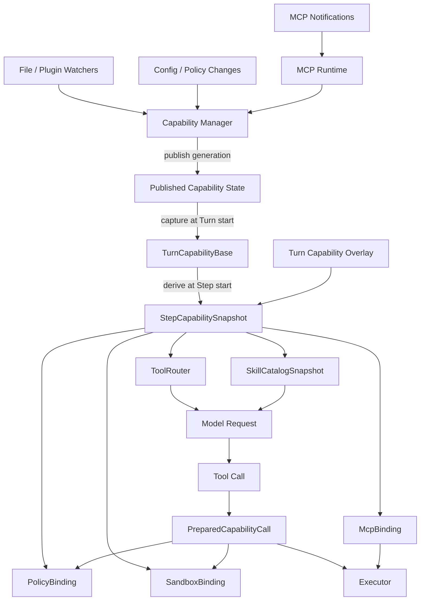

# Tool、Skill 与 MCP V2 设计
## 1. 文档定位
本文对比 Grok Build 与 Codex 当前源码中 Tool、Skill 和 MCP 的注册、管理、刷新与调用机制，并在此基础上设计一套新的能力运行时。

本文既不是简单罗列类名，也不把“最终都能被模型调用”当成架构已经一致。重点回答以下问题：

+ 能力最初从哪里注册；
+ 谁持有运行中的权威状态；
+ 模型在一次采样中到底看见什么；
+ 配置、文件或远端目录变化后如何刷新；
+ 模型已经生成 Tool Call 后，能力定义发生变化应如何处理；
+ 怎样同时兼顾动态能力、上下文预算、权限安全和确定性执行。

源码范围：

+ Grok Build：`/Users/zhengguilin/Documents/个人项目/grodex/grok/grok-build`
+ Codex：`/Users/zhengguilin/Documents/个人项目/grodex/codex/codex/codex-rs`

本文提出的 V2 是后续演进方案，不代表任一项目已经完整实现。它与 [Agent Loop V2](./09-agent-loop-v2-design.md) 的 `StepSnapshot` 配套：Agent Loop 管步骤和状态迁移，本文负责定义每个 Step 使用的能力快照。

## 2. 先看结论
两者都遵循同一个基础模型：

```latex
能力来源
  ├─ 编译期内置 Tool
  ├─ 文件系统 Skill
  ├─ Plugin / Extension
  └─ MCP Server
          |
          v
本地 Runtime 统一适配
          |
          +----> 模型可见目录 / Schema
          |
          +----> 执行时 Runtime / Client Handle
```

但它们选择了不同的生命周期边界：

```latex
Grok Build
Session Runtime
  ├─ FinalizedToolset（可被 MCP 热修改）
  ├─ SkillManager（会话内持续发现）
  └─ McpState（连接、认证、UI 与动态刷新）

Codex
Mutable Services
  ├─ SkillsService
  └─ McpRuntime
          |
          v
每个 Turn / Step 捕获不可变视图
  ├─ ToolRouter
  ├─ SkillCatalog / HostSkillsSnapshot
  └─ McpBinding
```

Grok 更强的是类型化 Tool 注册、共享资源、动态 Skill 发现、MCP 产品管理和 app-only Tool。Codex 更强的是模型可见性分层、每 Step 重新组装、不可变 MCP Binding 和旧调用 revision 校验。

新设计采用：

> Session 级可变管理面 + 原子发布的 generation + Turn/Step 级不可变能力快照。
>

这样既保留动态刷新，又保证模型产生调用后，其 Schema、权限语义和执行句柄不会漂移。

## 3. 三种能力不能混为一谈
Tool、Skill 和 MCP 最终都影响模型行为，但注册语义不同。

| 类型 | 本质 | 注册内容 | 模型命中后的动作 |
| --- | --- | --- | --- |
| 内置 Tool | 本地可执行能力 | 名称、Schema、Runtime、权限与并发 metadata | 执行 Runtime |
| Skill | 工作流和领域说明 | 名称、description、入口、来源、适用条件 | 读取并注入说明，或 fork 子 Agent |
| MCP Tool | 远端动态能力 | Server、远端 Schema、Client Handle、revision | 经 MCP `tools/call` 转发 |


因此，三者可以汇入同一个“能力准备阶段”，但不应该塞入完全相同的数据结构：

+ Skill 目录不应与 Tool Schema 竞争同一上下文预算；
+ MCP 调用必须保留远端连接和 catalog revision；
+ Skill 命中是“加载说明”，Tool 命中是“执行操作”；
+ app-only MCP Tool 可以被桌面 UI 使用，但不应进入模型目录。

## 4. Grok Build 的 Tool 实现
### 4.1 共同契约与静态注册
Grok 的 Tool 不继承传统基类，而是实现 Rust Trait：

```latex
xai_tool_runtime::Tool
+ ToolMetadata
```

Tool 通过关联类型声明 `Args` 和 `Output`。`ToolRegistryBuilder::register<T>()` 和 `register_with_params<T, P>()` 利用泛型同时捕获：

+ 输入与输出类型；
+ JSON Schema；
+ 参数反序列化和 `ToolInput` 转换；
+ 输出序列化和 `ToolOutput` 转换；
+ Tool metadata；
+ Tool 专属配置参数。

源码入口见 [registry/types.rs](../grok-build/crates/codegen/xai-grok-tools/src/registry/types.rs)。`ToolRegistryBuilder::new()` 手工注册 Bash、Read、Edit、Task、Memory、Skill 等内置 Tool，也允许 Tool Pack 在 Builder 创建前贡献额外注册项。

```latex
具体 Tool 类型
      |
      v
register<T>() / register_with_params<T, P>()
      |
      +--> ToolEntry：Schema、metadata、转换器、依赖
      |
      +--> LocalRegistry：实际进程内 dispatch
```

这不是简单的 `HashMap<String, Object>`。名称只是查找入口，注册项还携带类型转换、客户端名称覆盖、参数名称覆盖、依赖表达式和输出转换器。

### 4.2 finalize 与 Resources
Session 启动时，Builder 使用 `ToolServerConfig` 执行 `finalize()`：

1. 校验配置引用的 Tool 是否存在；
2. 校验 Tool 依赖和配置参数；
3. 解析 canonical name 与客户端可见名称；
4. 合并参数名称覆盖；
5. 只保留本 Session 启用的 Tool；
6. 创建 `SharedResources`；
7. 生成 `FinalizedToolset`。

`SharedResources` 保存 Tool 共享的 Session 能力，例如：

+ 文件系统与终端；
+ cwd 与 session folder；
+ SkillManager 和 AvailableSkills；
+ Memory backend；
+ Auth provider；
+ Sub-agent backend；
+ TemplateRenderer；
+ 通知与持久化资源。

这种设计的收益是 Tool 本身不需要到处构造基础设施，测试也可以通过替换 Resources 注入不同实现。

### 4.3 动态 Tool
`FinalizedToolset` 名义上已经 finalized，但内部列表是：

```rust
RwLock<Vec<FinalizedTool>>
```

MCP Tool 可以通过 `register_tool()` 运行时加入，也能按名称或 Server prefix 注销。动态 MCP Tool 通常使用动态 JSON 作为 Args，并用远端 `inputSchema` 覆盖 Rust 自动生成的 Schema。

因此 Grok 的真实 Tool 生命周期是：

```latex
启动时构造基础 Toolset
          |
          v
Session 持续使用
          |
          +--> MCP 连接成功：写锁追加 Tool
          +--> MCP 刷新：写锁删除旧 Tool，再追加新 Tool
```

### 4.4 Grok Tool 的优点
+ Trait、泛型和 Schema 生成形成强类型注册链；
+ Tool 配置、依赖、参数别名和客户端名称可以集中校验；
+ `SharedResources` 适合复杂 Agent Runtime；
+ 内置 Tool 和 MCP Tool 最终复用同一 dispatch 管线；
+ Tool Pack 为编译期扩展提供稳定入口；
+ 运行时增删实现直接，便于 Session、UI 和 MCP 状态同步。

### 4.5 Grok Tool 的缺点
1. **finalized 语义不彻底。** 当前 Step 读取的是一个可被后台刷新修改的 Tool 列表。
2. **模型目录与执行目录边界不够显式。** 虽然可以决定某个 MCP Tool 是否 model-visible，但没有统一的 Exposure 模型覆盖所有来源。
3. **存在目录漂移窗口。** 模型看到 Tool A 后、真正执行前，MCP 刷新可能删除或替换 A。
4. **刷新直接作用于共享 Registry。** 旧 Step 和新 Step 没有天然隔离，正确性依赖调用时序和额外 generation 判断。
5. **能力数量很大时上下文治理分散。** 延迟暴露、搜索暴露和直接暴露没有完全收敛为一种通用策略。

## 5. Codex 的 Tool 实现
### 5.1 Runtime 与 Registry
Codex 的 Tool 实现 `ToolExecutor<ToolInvocation>`，Core Tool 再实现统一的 Core Runtime 契约。`ToolRegistry` 使用：

```rust
IndexMap<ToolName, RegisteredTool>
```

每个 `RegisteredTool` 同时保存 Runtime 与 Exposure。核心实现见 [registry.rs](/Users/zhengguilin/Documents/个人项目/grodex/codex/codex/codex-rs/core/src/tools/registry.rs)。

内置 Tool 重名被视为内部错误；外部 Tool 使用保守策略，同名时记录警告并跳过，避免动态来源覆盖可信核心能力。

### 5.2 每 Step 构造 ToolRouter
Codex 不长期复用一个最终 Tool 数组。每个模型 Sampling Step 都调用 `build_tool_router()` 收集：

+ Core Tool；
+ 当前 `McpBinding` 提供的 MCP Tool；
+ Extension / Plugin Tool；
+ Dynamic Tool；
+ Hosted Model Tool。

随后构造：

```latex
ToolRouter
  ├─ ToolRegistry：能够实际 dispatch 的 Runtime
  └─ model_visible_specs：本次请求真正发给模型的 Schema
```

实现见 [spec_plan.rs](/Users/zhengguilin/Documents/个人项目/grodex/codex/codex/codex-rs/core/src/tools/spec_plan.rs)。这个 Router 被当前 Step 持有，Tool Call 使用该 Step 对应的 Runtime，而不是重新查询最新全局目录。

### 5.3 ToolExposure
Codex 显式区分能力存在与模型直接可见。当前 `ToolExposure` 包含：

+ `Direct`：Schema 进入初始模型请求，也能进入嵌套 Code Mode；
+ `Deferred`：可通过 Tool Search 发现，也能进入嵌套 Code Mode；
+ `DeferredModelOnly`：可通过 Tool Search 发现，但不能被嵌套 Code Mode 调用；
+ `DirectModelOnly`：只进入初始模型请求，不进入嵌套 Code Mode；
+ `CodeModeOnly`：只允许嵌套 Code Mode 调用；
+ `Hidden`：保留在执行 Registry 中，但不对模型暴露。

这种分层解决了两个问题：

1. Registry 可以保留完整执行能力，不必把全部 Schema 塞进上下文；
2. Tool Search、Code Mode 和模型直调可以共享同一 Runtime，而使用不同暴露策略。

### 5.4 Codex Tool 的优点
+ 每 Step Router 与模型采样形成清晰的一致性边界；
+ 模型可见 Schema 和实际执行 Registry 分离；
+ Exposure 是跨 Core、MCP 和 Extension 的统一概念；
+ 外部 Tool 不能静默覆盖核心 Tool；
+ Deferred Tool 能显著降低大量 MCP/插件 Schema 的上下文成本；
+ Extension Contributor 可以按 Step 动态贡献能力。

### 5.5 Codex Tool 的缺点
1. **组装链更复杂。** Tool 来自多个 source 和 contributor，定位“为什么本 Step 没有这个 Tool”需要更好的诊断。
2. **每 Step 构造有额外成本。** 即使大部分能力没有变化，也要重新生成或复用相关视图。
3. **类型化配置不如 Grok 集中。** Codex Runtime 抽象很强，但 Grok 的 Args/Output/Params 泛型注册与依赖校验更一体化。
4. **资源依赖较分散。** 不同 Runtime 从 Turn、Session、Extension、Environment 获取状态，整体没有 Grok `SharedResources` 那样直观。
5. **动态来源较多后可解释性下降。** Exposure、namespace、Extension 和 Tool Search 同时作用时，需要专门的能力诊断视图。

## 6. Tool 实现对比
| 维度 | Grok Build | Codex |
| --- | --- | --- |
| 共同接口 | `Tool + ToolMetadata` Trait | `ToolExecutor/CoreToolRuntime` Trait |
| 静态注册 | Builder + Tool Pack | Core Tool sources |
| 类型化参数 | 泛型关联 Args/Output/Params | Runtime 提供 spec 和执行 |
| 最终组装时机 | Session 启动 finalize | 每个 Sampling Step |
| 执行目录 | `LocalRegistry` | `ToolRegistry` |
| 模型可见目录 | Finalized Tool definitions | 独立 `model_visible_specs` |
| 暴露策略 | 按配置和个别 Tool 路径处理 | 统一 `ToolExposure` |
| 动态更新 | 修改当前 `FinalizedToolset` | 新 Step 构造新 Router |
| 资源注入 | 集中的 `SharedResources` | Session/Turn/Extension Context |
| 一致性边界 | 主要是 Session + generation | Step Router |


## 7. Grok Build 的 Skill 实现
### 7.1 SkillManager 是 Session 权威状态
Grok 的每个 Skill 不会生成一个新的 Rust Tool。文件系统发现的 Skill 被解析成 metadata，由 `SkillManager` 统一管理。

`SkillManager` 保存：

+ startup baseline；
+ Session 中动态发现的 Skill；
+ canonical path 去重集合；
+ 已检查目录；
+ 已公告名称；
+ cwd 和 git root；
+ `paths:` 条件 Skill；
+ listing 字符预算；
+ 当前客户端的 Tool 名称映射。

实现见 [skill_discovery_tracker/mod.rs](../grok-build/crates/codegen/xai-grok-tools/src/types/skill_discovery_tracker/mod.rs)。

### 7.2 启动发现与运行时发现
启动时，配置、项目、用户目录和插件 Skill 形成 baseline，并投影成 `AvailableSkills`。

运行期间，文件 Tool 触及新目录后会触发动态发现：

```latex
文件 Tool 完成
    |
    v
检查相关目录是否包含 Skill
    |
    v
SkillManager.add_discovered()
    |
    v
pending reconciliation
    |
    v
apply_pending_skill_update()
  ├─ 更新 AvailableSkills
  ├─ 生成 system reminder
  └─ 更新 slash commands
```

Plugin 或配置 watcher 变化时，baseline 可以 reload，而 Session 内动态发现结果继续由 Manager 协调。

### 7.3 统一 Skill Tool 延迟读取
模型先看到精简 Skill listing，再调用统一 Skill Tool。Runtime 根据名称从 `AvailableSkills` 找到 Skill，读取完整 Markdown 并返回/注入。

同名 Skill 不会静默选择。短名存在歧义时，Tool 返回所有 qualified names，例如 `local:commit`、`user:commit`，要求调用方明确来源。实现见 [skill/mod.rs](../grok-build/crates/codegen/xai-grok-tools/src/implementations/opencode/skill/mod.rs)。

### 7.4 Grok Skill 的优点
+ Session 运行时动态发现能力强；
+ baseline、动态发现、去重、公告和 slash command 同一处管理；
+ 只先暴露 name/description，正文延迟读取；
+ qualified name 避免同名 Skill 被错误解析；
+ system reminder 避免运行中发现的 Skill 必须重写 leading system prompt；
+ 文件 Tool 与 Skill discovery 联动，适合大型仓库逐步探索。

### 7.5 Grok Skill 的缺点
1. **状态持续变化但缺少 Turn 快照。** 同一 Turn 前后看到的 Skill 集合可能不同。
2. **来源协议不统一。** 本地、插件和未来远端 Skill 的定位方式容易继续增加分支。
3. **Manager 职责较重。** 发现、状态、公告、投影和压缩都集中在一个 Session 对象中。
4. **模型依赖 listing reminder。** listing 受字符预算截断后，低优先级 Skill 可能不可发现。
5. **远端资源读取抽象不足。** 本地路径很好用，但非文件系统 Skill 需要额外适配。

## 8. Codex 的 Skill 实现
Codex 当前存在两条并行路径，不能再简单描述成“所有 Skill 都由一个 SkillTool 加载”。

### 8.1 Host Skill 显式注入
`SkillsService` 负责：

+ 计算 Host Skill roots；
+ 扫描和解析本地 Skill；
+ 应用配置过滤；
+ 按 cwd 和有效配置缓存；
+ 发布不可变 `HostSkillsSnapshot`；
+ watcher 变化时清理缓存。

实现见 [service.rs](/Users/zhengguilin/Documents/个人项目/grodex/codex/codex/codex-rs/core-skills/src/service.rs) 和 [model.rs](/Users/zhengguilin/Documents/个人项目/grodex/codex/codex/codex-rs/core-skills/src/model.rs)。

用户通过结构化 Skill 输入或 `$skill-name` 显式选择本地 Skill 后，Runtime 读取完整 `SKILL.md`，作为 `SkillInstructions` 注入当前 Turn。

### 8.2 Skills Extension
对于 Executor Environment、Orchestrator/MCP 等来源，Codex 构造 Turn 级 `SkillCatalog`。Skills Extension 每 Step 贡献两个 namespaced Tool：

```latex
skills.list
skills.read
```

`skills.list` 返回：

+ authority；
+ package；
+ main_resource；
+ name 与 description。

`skills.read` 使用这些稳定 handle 分页读取入口正文或引用资源。远端内容还可以标记为 external context，避免与本地可信指令混淆。

实现见：

+ [catalog.rs](/Users/zhengguilin/Documents/个人项目/grodex/codex/codex/codex-rs/ext/skills/src/catalog.rs)
+ [skills.list](/Users/zhengguilin/Documents/个人项目/grodex/codex/codex/codex-rs/ext/skills/src/tools/list.rs)
+ [skills.read](/Users/zhengguilin/Documents/个人项目/grodex/codex/codex/codex-rs/ext/skills/src/tools/read.rs)
+ [extension.rs](/Users/zhengguilin/Documents/个人项目/grodex/codex/codex/codex-rs/ext/skills/src/extension.rs)

### 8.3 Codex Skill 的优点
+ Host Snapshot 不可变，避免同一 Turn 内目录漂移；
+ cache key 包含有效配置，避免同 cwd 不同权限/角色互相污染；
+ authority、package、resource 适合多环境和远端 Skill；
+ `skills.list/read` 将发现和正文读取分开；
+ 本地显式 mention 可以直接注入，减少额外模型 Tool Call；
+ external context 标记有利于处理远端内容的信任边界。

### 8.4 Codex Skill 的缺点
1. **两条路径增加理解成本。** Host 显式注入与 Extension list/read 不是同一种消费协议。
2. **运行中目录探索联动弱于 Grok。** 它更偏 root snapshot，而不是每次文件访问后持续向上发现。
3. **Provider 和 authority 较复杂。** 对纯本地 CLI 来说，这套模型的概念成本偏高。
4. **Skill 可发现性依赖 catalog 构造。** Provider 失败或快照过期时，需要明确诊断，否则仍可能静默漏 Skill。
5. **正文加载入口分裂。** 本地文件直接读，远端使用 `skills.read`，调用方必须理解 locator 类型。

## 9. Skill 实现对比
| 维度 | Grok Build | Codex |
| --- | --- | --- |
| 权威管理 | Session `SkillManager` | `SkillsService` + Provider/Catalog |
| 状态形态 | Session 内持续演进 | Host/Turn 不可变 Snapshot |
| 本地 Skill | 统一 Skill Tool 延迟读取 | 显式选择后直接注入 |
| 远端 Skill | 插件/MCP 相关路径分别适配 | `skills.list/read` 统一资源协议 |
| 动态目录发现 | 文件访问后继续发现 | root snapshot/cache 为主 |
| 多来源消歧 | qualified name | authority + package + resource |
| 变更通知 | reminder + slash commands | watcher 清缓存，下个 Turn/Step 重建 |
| 信任标记 | 主要按来源处理 | 可显式标记 external context |


## 10. Grok Build 的 MCP 实现
### 10.1 McpState
Grok 的 `McpState` 是 Session 级 MCP 管理状态，保存：

+ Server 配置；
+ owned/shared clients；
+ 初始化状态；
+ OAuth 和认证失败；
+ transport liveness；
+ Tool `_meta`；
+ 禁用 Tool registration；
+ Server generation；
+ 连接和通知任务。

核心实现见 [servers.rs](../grok-build/crates/codegen/xai-grok-mcp/src/servers.rs)。

### 10.2 tools/list 与本地适配
MCP Client 初始化后分页调用 `tools/list`。每个远端 Tool 被转换为 `McpErasedTool` 和 `McpToolRegistration`：

```latex
MCP tools/list result
       |
       v
McpErasedTool
       |
       v
McpToolRegistration
  ├─ name: server__tool
  ├─ input_schema
  ├─ metadata
  ├─ model_visible
  └─ executable adapter
```

执行时 Adapter 持有 Server 和 Tool 信息，将本地调用转发成 MCP `tools/call`。

### 10.3 model-visible 与 app-only
Grok 的 MCP Tool 可以分成：

+ model-visible：注册到 `ToolBridge/FinalizedToolset`，模型可以调用；
+ app-only：只通知前端，由扩展协议调用，不占模型 Tool Schema。

这对桌面产品很重要。例如某个 MCP 能力只服务文件选择器或管理面板，就不需要让模型知道它。

### 10.4 动态管理
Grok 支持：

+ `notifications/tools/list_changed`；
+ 运行时启停 Server；
+ 禁用或恢复单个 Tool；
+ OAuth 恢复；
+ transport liveness；
+ 配置 watcher 热更新；
+ generation 过滤迟到的初始化结果。

配置变化时，Session 通常按 Server prefix 注销旧 Tool，重新初始化 Server，再把新 Tool 注册到当前 Toolset。

### 10.5 Grok MCP 的优点
+ Server 生命周期、OAuth、失败状态和 UI 展示管理完整；
+ model-visible 与 app-only 分层很实用；
+ 单 Tool 禁用不一定需要重新 `tools/list`；
+ `list_changed`、配置 watcher 和 liveness 形成较完整的动态运行时；
+ generation 能避免旧初始化任务覆盖较新的配置；
+ MCP Adapter 复用普通 Tool 执行管线。

### 10.6 Grok MCP 的缺点
1. **刷新会修改当前共享 Toolset。** 目录变化可能影响仍在运行的 Step。
2. **generation 主要保护初始化结果，不等于调用绑定。** 已经生成的 Tool Call 没有天然绑定到当时的 client/catalog revision。
3. **删除再注册存在中间状态。** 读取者可能在刷新窗口看到缺失或部分目录。
4. **同名远端 Tool 的语义变化难检测。** 名称没变但 Schema 或行为变化时，旧调用可能落到新实现。
5. **Session 状态较重。** MCP 管理、UI、连接和 Tool Registry 修改形成较强耦合。

## 11. Codex 的 MCP 实现
### 11.1 Mutable McpRuntime
Codex 使用 Thread 级 `McpRuntime` 管理配置和连接，并通过 `ArcSwap` 原子发布最新 Runtime 状态。刷新可以建立新连接集，再一次性发布，而不是让读取者观察逐个修改过程。

实现见 [runtime.rs](/Users/zhengguilin/Documents/个人项目/grodex/codex/codex/codex-rs/codex-mcp/src/runtime.rs)。

### 11.2 Immutable McpBinding
每次 Sampling Step 从 Runtime 捕获不可变 `McpBinding`。Binding 同时冻结：

+ 本次模型看到的 Tool catalog；
+ 精确 Client Handle；
+ Config 与 Server metadata；
+ Tool timeout/审批相关信息；
+ 每个 Tool 的 `PreparedMcpCall`。

核心实现见 [binding.rs](/Users/zhengguilin/Documents/个人项目/grodex/codex/codex/codex-rs/codex-mcp/src/binding.rs)。

```latex
Mutable McpRuntime
       |
       | atomic publish
       v
Published Runtime State
       |
       | capture per Step
       v
Immutable McpBinding
  ├─ frozen catalog
  ├─ frozen clients
  └─ prepared calls
```

### 11.3 PreparedMcpCall 与 revision fence
模型根据本 Step 的 catalog 生成 Tool Call。执行阶段通过相同 Binding 取得 `PreparedMcpCall`，它绑定：

+ 当时的 client；
+ ToolInfo；
+ Server metadata；
+ catalog revision；
+ revision source。

执行前比较 revision。如果远端目录已刷新，旧调用会得到明确的 stale-catalog 错误，而不是悄悄按新定义执行。

这条不变量非常重要：

> 模型按哪个 Schema 生成参数，就只能按该 Schema 对应的能力版本执行。
>

### 11.4 Codex MCP 的优点
+ Runtime 可变、Step Binding 不可变，职责清楚；
+ 原子发布避免读取半刷新目录；
+ Prepared Call 同时绑定目录和实际 Client Handle；
+ revision fence 防止旧参数调用新 Schema；
+ 旧 Binding 持有旧连接生命周期，不会因刷新立即失效；
+ MCP Tool 进入普通 ToolRegistry，可共享 Exposure、Hook、审批和并发语义。

### 11.5 Codex MCP 的缺点
1. **实现复杂度高。** Runtime、Published State、Binding、Prepared Call 和 revision 都要保持一致。
2. **旧调用可能被保守拒绝。** 即使远端变化与当前 Tool 无关，catalog revision 变化也可能要求重新采样。
3. **产品管理能力不如 Grok 集中。** app-only Tool、细粒度 UI 状态和 OAuth 交互不是这一抽象的重点。
4. **连接生命周期更难调试。** 多代 Binding 同时持有旧 Client，需要可观测引用和回收状态。
5. **刷新成本更高。** 捕获完整 catalog 和 prepared call map 需要缓存和增量优化。

## 12. MCP 实现对比
| 维度 | Grok Build | Codex |
| --- | --- | --- |
| 权威管理 | Session `McpState` | Thread `McpRuntime` |
| 最新状态发布 | 修改 Session 状态和 Toolset | `ArcSwap` 原子发布 |
| Step 使用形态 | 读取当前 Toolset | 不可变 `McpBinding` |
| 调用句柄 | 动态 Tool Adapter | `PreparedMcpCall` |
| 旧目录防护 | generation 过滤迟到初始化 | catalog revision fence |
| UI-only Tool | 原生 app-only | 不是主要抽象 |
| OAuth/liveness | 产品化程度高 | 连接 Runtime 负责，但 UI 管理较分散 |
| 刷新一致性 | 直接、但可能漂移 | 强一致、但更复杂 |


## 13. 当前两套实现共同没有完全解决的问题
### 13.1 缺少统一 Capability Snapshot
Tool、Skill、MCP、Policy 和 Sandbox 往往分别捕获。若其中一个刷新，系统很难回答“模型生成这个 Tool Call 时究竟看到的是哪一组能力和权限”。

### 13.2 Skill 与 Tool 的可见性策略没有完全统一
Codex 有 ToolExposure，但 Skill 使用 Host Injection 和 list/read 两条路径；Grok 有 Skill listing budget，但没有统一的 Direct/Deferred/Hidden 策略描述整个能力面。

### 13.3 动态刷新缺少端到端因果链
需要从 watcher/MCP notification 一直记录到：

```latex
变更事件
 -> 新 generation
 -> 新 Snapshot
 -> 哪个 Step 使用了它
 -> 哪个 Tool Call 绑定到它
 -> 执行或因 stale 被拒绝
```

没有这条链，用户只会看到“Method not found”或 Tool 突然消失，无法判断是配置、发现、暴露、采样还是执行阶段的问题。

### 13.4 权限与能力快照容易分离
Tool 目录冻结但 Policy/Sandbox 使用最新值，会导致模型看到的能力与实际权限不一致；反过来，权限放宽后让旧 Tool Call 自动获得新权限，也会破坏审批绑定。

### 13.5 多来源冲突规则不完整
同名可能来自：

+ Core Tool；
+ Plugin Tool；
+ MCP Tool；
+ Environment Extension；
+ app-only capability；
+ 多个同名 Skill。

如果只依赖字符串前缀，很难同时表达来源、信任级别和用户可读名称。

## 14. V2 设计目标
1. **一次采样只使用一份不可漂移能力快照。**
2. **模型可见目录与可执行目录分离。**
3. **动态刷新默认在 Turn 边界采纳。** 管理面可以立即发布新 generation，但当前 Turn 默认继续复用原能力目录，避免破坏 leading Tool Specs 的 Prompt Cache。
4. **Tool Call 绑定精确 Runtime、Policy、Sandbox 和远端 revision。**
5. **Tool、Skill、MCP 保留不同语义，不强行塞入一种对象。**
6. **本地、插件、环境和远端能力使用稳定 Authority。**
7. **直接暴露、延迟发现、代码模式和 UI-only 使用统一 Exposure。**
8. **所有刷新、选择、拒绝和 stale 结果可诊断、可回放。**
9. **先保证确定性，再通过缓存和结构共享降低每 Step 成本。**

## 15. V2 总体架构


设计分为两面：

+ **管理面**持续变化：发现文件、维护连接、响应配置、构造新目录；
+ **Turn 基线**默认稳定：Tool Specs、Skill Catalog 和 MCP 目录在同一用户目标内复用；
+ **Step 执行面**不可变：模型目录、Runtime Handle、权限上界和沙箱绑定固定，并叠加显式的 Turn overlay；
+ **实时安全面**只允许收紧：revocation fence 可以立即撤销旧快照中的授权，不能借此放宽权限。

## 16. 核心数据模型
### 16.1 CapabilityId
不要只用展示名称作为主键：

```latex
CapabilityId {
  authority,       // core | host | plugin | executor | orchestrator | mcp | app
  provider_id,     // plugin id / server id / environment id
  kind,            // tool | skill | resource | app_action
  canonical_name
}
```

展示名可以保持简短，内部 ID 必须稳定且带来源。`CapabilityId` 只表示身份，不包含 revision。Policy 规则、“始终允许”、DelegationEnvelope allowlist 和审计聚合都绑定稳定 ID，不会因为 description 或 Schema 更新而失配。

### 16.2 CapabilityDescriptor
```latex
CapabilityDescriptor {
  id,
  display_name,
  description,
  exposure,
  trust_level,
  input_schema?,
  concurrency_class?,
  side_effect_class?,
  source_locator,
  content_hash,
  capability_revision,
  generation
}
```

Descriptor 是目录信息，不直接等于执行对象。`capability_revision` 表示该身份当前的可执行版本，至少覆盖 input schema、影响调用语义的 metadata 和 Runtime binding；它用于 stale fence，不参与身份匹配。

### 16.3 StepCapabilitySnapshot
```latex
StepCapabilitySnapshot {
  snapshot_id,
  turn_base_generation,
  step_generation,
  promoted_capability_ids,
  tool_router,
  skill_catalog,
  mcp_binding,
  policy_binding,
  sandbox_binding,
  revocation_epoch_at_capture,
  created_at,
  source_generations
}
```

`source_generations` 分别记录 Tool、Skill、MCP、Policy 和 Sandbox 的版本，便于诊断哪个来源触发新快照。

必须满足：

> 一个 Tool Call 从模型生成、参数校验、审批到执行完成，始终引用同一个 `snapshot_id`。
>

### 16.4 PreparedCapabilityCall
```latex
PreparedCapabilityCall {
  tool_call_id,
  snapshot_id,
  capability_id,
  capability_revision,
  runtime_handle,
  validated_args,
  args_hash,
  policy_ceiling,
  policy_generation,
  sandbox_profile,
  remote_revision?,
  operation_id
}
```

这使审批、沙箱和执行使用同一份已验证参数，避免审批后重新从字符串名称查最新 Tool。审批必须绑定 `capability_revision + args_hash + policy_generation`；Schema、参数或策略版本任一变化都不能复用旧审批。

### 16.5 Turn 基线、Step Overlay 与实时撤销
能力版本分成三个不同层次，不能都叫 generation：

```latex
PublishedCapabilityState
  管理面最新状态，可在任意时刻更新

TurnCapabilityBase
  Turn 开始时捕获，默认贯穿整个用户目标

TurnCapabilityOverlay
  仅记录本 Turn 明确发生的 Deferred promotion

LiveRevocationFence
  单调收紧的安全撤销集合，执行前实时检查
```

默认规则：

1. Tool、Skill、MCP 目录的新 generation 在下一个 Turn 才进入 `TurnCapabilityBase`；
2. Turn 内只有三种情况允许改变后续 Step 的有效能力语义：Deferred 命中提升、安全性收紧、当前调用因 stale 被拒后的受控重采样；只有前者和确需重建目录的 stale 重采样会改变 leading Tool Specs，安全收紧优先通过 revocation fence 生效；
3. 普通 watcher、MCP reconnect、`tools/list_changed` 和新 Skill discovery 只记录 staged update，不改当前 Turn 的 leading Tool Specs；
4. 放宽 Policy 只对后续 Snapshot 生效；如果放宽会新增模型可见能力，则仍等到下一 Turn；
5. 收紧 Policy、撤销“会话允许”和 kill-switch 立即写入 `LiveRevocationFence`，所有尚未产生副作用的调用在执行前重新检查；
6. 快照冻结的是当时的授权上界，不构成对后续撤销的豁免。
7. 对已经运行的调用，Supervisor 同时发送 cancellation；长流程 Tool 必须在可中断的副作用边界重查 fence。已经完成的外部副作用只能如实审计和补偿，不能宣称撤销能够回滚历史事实。

这与 Memory V2 以及 [上下文管理 V2 §10](./11-context-management-v2-design.md#10-上下文分区与缓存策略) 使用同一立场：同一 Turn 的 leading context 默认稳定；运行时变化先进入管理面和事件日志，只有明确例外才改变后续 Step。普通目录刷新是“下一 Turn 采纳”，Deferred promotion 是模型在当前 Turn 主动搜索后的显式 overlay，因此“下一 Step 暴露”不是普通刷新规则的例外泄漏。

## 17. Tool V2
### 17.1 保留 Grok 的类型化 Adapter
内置 Tool 继续使用强类型 Trait 和泛型注册：

+ 自动生成 Schema；
+ 统一 Args/Output 转换；
+ 配置参数和依赖校验；
+ `SharedResources` 注入。

这部分不需要为了模仿 Codex 改成弱类型对象。

### 17.2 引入 Codex 的 Router 与 Exposure
Builder 不再直接产生一个长期被修改的最终列表，而是产生稳定的 `ToolRuntimeCatalog`。Turn 开始时先固定 Catalog、MCP 和 Skill 基线；每个 Step 再根据：

+ 有效配置；
+ Turn 基线中的 Skill Extension；
+ Turn 基线中的 `McpBinding`；
+ Tool Search/Code Mode；
+ Policy 与 Session 模式；

构造不可变 `ToolRouter`。

统一 Exposure：

| Exposure | 含义 |
| --- | --- |
| `Direct` | 完整 Schema 直接进入模型请求 |
| `Deferred` | 进入搜索目录，命中后下一 Step 暴露 |
| `CodeMode` | 只在代码执行模式中可调用 |
| `AppOnly` | 只允许可信客户端入口，不提供给模型 |
| `Internal` | Runtime 内部使用，不对模型和普通 UI 暴露 |
| `Disabled` | 保留诊断记录，但不可调用 |


V1 的初始分配使用可解释硬规则，不做基于未知分数的自动降级：

+ Core Tool 默认 `Direct`；
+ 外部 Plugin、Extension 和 MCP Tool 默认 `Deferred`；
+ 明确声明为客户端动作的能力使用 `AppOnly`；
+ Runtime 内部协调能力使用 `Internal`；
+ 配置可以显式覆盖，但外部配置不能覆盖 Core Tool 的安全下界；
+ 当 Direct Schema 超出固定预算时，按“外部优先降为 Deferred、Core 保底”的确定顺序处理，并记录诊断事件。

### 17.3 Deferred promotion
Tool Search 是一个内置 Core Tool，V1 固定为 `Direct`。它只搜索当前 `TurnCapabilityBase` 中允许被发现的 Deferred descriptors，不得返回 Hidden、Internal、AppOnly 或被 Policy 排除的能力。

命中后不修改全局 `PublishedCapabilityState`，而是在 `TurnContext` 写入：

```latex
promoted_capabilities[CapabilityId] = capability_revision
```

下一 Step 构造 Router 时叠加该 overlay，将命中能力提升为 Direct。这里的下一 Step 只适用于当前 Turn 内的显式 Deferred promotion，不适用于 watcher、MCP reconnect、`tools/list_changed` 或普通 Skill discovery。提升必须钉住搜索命中时的 revision；组装下一 Step 时如果 revision 已变化，则记录 stale，不使用新版本冒充原命中，并进入受控重采样或要求重新搜索。

每次提升写入 `CapabilityPromoted` 事件，包含 query hash、CapabilityId、钉住的 revision、来源 Step 和目标 Step。这样回放可以解释为什么某个 Step 比 Turn 基线多出一个 Direct Tool。

### 17.4 冲突规则
1. Core Tool 不允许被外部来源覆盖；
2. 内部查找始终使用 `CapabilityId`；
3. 展示名冲突时生成 qualified display name；
4. 外部同名能力可以共存，但模型目录必须使用不冲突名称；
5. alias 只能由配置显式声明，不能由后注册者抢占；
6. `AppOnly` 与模型 Tool 可以同源，但必须是两个 Exposure 投影，而不是复制两个 Runtime。

### 17.5 AppOnly 执行与审计
`AppOnly` 只是不进入模型目录，不代表它绕过 Runtime。可信 UI 调用必须经过：

```latex
caller authentication
  -> CapabilityId lookup
  -> Schema validation
  -> PolicyBinding
  -> LiveRevocationFence
  -> Sandbox / resource scheduling
  -> operation journal
  -> Runtime execution
```

调用不写入模型 transcript，但必须写入同一 `rollout.jsonl`。`AppActionInvoked` 事件至少包含 caller identity、CapabilityId、capability revision、args hash、policy generation、operation id、结果摘要或 blob reference。这样 AppOnly 的真实副作用仍属于唯一事实事件流，不形成审计盲区。

## 18. Skill V2
### 18.1 两层状态
结合 Grok 和 Codex：

```latex
Session SkillsService / Manager
  ├─ 扫描 roots
  ├─ 文件访问后的动态发现
  ├─ watcher 与 cache invalidation
  ├─ Provider/Authority 管理
  └─ 发布 Skill generation
                 |
                 v
Turn SkillCatalogSnapshot
  ├─ 当前可发现 Skill metadata
  ├─ stable locator
  ├─ trust/source
  └─ content hash
```

Manager 负责变化，Catalog 负责本 Turn 的确定性。

### 18.2 三种消费方式
1. **本地显式选择。** 用户 `$skill` 或结构化选择时，直接读取并注入正文。
2. **模型按目录选择。** 模型看到 name、description 和 qualified source，通过统一 `skills.read` 加载正文。
3. **远端/环境 Skill。** 使用 `skills.list/read` 的 authority、package、resource 协议分页读取。

本地 Skill 可以使用路径实现读取，但对模型暴露的逻辑协议应一致：模型选择的是稳定 Skill ID，而不是猜测文件路径。

### 18.3 动态发现边界
Grok 的文件访问动态发现继续保留，但新 Skill 只发布到管理面的下一代 Catalog，默认到下一个 Turn 才被采纳：

```latex
Step N 访问目录并发现 Skill
        |
        v
SkillsManager generation + 1
        |
        v
当前 Turn 保持旧 Catalog
下一 Turn 捕获新 Catalog
```

当前 Turn 可以追加“发现新 Skill，将在下一 Turn 可用”的 runtime 合成消息，但必须复用 Agent Loop V2 的统一协议：`author=runtime`，带 `reason_code`、`template_version` 和结构化 Skill ID，并进入 transcript 与下一次 `input_hash`。不能临时拼接一种新的 reminder 文本，也不能借 reminder 原地修改当前 Turn 的 Skill Catalog。

### 18.4 信任规则
+ Core/managed Skill 和用户自己维护的全局 Skill 可以作为受信指令；
+ Workspace 中随仓库检出的 Skill 默认属于 external/untrusted context，不能因为目录名叫“project skill”就自动受信；
+ Plugin、Executor、Orchestrator/MCP Skill 默认属于 external/untrusted context；
+ 外部 Skill 内容不得提升权限或改变 Policy/Sandbox；
+ Skill 中声明的 `allowedTools` 只能收窄当前权限上界；
+ 子 Agent Skill 继承父 Agent 权限上界，不能借 fork 扩权。

仓库 Skill 使用显式信任裁决：

1. 首次准备读取仓库 Skill 正文时，UI 展示 workspace、canonical path、来源和 content hash；
2. 用户确认后持久化 `SkillTrustGrant(workspace_id, path, content_hash, decision)`；
3. content hash 改变后旧确认自动失效，必须重新确认；
4. 未确认时可以在过滤后的目录中标记“存在未信任 Skill”，但正文不能作为受信指令注入；
5. 信任 Skill 只允许读取说明，不会授予额外 Tool、网络、文件或 Sub-agent 权限；
6. Managed deny 和组织策略高于用户信任决定。

## 19. MCP V2
### 19.1 保留 Grok 的管理面
继续保留：

+ app-only Tool；
+ Server 和单 Tool 启停；
+ OAuth 与认证恢复；
+ transport liveness；
+ `tools/list_changed`；
+ UI 状态事件；
+ 配置 watcher；
+ disabled registration 缓存。

这些能力解决的是产品运行问题，不应为了实现快照而删掉。

### 19.2 引入 Codex 的 Binding 模型
MCP 更新不再直接修改当前 `FinalizedToolset`，而是：

```latex
McpRuntime 接收连接/目录变化
       |
       v
构造完整新 PublishedMcpState
       |
       v
原子发布 mcp_generation
       |
       +--> 当前 Turn 继续持有原 McpBinding
       +--> 下一 Turn 捕获新 McpBinding
       +--> stale 拒绝时按例外创建受控重采样 Binding
```

每个 model-visible MCP Tool 生成 `PreparedMcpCall`，绑定精确 Client、Schema hash、Server generation 和 Tool revision。

普通 reconnect 或 `tools/list_changed` 不自动改写当前 Turn 的 Tool Specs。Runtime 记录 staged update，并可用版本化 runtime 合成消息告知“能力目录将在下一 Turn 更新”；只有当前调用因 Client/Tool revision stale 被拒绝时，才允许当前 Turn 捕获新 Binding 并重新采样，且必须生成新的 Step generation 和 input hash。

### 19.3 revision fence 的粒度
Codex 的整体 catalog revision 很安全，但可能因无关 Tool 更新而拒绝调用。V2 建议同时保存：

+ `server_generation`：连接或 Server 级重建；
+ `tool_revision`：Tool name + schema +关键 metadata 的 hash；
+ `client_instance_id`：精确连接实例。

执行规则：

1. Client 已失效或 Server generation 不兼容：拒绝并要求重新采样；
2. 当前 Tool revision 变化：拒绝旧调用；
3. 只有同 Server 的无关 Tool 变化，当前 Tool revision 和 Client 仍兼容：允许执行；
4. 无法确定兼容性时保守拒绝。

这比单一全局 revision 更少误伤，同时保持 Schema 与执行一致。

## 20. Permission Policy Language V2
### 20.1 为什么 Capability Snapshot 还不够
前文已经定义 `PolicyBinding`、`policy_generation`、`LiveRevocationFence` 和审批绑定，但它们只回答“哪一版策略参与了执行”，没有回答策略本身怎样表达和裁决。

如果这一层不统一，常见实现会退化成：

```latex
command.starts_with("git") -> allow
path.matches("src/**")      -> allow
otherwise                   -> ask
```

这无法可靠区分：

+ `git status` 与 `git push --force`；
+ `cargo test` 与 `cargo test | curl ...`；
+ workspace 内路径与经过 symlink 后落到 workspace 外的路径；
+ 只允许 `https://api.example.com:443` 与允许任意网络；
+ 用户本次允许与企业永久 deny。

Permission Policy Language 必须成为独立、可解析、可测试、可解释的安全协议，而不是散落在 Tool handler 中的条件判断。

### 20.2 Grok Build 当前实现
Grok 的权限配置已经有通用规则形态：

```latex
PermissionRule {
  action: allow | deny | ask
  tool: any | bash | edit | read | grep | mcp | web_fetch | web_search
  pattern?
  pattern_mode: glob | domain
}
```

实现见 [types.rs](/Users/zhengguilin/Documents/个人项目/grodex/grok/grok-build/crates/codegen/xai-grok-workspace/src/permission/types.rs) 和 [policy.rs](/Users/zhengguilin/Documents/个人项目/grodex/grok/grok-build/crates/codegen/xai-grok-workspace/src/permission/policy.rs)。

它不是只对 Bash 原字符串做一次 glob：

+ compound command 会尝试拆成多个 segment；
+ `env`、`timeout` 等 wrapper 会被解包；
+ `bash -c` 等内嵌脚本会递归分析；
+ shell 读写路径有单独 gate；
+ 无法分解的 opaque shell 默认升级为 ask；
+ deny/ask gate 只会收紧，不会被普通 allow 绕过；
+ auto mode 可以对非 fast-path 调用做分类，同时有连续/总拒绝上限；
+ permission event 记录 policy、classifier、sandbox、session grant 等 decision reason。

权限 actor 使用 mpsc 接收请求、oneshot 返回决定，调用方 await 的是对应请求结果，而不是阻塞线程。

Grok 的优点：

+ Tool、路径、domain 和 Bash 已进入同一权限管理面；
+ Bash segment、wrapper、opaque shell 的 fail-closed 处理较深入；
+ ask/deny 的来源可记录；
+ session/persisted grant、auto classifier 和 sandbox fast path 已产品化；
+ managed requirement source 与普通用户配置能够区分。

Grok 的不足：

1. `tool + pattern + pattern_mode` 对路径、命令、MCP 参数和网络的表达能力仍偏平。
2. glob 对 Bash freeform 与文件 path 的语义不同，用户不容易准确预测。
3. 规则特定度、来源优先级和冲突裁决没有形成一份独立的语言规范。
4. auto classifier 增加灵活性，也会增加延迟、不可重复性和误判归因难度。
5. “始终允许”与持久配置之间的 scope、expiry 和 capability revision 绑定不够统一。

### 20.3 Codex 当前实现
Codex 使用独立 `codex-execpolicy`。当前语言以 Starlark 风格 `prefix_rule` 为核心：

```plain
prefix_rule(
    pattern = ["git", "push", ["--force", "--force-with-lease"]],
    decision = "prompt",
    justification = "publishes rewritten history",
    match = [["git", "push", "--force"]],
    not_match = [["git", "status"]],
)
```

实现与说明见：

+ [execpolicy README](/Users/zhengguilin/Documents/个人项目/grodex/codex/codex/codex-rs/execpolicy/README.md)
+ [rule.rs](/Users/zhengguilin/Documents/个人项目/grodex/codex/codex/codex-rs/execpolicy/src/rule.rs)
+ [policy.rs](/Users/zhengguilin/Documents/个人项目/grodex/codex/codex/codex-rs/execpolicy/src/policy.rs)
+ [core exec_policy.rs](/Users/zhengguilin/Documents/个人项目/grodex/codex/codex/codex-rs/core/src/exec_policy.rs)

匹配按 token prefix，而不是普通字符串前缀。pattern token 可以是单值或 alternatives；规则还能携带正/反例，在加载时充当单元测试。多个匹配取最严格决定：

```latex
forbidden > prompt > allow
```

Codex 还支持 host executable 元数据，限制 `/usr/bin/git` 何时可以回退匹配 basename `git`；network rule 独立表达 host、protocol 和 decision。

执行前，Codex 会先把 shell wrapper/compound command 降成待判定命令列表，再让 execpolicy 逐个检查。未命中显式规则时，safe/dangerous command heuristic 与 `AskForApproval`、Sandbox profile 一起产生最终要求。用户批准后可以追加 prefix amendment，并用 `ArcSwap` 发布新 Policy。

Codex 的优点：

+ token prefix 比整段 shell regex 更可解释；
+ match/not_match 让规则自带可执行样例；
+ 严格决策合并避免宽 allow 覆盖窄 forbidden；
+ executable path 解析降低 PATH 替换绕过；
+ rule amendment 有持久化与原子内存发布路径；
+ policy prompt 与 sandbox escalation prompt 可以区分。

Codex 的不足：

1. 当前 execpolicy 主要围绕 command prefix，尚不是完整的 Tool/path/MCP/Agent policy 语言。
2. prefix 适合命令名和固定子命令，但不适合表达复杂资源关系。
3. safe/dangerous heuristic 仍是代码规则，语言层无法完整解释所有 fallback。
4. 持久 allow prefix 若范围过宽，用户很难看到它实际覆盖的未来命令集合。
5. command、filesystem permission profile 和 approval policy 仍需要外层组合。

### 20.4 原实现对比
| 维度 | Grok Build | Codex |
| --- | --- | --- |
| 规则覆盖 | Tool/path/domain/Bash/MCP 等较广 | command prefix + network 为核心 |
| 命令匹配 | shell 拆分、wrapper 解包、glob/freeform | argv token prefix + alternatives |
| 冲突 | gate 有收紧顺序，完整语言规则较分散 | 最严格 decision 合并明确 |
| 规则测试 | Rust 测试为主 | `match/not_match` 内嵌示例 |
| 未命中 | static safe list、auto classifier、ask | safe/dangerous heuristic + approval mode |
| 动态更新 | session/persisted grant 和 actor state | amendment 持久化 + ArcSwap |
| 可解释性 | decision reason 丰富 | matched rules/justification 清楚 |
| 强项 | 广覆盖和复杂 shell gate | 结构化 prefix 语言和确定裁决 |


融合方向是：

> 使用 Grok 的广覆盖 Policy facts 和 shell 分解能力，采用 Codex 的 token matcher、严格裁决、规则自测和原子发布。
>

### 20.5 Policy Rule 数据模型
```latex
PolicyRule {
  rule_id
  schema_version
  effect: deny | ask | allow
  subject_matcher
  capability_matcher
  operation_matcher
  resource_matcher?
  command_matcher?
  network_matcher?
  mcp_matcher?
  scope
  source
  priority_class
  expires_at?
  max_uses?
  justification?
  examples?
}
```

字段语义：

+ `subject_matcher`：user、agent、role、sub-agent task 或 app caller；
+ `capability_matcher`：稳定 `CapabilityId`、authority、kind 或显式集合；
+ `operation_matcher`：read/write/execute/network/spawn/approve 等标准动作；
+ `resource_matcher`：文件、workspace、artifact、secret handle；
+ `command_matcher`：解析后的 argv/segment 结构；
+ `network_matcher`：protocol、host、port、direction、method class；
+ `scope`：managed、user、workspace、session、task、operation；
+ `source`：具体配置层和 locator；
+ `priority_class`：只能取预定义层级，普通规则不能填写任意数字抢占 managed policy。

规则不包含 `capability_revision` 作为身份匹配键；稳定 Policy 绑定 `CapabilityId`。审批和 PreparedCall 另外绑定 revision，防止 schema 变化后复用旧批准。

### 20.6 Command Matcher
禁止使用普通 regex 对整段 shell 字符串做最终 allow 判定。流程必须是：

```latex
raw command / argv
  -> shell family parser
  -> unwrap known wrappers
  -> CommandGraph
       segments[]
       pipelines[]
       redirects[]
       substitutions[]
       opaque_nodes[]
  -> each executable segment policy evaluation
  -> combine with redirect/file/network facts
```

结构：

```latex
CommandMatcher {
  executable: Exact | OneOf | TrustedResolvedPath
  argv_prefix[]
  required_flags[]
  forbidden_flags[]
  positional_constraints[]
  cwd_matcher?
  env_key_constraints?
  allow_extra_args
}
```

示例：

```latex
allow: git status [任意只读显示参数]
ask:  git push [任意参数]
deny: git push --force
allow: git push --force-with-lease  // 仍可由 managed policy 设为 ask/deny
```

这里 `git push --force` 与 `git push --force-with-lease` 不是同一条 string prefix。flag normalization 必须由 git command classifier 明确支持；无法理解的组合回到 ask，不能从子串推断安全。

Compound command 的最终决策取所有节点和资源事实的最严格值。`safe | unknown` 仍是 unknown/ask；一段 allow 不能为整条 pipeline 洗白。

### 20.7 Resource Matcher
```latex
ResourceMatcher {
  kind: file | directory | workspace | artifact | secret_handle
  root_id?
  path_pattern?
  access: read | write | create | delete | rename
  follow_symlinks: false
}
```

规则匹配 canonical resource，而不是未经解析的模型 path：

1. 相对路径在 PreparedCall 的 environment cwd 下解析；
2. lexical normalize；
3. 解析已存在 parent/symlink；
4. 同时保留 requested path 和 resolved target；
5. Policy 匹配 resolved resource id；
6. execute 前由 Sandbox/Supervisor 重查。

V1 path pattern 只支持：

+ exact path；
+ trailing `/**` subtree；
+ 明确的 deny glob。

不在第一版提供任意 regex allow。跨平台不支持完全相同 glob 强制语义时，编译器必须报 unsupported，不能静默近似。

### 20.8 Network Matcher
```latex
NetworkMatcher {
  protocol: http | https | tcp | udp | unix
  host: exact | domain_suffix
  port: exact | set | range
  direction: connect | listen
  method_class?
  redirect_policy
  dns_policy
}
```

默认禁止：

+ wildcard 到任意 host 的持久 allow；
+ 把 URL path regex 当成网络隔离边界；
+ 审批域名后自动允许 redirect 到其他域；
+ 域名审批自动包含 resolved private/loopback/metadata IP；
+ outbound allow 自动包含 inbound listen。

Policy compiler 把 network rule 编译为 [外置 Sandbox V2 §13.2](./13-external-sandbox-runtime-v2-design.md#132-动态网络审批) 的 NetworkLease 上界。

### 20.9 MCP 和 AppOnly Matcher
MCP rule 至少绑定：

```latex
McpMatcher {
  server_capability_id
  tool_capability_id
  argument_constraints?
  side_effect_class
}
```

外部 MCP description 自称 read-only 不构成权限事实。`side_effect_class` 来自受信配置/用户管理面；未知默认 ask。对高价值结构化参数可以声明 exact/set/path/host constraint，但 V1 不提供任意 JSONPath 脚本，以免策略语言本身变成代码执行面。

`AppOnly` 调用同样进入 Policy，只是 subject 是可信 UI/app caller，不是模型 Agent。

### 20.10 规则来源与裁决顺序
固定优先级：

```latex
1. Host/managed hard deny
2. Live revocation fence
3. Parent authority ceiling / DelegationEnvelope
4. 当前匹配集合中的 deny
5. 当前匹配集合中的 ask
6. 当前匹配集合中的 allow
7. Tool-specific safe classifier
8. default effect: ask 或 deny
```

同一优先层内不使用“后加载覆盖前加载”。先收集全部匹配，再按最严格 effect 合并：

```latex
deny > ask > allow
```

“更具体”只用于解释和生成 UI 建议，不能让更具体 allow 覆盖 managed/同层 deny。这样用户不会通过添加一条窄 allow 绕过组织 forbidden。

Policy 层级求交：

```latex
HostMaximum
  ∩ ManagedPolicy
  ∩ UserPolicy
  ∩ WorkspaceTrust
  ∩ ParentCeiling
  ∩ SessionOverlay
  ∩ TaskEnvelope
  ∩ LiveRevocation
```

### 20.11 未命中与 Bash 安全分类器
融合方案保留两类分类器，但职责不同：

```latex
Deterministic classifier
  输入：CommandGraph + sandbox profile
  输出：known_read_only | known_dangerous | unknown
  用途：未命中规则的默认建议

Optional LLM classifier
  输入：最小化、脱敏后的调用事实
  输出：allow_recommendation | ask | deny_recommendation
  用途：auto mode 的产品便利性，不是 managed deny 的替代
```

硬规则：

1. 显式 deny/ask 不能被 classifier 降为 allow；
2. opaque shell 不能进入 deterministic allow；
3. unknown 默认 ask；UI 不可用/后台 child 时默认 deny；
4. classifier timeout/error 默认 ask 或 deny；
5. read-only Sandbox 中成功阻止写入，可以让确定性 classifier 扩大“无需审批运行”的范围，但不能绕过 denied-read 和 network policy；
6. classifier model/output/version 进入 decision trace；
7. 第一版不使用 LLM classifier 自动生成持久规则。

相比单纯采用 Grok auto classifier，新设计把它降为可选建议层；相比只采用 Codex safe/dangerous list，新设计保留对复杂企业 Tool/MCP 的扩展能力。

### 20.12 Session “始终允许”
用户选择“本 Session 始终允许”时，不修改原 Tool Call，也不向用户/managed 配置文件追加宽规则，而是生成：

```latex
SessionPolicyGrant {
  grant_id
  origin_approval_id
  subject_id
  capability_id
  normalized_operation_matcher
  normalized_resource_or_command_matcher
  ceiling_hash
  policy_generation_created
  created_at
  expires_at
  max_uses?
  revoked_at?
}
```

规则：

+ 默认随 Session 结束失效；
+ `allow once` 使用 `max_uses=1`；
+ 用户明确选择持久化时，生成独立 amendment proposal，再展示准确覆盖范围；
+ compound/opaque command 不能自动推导持久 prefix；
+ capability revision 变化不会让 Rule 身份丢失，但旧审批失效，首次新 revision 至少重新验证/ask；
+ managed policy 更新或 live revocation 立即压过 Session Grant；
+ child 不能把自己的 grant 写回 parent 或 user policy。

### 20.13 编译、发布与 PolicyBinding
```latex
Policy sources
  -> parse + schema validation
  -> normalize matchers
  -> run embedded examples
  -> compile decision graph/indexes
  -> build candidate PublishedPolicy
  -> atomic publish policy_generation + 1
  -> Turn/Step capture PolicyBinding
```

`PublishedPolicy` 是不可变对象，包含：

+ command first-token/executable index；
+ capability id index；
+ canonical resource prefix tree；
+ network host/protocol index；
+ source manifest 和 diagnostics；
+ policy hash、schema version 和 generation。

新 Policy 放宽默认只影响后续 Snapshot；收紧同时写入 `LiveRevocationFence`，尚未产生副作用的旧 PreparedCall 执行前重查。规则文件解析失败保留上一代有效 Policy，不发布半成品。

### 20.14 决策结果与 explain
```latex
PolicyDecision {
  effect
  policy_generation
  matched_rule_ids[]
  dominant_rule_id?
  normalized_facts_hash
  reason_code
  approval_scope_proposal?
  sandbox_requirement
  diagnostics[]
}
```

`policy.explain(operation_id)` 至少展示：

+ 原始请求摘要；
+ 解析后的 command/resource/network facts；
+ 所有匹配规则及来源；
+ strictest merge 过程；
+ classifier fallback；
+ Sandbox 对结果的影响；
+ 为什么是 allow/ask/deny；
+ “始终允许”将生成的精确 matcher。

模型只能看到适合 Tool Result 的 bounded reason；完整规则路径只给 UI/诊断，避免泄漏 Hidden capability 和敏感 managed policy 内容。

### 20.15 与审批和 Sandbox 联动
```latex
PreparedCapabilityCall
  -> extract PolicyFacts
  -> evaluate PublishedPolicy
  -> deny: rejected result
  -> ask: ApprovalRequest(args_hash + facts_hash + policy_generation)
  -> allow: derive SandboxRequirement
  -> LiveRevocationFence
  -> execute
```

批准不是把 policy decision 改成无条件 allow，而是签发受约束 PermissionLease。用户 `Narrow` 后产生新的 `EffectiveToolCallRevision`，重新进行 schema、Policy、资源锁和 Sandbox 编译。实际参数和 scope 必须在 Tool Result 中对模型可见。

### 20.16 事件和恢复
增加事件：

+ `PolicyCandidateCompiled`；
+ `PolicyPublished`；
+ `PolicyCompilationFailed`；
+ `PolicyDecisionMade`；
+ `PolicyApprovalRequested`；
+ `PolicyApprovalResolved`；
+ `SessionPolicyGrantCreated`；
+ `SessionPolicyGrantRevoked`；
+ `PolicyRevoked`。

事件保存 rule id/source locator/hash，不复制敏感规则正文和 credential。恢复时从来源重建当前 Policy，用历史 hash 解释旧决定；无法重建旧规则正文不改变已经提交的历史事实。

### 20.17 相对 Grok Build 的收益
| Grok 当前问题 | V2 改动 | 收益 |
| --- | --- | --- |
| `tool + glob` 表达偏平 | typed command/resource/network/MCP matcher | 规则边界更精确 |
| glob 语义随上下文变化 | token matcher 和 canonical resource matcher 分开 | 用户能预测匹配范围 |
| 完整优先级分散在 manager/gate | 固定层级 + strictest merge | 冲突可解释、不可被加载顺序影响 |
| auto classifier 权重较高 | 降为未命中时可选建议层 | 降低不可重复安全决策 |
| session/persisted grant 形态分散 | SessionPolicyGrant | scope、expiry、撤销一致 |
| 规则验证依赖代码测试 | 内嵌 examples + compiler lint | 配置错误在发布前发现 |


保留 Grok 的广 Tool 覆盖、shell 分解、wrapper 解包、file gate、decision telemetry 和 fail-closed 思路。

### 20.18 相对 Codex 的收益
| Codex 当前限制 | V2 改动 | 收益 |
| --- | --- | --- |
| execpolicy 主要是 command prefix | 统一 Capability/Resource/MCP/Network | 非 Bash Tool 共享同一语言 |
| prefix 难表达资源 | typed matcher | 文件和网络不借用命令语法 |
| heuristic 仍在外层组合 | 标准 fallback contract | explain 能覆盖完整因果链 |
| amendment 容易变宽 | session overlay 默认短期、持久化二次确认 | 降低永久过度授权 |
| filesystem/approval policy 分散 | PolicyFacts -> SandboxRequirement | 审批与强制执行同源 |


保留 Codex 的 token prefix、alternatives、host executable、match/not_match、strictest decision 和原子发布。

### 20.19 关键决策的收益闭环
| 设计决策 | 为什么这样选 | 直接收益 | 验证指标 |
| --- | --- | --- | --- |
| typed matcher，不匹配 raw shell regex | 命令、路径、网络的语义不同 | 减少误 allow 和规则歧义 | parser unknown 率、误判样本 |
| 每个 command segment 独立判定 | pipeline 任一段都可能有副作用 | allow 不能给整条链洗白 | compound bypass 数为 0 |
| strictest merge | 加载顺序不是安全语义 | deny/ask 不被宽 allow 覆盖 | conflict fixture 通过率 |
| managed deny 与 live revocation 在最上层 | 紧急收权必须压过旧快照 | kill-switch 有确定语义 | revocation enforcement latency |
| Session grant 默认短期 | 用户通常只理解当前任务范围 | 降低永久过授权 | persistent grant 数/撤销率 |
| classifier 只做 fallback | LLM 判定不可完全复现 | 保留便利性且不削弱硬策略 | classifier override hard rule 数为 0 |
| Policy 编译后原子发布 | watcher 更新不能暴露半套规则 | 旧策略持续可用 | failed compile availability |
| rule examples 作为加载测试 | 策略错误应在执行前发现 | 配置可单测 | example coverage、lint failure |


### 20.20 Policy 验收标准
1. `git status`、`git push`、`git push --force` 和 `git push --force-with-lease` 可以由结构化规则分别裁决。
2. `safe_command | unknown_command` 的整条 pipeline 不会因为前一段安全而自动 allow。
3. wrapper、subshell、redirect 或 command substitution 无法解析时默认 ask；后台 child/UI 不可用时默认 deny。
4. 同时命中 allow/ask/deny 时结果与配置加载顺序无关，始终取最严格决定。
5. managed deny、parent ceiling 和 live revocation 不能被 Session Grant、Skill 或 workspace policy 放宽。
6. path allow 绑定 resolved resource；symlink 切换后旧审批失效或执行被拒绝。
7. network approval 精确到 protocol/host/port，并拒绝未批准 redirect、private address 和 listen。
8. “Session 始终允许”可展示精确 matcher、expiry 和来源，Session 结束后不再生效。
9. Policy 解析/示例校验失败时继续使用上一代完整 Policy，不能发布半代。
10. 每个决定都能由 `policy.explain` 归因到 matcher、rule source、classifier 和 Sandbox requirement。
11. 用户审批绑定 normalized facts hash、args hash、capability revision 和 policy generation；任一变化旧审批失效。
12. 随机化测试覆盖 Policy publish、approval、revocation 和 execute 的交错，旧快照不能绕过新收紧。

## 21. 注册和刷新完整流程
### 21.1 启动
```latex
1. 注册 Core Tool Runtime
2. 加载 Tool 配置和 Policy 上界
3. 扫描 Host/Plugin Skills
4. 初始化 MCP Servers
5. 构造 PublishedCapabilityState generation=1
6. Session 进入 Ready
```

MCP Server 尚未就绪时不阻塞所有 Core Tool。状态中明确标记 `initializing/failed/auth_required`，后续连接成功再发布新 generation。

### 21.2 Turn 开始
```latex
1. 捕获 PublishedCapabilityState
2. 构造稳定的 TurnCapabilityBase
3. 构造 SkillCatalogSnapshot
4. 捕获基础 McpBinding
5. 捕获 Policy/Sandbox 授权上界
6. 记录各 source generation 与 leading Tool Specs hash
```

捕获过程必须要么成功得到完整 Turn 基线，要么失败；不能得到 Tool generation=N、Policy generation=N+1 的不明组合。实现上可以使用单一 publication record，或在乐观读取后校验总 generation 未变化。

### 21.3 Step 开始
```latex
1. 复用 TurnCapabilityBase
2. 叠加 promoted_capability_ids Turn overlay
3. 捕获后续 Snapshot 可见的 Policy 放宽
4. 绑定当前 revocation epoch
5. 构造 ToolRouter 和 model_visible_specs
6. 生成 StepCapabilitySnapshotId
7. 将目录发送给模型
```

普通管理面 generation 变化不进入步骤 1。只有 Deferred promotion、stale 后受控重采样或安全收紧可以改变当前 Turn 后续 Step；其中安全收紧通常通过执行前 revocation fence 生效，不需要改写 Tool Specs。

### 21.4 Tool Call
```latex
模型返回 Tool Call
  -> 在本 Step ToolRouter 查 Runtime
  -> Schema 校验与参数规范化
  -> 生成 args_hash / operation_id
  -> PolicyBinding 判定 allow/deny/ask
  -> ask 时审批绑定 snapshot_id + args_hash
  -> SandboxBinding 选择执行 profile
  -> 执行前检查 LiveRevocationFence
  -> 执行本 Step Runtime / PreparedMcpCall
  -> 按 ToolCallId 和 CommitSequence 回填
```

任何阶段都不允许仅凭名称重新查询“最新 Tool”。

### 21.5 动态刷新
```latex
Watcher / MCP notification / Config change
  -> 管理面构造候选状态
  -> 完整校验
  -> 原子发布 generation+1
  -> 记录 CapabilityPublished 事件
  -> 当前 Step 不变
  -> 当前 Turn 默认继续使用旧基线
  -> 下一 Turn 使用新状态
```

刷新失败保留上一代可用状态，同时暴露诊断；不能先删除旧能力再尝试构造新能力。当前 Turn 如需知道变化，只能追加 [Agent Loop V2 §9.1](./09-agent-loop-v2-design.md#91-termination-gate-的输入协议) 定义的统一 runtime 合成消息：`author=runtime`、版本化模板、结构化参数，并进入 transcript 与 `input_hash`；不能重写 leading Tool Specs，也不能另造临时注入文本。

## 22. 与 Agent Loop V2 的结合
`StepSnapshot` 应包含本文的 `StepCapabilitySnapshot`：

```latex
StepSnapshot
  ├─ ModelConfigSnapshot
  ├─ ContextSnapshot
  ├─ MemorySnapshot
  └─ StepCapabilitySnapshot
       ├─ ToolRouter
       ├─ SkillCatalogSnapshot
       ├─ McpBinding
       ├─ PolicyBinding
       └─ SandboxBinding
```

Sub-agent 创建时先从 Parent Snapshot 派生 Child 上界：

```latex
child_policy  <= parent_policy
child_sandbox <= parent_sandbox
child_tools   subset/filter of parent-authorized capabilities
```

Child 可以在自己的 Turn 边界捕获新 MCP/Skill generation，但所有能力都必须重新与 `DelegationEnvelope.tool_allowlist` 求交。allowlist 使用不含 revision 的稳定 `CapabilityId` 匹配；新 generation 中不在 allowlist 的能力一律排除，revision 变化则另走 stale/重新审批规则。Child 不能因此突破 Parent 的 Authority 和 Policy ceiling。后台 Child 在 V1 不允许交互式 `ask`；需要审批的调用直接失败并回填，避免审批 UI 与前台任务错位。

## 23. 可观测性与诊断
每个 Step 至少记录：

```latex
CapabilitySnapshotCreated {
  snapshot_id,
  tool_generation,
  skill_generation,
  mcp_generation,
  policy_generation,
  sandbox_generation,
  direct_tool_count,
  deferred_tool_count,
  skill_count,
  app_only_count
}
```

每次能力未出现都应该能归因到明确阶段：

+ 未发现；
+ 被配置禁用；
+ 名称冲突；
+ Provider 失败；
+ Exposure 不是 Direct；
+ 被 Policy 过滤；
+ 超出 listing/schema 预算；
+ MCP 未认证或连接失败；
+ 当前 Step 使用旧 generation；
+ stale revision 被拒绝。

建议提供统一诊断接口：

```latex
capabilities.list(snapshot_id?)
capabilities.explain(capability_id, snapshot_id)
capabilities.generations()
```

前者查看目录，第二个回答“为什么可见/不可见/不可执行”，第三个查看管理面最新代与当前 Turn 基线的差异。这些是 UI/管理员诊断接口，不直接暴露给模型，避免泄漏 Hidden、Internal 和 AppOnly 能力的存在。若模型需要自查，只提供按当前 Snapshot 和 Policy 过滤后的 `tools.search/list` 视图。

## 24. 持久化与恢复
事件日志复用 Agent Loop V2 的 `rollout.jsonl`，不再另建第二套日志。增加：

+ `CapabilitySourceChanged`；
+ `CapabilityPublished`；
+ `CapabilitySnapshotCreated`；
+ `CapabilityPromoted`；
+ `CapabilityCallPrepared`；
+ `CapabilityCallRejectedStale`；
+ `SkillSelected`；
+ `SkillTrustRequested / SkillTrustResolved`；
+ `AppActionInvoked`；
+ `PolicyRevoked`；
+ `McpAuthRequired`。

不要持久化不可序列化的 Runtime/Client Handle，只持久化 ID、generation、revision、Schema hash 和选择结果。

恢复规则：

1. 重建管理面和最新连接；
2. 已完成 Tool Result 直接恢复；
3. 已 prepare 但未执行的调用，只有 capability revision、Policy 和 operation journal 都可验证时才允许恢复；
4. 外部副作用结果未知时标记 `unknown_outcome`，不自动重放；
5. 旧 Snapshot 只用于解释历史，不尝试伪造已经不存在的 Client Handle。

## 25. 新设计相对 Grok 的收益
| Grok 当前问题 | V2 改动 | 收益 |
| --- | --- | --- |
| MCP 直接修改 `FinalizedToolset` | 发布新 generation，Turn 捕获不可变 Binding | 当前调用不受后台刷新影响，普通刷新不破坏 Turn Prompt Cache |
| 模型目录和执行目录边界较弱 | `ToolRouter` 分成 visible specs 与 runtime registry | 可独立治理 token 和执行能力 |
| 动态 Skill 直接更新 Session projection | Manager 发布新 Catalog，下一 Turn 使用 | Skill 发现保留，Turn 前缀稳定 |
| MCP generation 不绑定具体调用 | Prepared Call 绑定 Tool revision 与 Client | 防止旧 Schema 调用新实现 |
| 暴露策略分散 | 统一 Direct/Deferred/AppOnly/Internal | Core、Plugin、MCP 共用治理规则 |
| 刷新时先删后加 | 候选状态完整校验后原子发布 | 不暴露半刷新目录 |
| Method not found 难定位 | snapshot/generation/explain 诊断 | 能区分旧 Step、连接失败和真实缺失 |
| Session Manager 职责过重 | 管理面与不可变执行面分离 | 降低并发耦合和时序依赖 |
| 权限快照无法表达紧急撤销 | 授权上界快照 + LiveRevocationFence | 保留确定性，同时提供立即收权和 kill-switch |


V2 没有放弃 Grok 的强项：类型化 Tool、Resources、动态目录发现、app-only MCP、OAuth 和 liveness 全部保留。

## 26. 新设计相对 Codex 的收益
| Codex 当前问题 | V2 改动 | 收益 |
| --- | --- | --- |
| Tool、Skill、MCP 快照概念分散 | 聚合成 `StepCapabilitySnapshot` | 能证明一次调用使用哪套完整能力 |
| Host Skill 与 Extension Skill 两条路径 | 统一 ID/Locator，保留不同读取实现 | 调用方语义一致，Provider 仍可扩展 |
| Skill 与文件探索联动较弱 | 引入 Grok 式动态目录发现 | 大仓库中按探索路径逐步发现 Skill |
| MCP catalog revision 可能过度失效 | Server generation + Tool revision | 无关 Tool 更新不必拒绝当前调用 |
| 产品侧 app-only 能力不突出 | Exposure 增加 `AppOnly` | 桌面 UI 能复用 MCP，但不污染模型上下文 |
| 资源依赖分散 | 类型化 Adapter + SharedResources 层 | Tool 构造、测试和资源替换更集中 |
| 多来源诊断复杂 | capability explain 与 source generations | 可解释某能力为何未进入本 Step |
| OAuth/liveness/UI 状态较分散 | 复用 Grok MCP 管理面 | 连接管理更适合完整桌面产品 |
| 每 Step 能力目录可能随最新状态变化 | TurnCapabilityBase + 显式三类例外 | 与 Memory 快照使用同一 cache 稳定策略 |


V2 也不放弃 Codex 的强项：每 Step Router、Exposure、不可变 Binding、Prepared Call 和 revision fence 是执行面基础。

## 27. 新设计的综合收益
### 27.1 正确性
+ 模型看到的 Schema 与执行使用的 Runtime 一致；
+ 审批绑定同一份参数和能力版本；
+ MCP 刷新不会造成当前 Step 能力漂移；
+ Skill 动态发现不会改写已经发出的模型请求；
+ 外部来源不能覆盖 Core Tool 或突破权限上界。

### 27.2 性能与上下文
+ Direct 和 Deferred 分层降低 Tool Schema token；
+ Skill 只暴露 metadata，正文按需读取；
+ app-only Tool 完全不占模型上下文；
+ 同一 Turn 默认保持 leading Tool Specs hash 稳定，提高 Prompt Cache 命中率；
+ generation 未变化时可结构共享 Router、Catalog 和 Binding；
+ 每 Step 只重建投影，不必重连 MCP 或重扫所有目录。

### 27.3 产品能力
+ UI 可以展示能力来源、状态、认证和禁用原因；
+ 插件、远端 Skill、环境 Skill 与 MCP 使用统一 Authority；
+ 桌面端可以调用 app-only 能力，而不扩大模型权限；
+ 配置热更新不需要重启整个 Session；
+ “为什么没调用/为什么找不到”可以给出确定答案。

### 27.4 安全
+ Tool Call、Policy、Sandbox、Args hash 和审批处于同一 Binding；
+ Skill 声明只能收窄权限，不能自行提权；
+ 远端 Skill 和 MCP metadata 明确标记为外部输入；
+ stale MCP 调用明确拒绝，不降级成按名称调用最新 Tool；
+ Child Agent 权限始终不超过 Parent ceiling。

### 27.5 关键设计决策的收益闭环
| 设计决策 | 解决的问题 | 为什么这样选 | 直接收益 | 验证指标 |
| --- | --- | --- | --- | --- |
| 管理面可变、执行面 Snapshot 不可变 | 动态刷新与调用一致性冲突 | 发现可以实时，执行必须钉住版本 | 保留热更新且不产生 Schema/Runtime 漂移 | stale 调用率、snapshot 重建一致率 |
| `CapabilityId` 与 revision 分离 | 版本变化导致 Policy/allowlist 身份失配 | 身份稳定，兼容性由 revision 判断 | 授权规则稳定，旧调用可精确 fence | 无关刷新造成的拒绝率 |
| Direct/Deferred/AppOnly/Internal 分层 | 所有 Tool Schema 塞入模型上下文 | 暴露目的和调用者不同 | 降低 token，UI 能复用能力而不扩模型权限 | Tool specs token、Deferred 命中率 |
| Skill 只索引 metadata、正文按需读 | Skill 正文污染 Tool/Memory 召回 | Skill 命中动作是读取入口 | 描述决定可发现性，正文不占常驻预算 | Skill Top-1、正文注入 token |
| MCP server generation + tool revision | 单个 Tool 更新让整个 catalog 失效 | 失效粒度应与变化范围一致 | 减少无关 stale 拒绝 | catalog 刷新后有效调用保持率 |
| PreparedCall 绑定 args hash 和 handle | 审批后重新按名称查找会漂移 | 审批和执行必须消费同一对象 | 防止参数替换和远端连接串线 | binding mismatch 拒绝数 |
| 普通刷新下一 Turn、三类例外提前 | 新鲜度与 Prompt Cache 冲突 | promotion、安全收紧、stale 重采样有明确必要性 | Turn 内稳定又不牺牲安全 | leading hash 稳定率、紧急收权延迟 |
| 统一 explain/诊断 | Method not found 无法归因 | 缺失、隐藏、未认证、旧代次语义不同 | UI 和开发者获得确定原因 | unknown error 占比、诊断覆盖率 |


## 28. 新设计的代价与风险
### 28.1 内存和生命周期
旧 Step 会持有旧 Router、Catalog、MCP Client 和 Resources。必须：

+ 使用 `Arc` 结构共享；
+ 限制同时存活 generation 数；
+ 记录旧 Client 的引用和回收状态；
+ Turn 结束后及时释放 Snapshot。

### 28.2 实现复杂度
不可变快照、原子发布和 revision fence 会增加类型数量。必须避免只加结构不加不变量测试，否则复杂度不会自动带来正确性。

### 28.3 刷新延迟
动态发现的 Skill 或 MCP Tool 默认在下一 Turn 生效。UI 可以立即显示“已发现，下一会话目标可用”；当前 Turn 需要感知时使用追加式 runtime 合成消息。只有 Deferred promotion、紧急收权和 stale 后重采样可以提前改变后续 Step。

### 28.4 过度保守拒绝
revision 规则太粗会造成无关刷新导致 Tool Call 失败。需要 Tool 级 schema hash，同时保留“无法证明兼容就拒绝”的安全默认。

### 28.5 每 Step 构造成本
解决方式不是回到共享可变数组，而是：

+ 同一 Turn 固定复用 Catalog 和 leading Tool Specs；
+ Schema 和 description 内容寻址缓存；
+ Router 使用不可变结构共享；
+ 只有 Turn promotion overlay 和不影响目录的 Policy 投影按 Step 计算；
+ 用基准测试约束构造时间和内存。

## 29. 实施顺序
### Phase 1：Tool 目录、最小 Policy 与快照
1. 定义 `CapabilityId`、Descriptor、Exposure；
2. 将模型可见 Tool specs 与执行 Runtime Registry 分离；
3. 引入 `TurnCapabilityBase`、`TurnCapabilityOverlay` 和 `StepCapabilitySnapshotId`；
4. 加入最小 `PolicyBinding/SandboxBinding` 引用、policy generation 和实时 `LiveRevocationFence`；
5. Tool Call 全链路携带稳定 CapabilityId、capability revision、snapshot id 和 args hash；
6. 审批从第一阶段就绑定 capability revision、args hash 和 policy generation；
7. 增加 capabilities explain、promotion 和 staged update 诊断；
8. 通过 Adapter 保留现有 MCP/Skill 管理逻辑，但普通刷新只 staged 到下一 Turn。
9. 定义 PolicyRule、PolicyFacts、PolicyDecision 和固定冲突裁决；
10. V1 command matcher 使用 argv token/segment，opaque shell 默认 ask；
11. PolicyBinding 与审批从第一阶段记录 normalized facts hash。

### Phase 2：MCP Binding 与 Policy 资源规则
1. 把 `McpState` 拆成可变管理面与 Published State；
2. 刷新改为构造完整候选后原子发布；
3. 每 Turn 捕获基础 `McpBinding`，stale 重采样按显式例外更新；
4. 增加 Prepared Call、client instance id 和 tool revision；
5. 保留 app-only、OAuth、liveness 和单 Tool 禁用；
6. 删除直接修改当前 Step Toolset 的路径。
7. 增加 canonical path、network 和 MCP matcher；
8. 建立 Policy compiler、embedded examples 和原子发布。

### Phase 3：Skill Catalog 与 Session Grant
1. SkillManager 继续负责发现和 watcher；
2. 增加 Authority、stable locator 和 content hash；
3. 发布不可变 Turn Catalog；
4. 统一本地、环境和远端 Skill 的选择 ID；
5. 保留显式本地注入与 list/read 两种优化路径；
6. 动态发现默认只影响下一 Turn，当前 Turn 使用统一 runtime 合成消息告知 staged update；
7. 增加按 workspace、path 和 content hash 的仓库 Skill 信任确认。
8. 实现有 expiry/revocation 的 SessionPolicyGrant；
9. 持久 amendment 必须二次展示精确匹配范围。

### Phase 4：完整 Policy/Sandbox 与委派联动
1. 在 Phase 1 最小 Binding 基础上接入完整沙箱 profile、资源调度和执行器生命周期；
2. 完善 Policy 放宽、撤销、会话授权和 managed policy 的优先级；
3. Sub-agent 从 Parent Snapshot 派生权限上界，并按稳定 CapabilityId 求交 allowlist；
4. AppOnly 调用接入相同 Policy、journal 和审计事件；
5. 回放测试覆盖刷新、审批、撤销、取消和迟到完成事件。
6. deterministic classifier 与可选 auto classifier 使用统一 fallback contract；
7. policy.explain 展示 rule、classifier、Sandbox 的完整因果链。

## 30. 验收标准
1. 模型看到 MCP Tool 后，即使后台发生 `tools/list_changed`，当前 Turn 仍使用原 Binding；原 Client/Tool 已不可兼容时明确返回 stale 并受控重采样，不能调用新定义。
2. MCP 刷新失败时，上一代完整目录继续可用，不出现半刷新状态。
3. 当前 Turn 运行中发现新 Skill，当前 Turn 只收到版本化 staged reminder，新 Skill 到下一 Turn 才进入 Catalog。
4. Core Tool、Plugin Tool、两个 MCP Server 提供同名 Tool 时，结果确定且可诊断。
5. `AppOnly` Tool 永远不进入模型请求；可信 UI 调用仍经过 Policy、revocation、sandbox 和 journal，并产生 `AppActionInvoked`。
6. Deferred Tool 不占初始完整 Schema 预算；Tool Search 命中后写入钉住 revision 的 Turn overlay 和 `CapabilityPromoted`，下一 Step 可正确调用。
7. 用户审批后 Tool 参数、capability revision 或 policy generation 变化，旧审批立即失效。
8. Child Agent 无法通过自己的 Skill、MCP 或新 generation 获得高于 Parent 的权限。
9. Provider、认证、配置、Exposure、Policy 和预算导致的不可见，都能由 `capabilities.explain` 区分。
10. 同一 Turn 未发生三类例外时，多次 Step 的 leading Tool Specs hash 保持不变并复用 Prompt Cache。
11. 随机化调度测试覆盖“模型响应、MCP 刷新、审批返回、取消”不同交错，transcript 和执行结论保持确定。
12. 进程在 Tool 执行完成、结果提交前崩溃，恢复不会因为能力目录变化自动重复副作用。
13. 用户或 managed policy 收紧权限后，尚未产生副作用的旧 Snapshot 调用在执行前被 revocation fence 拒绝；权限放宽不能反向修改旧调用。
14. 仓库 Skill 首次读取需要基于 content hash 的信任确认，文件变化后旧确认自动失效。
15. Bash compound command 的每个 segment 都经过结构化判定；无法解析时不允许自动 allow。
16. 同时命中 allow/ask/deny 的结果与配置加载顺序无关，managed deny 和 revocation 始终优先。
17. Session “始终允许”生成有期限、可撤销的 overlay，不直接扩大用户永久策略。
18. Policy 编译失败继续使用上一代完整状态，所有决定可由 `policy.explain` 归因。

## 31. 最终结论
Grok 和 Codex 在“统一适配能力供模型调用”这一理念上相同，但它们解决的是不同重点：

+ Grok 主要解决复杂 Session 中能力如何被发现、配置、连接、展示和热更新；
+ Codex 主要解决一次模型采样看到的能力如何与后续执行保持一致。

新的设计不应选择其中一套替换另一套，而应把它们放在不同层：

```latex
Grok 风格管理面
  类型化 Tool + Resources + Skill Discovery
  MCP OAuth / liveness / app-only / UI 状态
                     |
                     | atomic generation publish
                     v
Codex 风格执行面
  Step ToolRouter + SkillCatalogSnapshot
  McpBinding + Prepared Call + revision fence
                     |
                     v
融合后的 Policy 执行语义
  Grok 广覆盖 facts + shell gate
  Codex token matcher + strictest merge + rule examples
```

最终得到的不是一个更大的 Registry，而是一套有明确时间边界的 Capability Runtime：管理面允许持续变化，执行面只消费不可变快照；Tool、Skill 和 MCP 保留各自语义，又能在同一个 Step、权限、沙箱和诊断协议下协同工作。Policy Language 则把“能被模型看见”和“当前调用被允许执行”分成两次明确裁决，使审批、Session Grant、实时撤销和外置 Sandbox 使用同一组结构化事实。