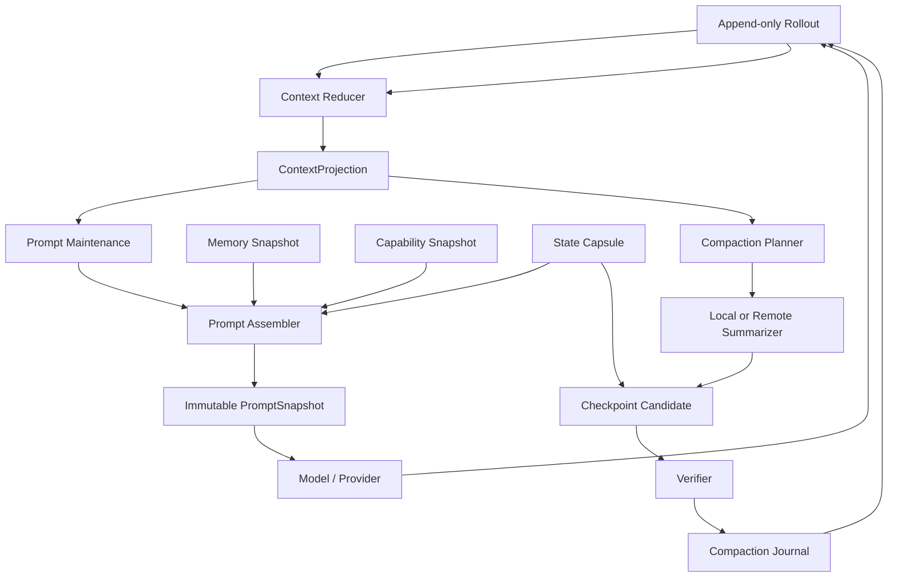

# 上下文管理对比与 V2 设计
## 1. 文档定位
本文先从源码层面对比 Grok Build 与 Codex 的上下文管理，再设计一套结合两者优势的新实现。重点回答：

+ 对话、Tool Call 和 Tool Result 如何进入在线上下文；
+ 模型当前看到的上下文与磁盘上的完整会话有什么区别；
+ 请求前如何裁剪大 Tool Result、图片和不完整调用；
+ 何时触发压缩，压缩模型看到什么；
+ 压缩后保留什么、丢弃什么；
+ 如何保存压缩结果，并在进程重启后恢复；
+ 如何同时兼顾任务连续性、Prompt Cache、确定性恢复和实现复杂度；
+ 新实现相对 Grok Build 与 Codex 分别带来什么收益。

源码范围：

+ Grok Build：`/Users/zhengguilin/Documents/个人项目/grodex/grok/grok-build`
+ Codex：`/Users/zhengguilin/Documents/个人项目/grodex/codex/codex/codex-rs`

本文提出的 V2 是后续演进方案，不代表任一项目已经完整实现。它与以下设计配套：

+ [Memory Retrieval V2](./08-memory-retrieval-v2-design.md)：长期记忆和证据检索；
+ [Agent Loop V2](./09-agent-loop-v2-design.md)：Session、Turn、Step 和 Tool 状态机；
+ [Tool、Skill 与 MCP V2](./10-tool-skill-mcp-v2-design.md)：能力目录和不可变能力快照。

## 2. 先看结论
Grok Build 与 Codex 的共同基础是：

> 完整会话事实与模型在线工作上下文必须分离。压缩只替换模型接下来看到的上下文投影，不应删除原始会话事实。
>

```latex
不可变会话事件日志
        |
        | reduce / replay
        v
在线上下文投影
        |
        | normalize / trim / attach
        v
模型请求
```

两者的主要倾向不同：

+ **Grok Build 把压缩看成 Agent 运行状态迁移。** 它不仅生成对话摘要，还显式恢复项目指令、最近消息、Todo、编辑文件、后台任务、Sub-agent、MCP、Skill 和 Memory 等状态。
+ **Codex 把压缩看成事件日志上的上下文投影切换。** rollout 是事实源，在线 `ContextManager` 是可变投影，`Compacted.replacement_history` 是恢复 checkpoint；同时按 Provider 能力选择本地摘要、远端压缩或新 context window。

新设计采用：

> 不可变 Rollout + 可重建 Context Projection + 结构化 State Capsule + 分层压缩 + 原子 Compaction Checkpoint。
>

它保留 Grok 的任务连续性，也保留 Codex 的事件溯源、Provider 适配和确定性恢复，同时把缓存稳定、失败降级和评估机制写成明确协议。

## 3. 必须先区分的四种数据
“上下文”这个词很容易同时指向四种不同数据。新实现必须在类型和存储上把它们拆开。

| 数据 | 作用 | 是否完整 | 是否可替换 |
| --- | --- | ---: | ---: |
| `rollout.jsonl` | 审计、恢复、UI、离线评估 | 尽量完整 | 只追加，不原地替换 |
| `ContextProjection` | 模型当前工作历史 | 有损 | 可以被压缩替换 |
| `PromptSnapshot` | 某一次采样实际发送的请求视图 | 精确到该 Step | 不可变 |
| `Memory/Evidence` | 跨会话事实和证据 | 独立治理 | 不由 compaction 直接改写 |


关键边界：

1. Tool Output 在 `ContextProjection` 中被截断，不代表 rollout 里的原始结果被删除。
2. compaction 替换 `ContextProjection`，不代表 UI transcript 被改成一条摘要。
3. Session summary 是上下文连续性材料，不自动等于长期 Memory。
4. Memory flush 可以从会话提炼候选记忆，但它不能成为 compaction 成功的前置条件。

## 4. Grok Build 当前实现
### 4.1 在线上下文结构
Grok 的在线结构是：

```rust
Vec<ConversationItem>
```

`ConversationItem` 主要包括：

```latex
System
User
Assistant
Reasoning
ToolResult
BackendToolCall
```

类型定义见 [conversation.rs](/Users/zhengguilin/Documents/个人项目/grodex/grok/grok-build/crates/codegen/xai-grok-sampling-types/src/conversation.rs:29)。这份数组由 `ChatStateActor` 独占修改，用户消息、Assistant 输出和 Tool Result 通过 Actor command 串行追加。

它的优势是状态所有权清楚：并发任务不能随意改写对话数组。但在线上下文、`chat_history.jsonl` 和 UI 更新流具有不同用途，不能把它们视为同一份数据。

### 4.2 消息追加和持久化
主路径是：

```latex
用户输入
  -> ChatState command
  -> append User
  -> persist_message(chat_history.jsonl)
  -> 模型响应
  -> append Assistant / Reasoning / Tool Call
  -> Tool 执行
  -> append ToolResult
```

普通追加会同步更新当前在线历史，并通过 `ChatPersistence` 追加到 `chat_history.jsonl`。压缩或 rewind 则通过整体 replacement 改写当前可恢复历史。

Grok 另外维护 `updates.jsonl`，保存更完整的 UI/session 更新流。因此在线历史被压缩后，旧 UI 事件仍可以保留。

### 4.3 请求前维护
构造模型请求时，Grok 不会直接无条件克隆全部历史，而会执行多层维护：

1. 检查并修复 Tool Call 与 Tool Result 配对；
2. 上下文使用率较高后，按新旧程度裁剪 Tool Result；
3. 很旧的 Tool Result 替换为稳定占位文本；
4. 较新的大 Tool Result 保留头尾，删除中间内容；
5. 请求体接近大小上限时移除最旧内联图片；
6. 按需要加入 Memory 或状态 reminder。

典型占位文本是：

```latex
[Tool result omitted — too old]
```

这类裁剪主要在请求副本上执行，避免每次维护都改写稳定历史，从而降低 Prompt Cache 失效概率。

### 4.4 压缩触发
默认自动压缩阈值是上下文窗口的 85%。策略还包含：

```latex
auto_compact_threshold_percent
compact_model
memory_flush_enabled
wall_clock_budget_secs
two_pass_enabled
```

除阈值外，还可能由以下情况触发：

+ 用户手动压缩；
+ 模型切换后新窗口更小；
+ 采样前估算即将超限；
+ 模型返回 context overflow；
+ two-pass 预压缩达到预生成阈值。

### 4.5 压缩输入
默认的有损压缩输入会：

| 原始内容 | 给总结模型的形式 |
| --- | --- |
| User 文本 | 保留 |
| Assistant 普通文本 | 保留 |
| Assistant Tool Call | 展平为调用说明 |
| Tool Result | 删除正文 |
| Reasoning | 删除 |
| 图片 | 替换为 `[image]` |


Grok 也支持 verbatim 模式：尽量原样保留 Tool I/O 和图片，以提高忠实度和 Prompt Cache 命中。当输入超预算时，它优先按完整 Turn 从最旧处删除，不拆散 Tool Call/Result 对；最后一个单元仍过大时才做局部截断。

two-pass 模式则先在接近阈值时后台总结旧前缀，真正压缩时再总结“旧前缀摘要 + 最近尾部”。

### 4.6 压缩输出
Grok 不是只用一条摘要替换全部历史，而是重建：

```latex
System
User metadata / project layout
AGENTS.md / project instructions
Last real user query
Recent messages
Compaction summary
State reminder
```

`State reminder` 可以重新注入：

+ 已编辑文件；
+ Todo；
+ 后台任务；
+ Sub-agent；
+ MCP Server；
+ Skill；
+ Memory 检索结果；
+ Plan mode。

构造入口见 [compaction_utils.rs](/Users/zhengguilin/Documents/个人项目/grodex/grok/grok-build/crates/codegen/xai-chat-state/src/compaction_utils.rs:839)。这使 compaction 更接近“任务运行状态迁移”，而不只是聊天摘要。

### 4.7 压缩持久化与恢复
Grok 至少有三层数据：

| 存储 | 内容 |
| --- | --- |
| `chat_history.jsonl` | 当前可恢复的在线对话历史 |
| `updates.jsonl` | 原始 UI/session 更新流 |
| `compaction_checkpoints/<id>.json` | 一次压缩后的完整 replacement history |


压缩提交大致是：

```latex
生成 summary
  -> build_compacted_history
  -> 清理 orphan ToolResult
  -> 写 compaction checkpoint
  -> updates.jsonl 写 checkpoint marker
  -> replace_conversation_for_compaction
  -> 重算 token
```

恢复时读取最近 checkpoint，再重放 checkpoint 之后的更新。checkpoint 创建和 marker 持久化见 [compaction.rs](/Users/zhengguilin/Documents/个人项目/grodex/grok/grok-build/crates/codegen/xai-grok-shell/src/session/compaction.rs:2152)，在线历史 replacement 见同文件的 [压缩提交路径](/Users/zhengguilin/Documents/个人项目/grodex/grok/grok-build/crates/codegen/xai-grok-shell/src/session/compaction.rs:1649)。

### 4.8 Grok 的优势与不足
优势：

+ compaction 明确恢复 Agent 的活动状态，任务连续性强；
+ 支持 lossy、verbatim、two-pass 等多种输入策略；
+ Actor 独占在线历史，状态写入边界清楚；
+ 能处理 Tool Result、图片和协议配对等实际大上下文问题。

不足：

+ `chat_history`、`updates` 和独立 checkpoint 形成多套相近数据，需要维护一致性；
+ 状态 reminder 主要是渲染文本，结构化校验和版本迁移能力有限；
+ summary、recent messages、last query 和 reminder 可能表达重复信息；
+ checkpoint 落盘、marker 落盘和在线 replacement 不是天然的单事务；
+ two-pass 和 memory flush 增加了并发、超时和失败状态，但缺少统一 journal 协议；
+ 压缩质量主要依赖提示词，缺少与 rollout 结合的系统化回放评估。

## 5. Codex 当前实现
### 5.1 在线上下文结构
Codex 使用：

```rust
ContextManager {
    items: Arc<Vec<ResponseItem>>,
    history_version: u64,
    token_info: ...,
    reference_context_item: ...,
    world_state_baseline: ...,
}
```

`ResponseItem` 包括：

```latex
Message / AgentMessage
Reasoning
FunctionCall / FunctionCallOutput
CustomToolCall / Output
LocalShellCall
ToolSearchCall / Output
Compaction / ContextCompaction
AdditionalTools
```

`history_version` 在整体 replacement 后递增，用于使旧快照失效。`reference_context_item` 和 `world_state_baseline` 用于判断初始上下文和工作区状态是全量重注入还是增量更新。

追加、请求前 normalize 和整体 replacement 的入口见 [history.rs](/Users/zhengguilin/Documents/个人项目/grodex/codex/codex/codex-rs/core/src/context_manager/history.rs:125)。

### 5.2 消息追加和在线截断
主路径是：

```latex
模型或 Runtime 产生 ResponseItem
  -> rollout 追加事实事件
  -> ContextManager.record_items
  -> 过滤不属于 API history 的 item
  -> 截断过长 Function/Custom Tool Output
  -> 加入在线历史
```

因此 rollout 和在线历史从一开始就允许不同：

+ rollout 保存恢复和审计所需事实；
+ `ContextManager` 保存适合继续发给模型的有损工作视图。

这比“先把完整结果写进在线 history，快满时再清理”更早建立数据边界。

### 5.3 请求前 normalize
`for_prompt()` 在发送前执行：

```latex
有 Tool Call 但没有 Output
  -> 生成稳定的 aborted Output

有孤立 Output
  -> 删除

模型不支持图片或音频
  -> 移除或降级
```

这保证每次请求满足 API 对 Tool Call/Output 配对和输入模态的要求。

### 5.4 压缩触发
Codex 不使用一个统一的固定百分比，而是由模型和配置提供：

```latex
model_auto_compact_token_limit
model_auto_compact_token_limit_scope
full_context_window
auto_compact_fallback_buffer_tokens
```

scope 支持：

+ `Total`：统计完整活跃上下文；
+ `BodyAfterPrefix`：只统计稳定前缀之后新增的正文。

token scope 与 hard limit 的判断见 [context_window.rs](/Users/zhengguilin/Documents/个人项目/grodex/codex/codex/codex-rs/core/src/session/context_window.rs:30)，pre-turn、mid-turn 和 model downshift 的调度见 [turn.rs](/Users/zhengguilin/Documents/个人项目/grodex/codex/codex/codex-rs/core/src/session/turn.rs:983)。

压缩可以发生在：

+ 新 Turn 采样前；
+ Turn 内 Tool 结果提交后、还需要继续采样时；
+ 切换到更小 context window 的模型时；
+ compaction compatibility hash 变化时；
+ Provider 或 token-budget 机制要求开启新 context window 时。

### 5.5 三类压缩实现
Codex 会按 Feature 和 Provider 能力选择：

```latex
TokenBudget enabled
  -> 不调用总结模型，安装新的 context window

Provider supports remote compaction
  -> 调用远端 compaction

otherwise
  -> 本地 summarization prompt
```

这使“上下文生命周期”成为 Provider 能力的一部分，而不强制所有模型使用同一种摘要协议。

### 5.6 本地压缩输出
本地压缩先让模型生成 summary，再构造：

```latex
最近的真实 User messages，总计最多约 20,000 token
Compaction summary，编码为带固定前缀的 User message
```

普通 Assistant、Tool Call、Tool Result 和 Reasoning 不直接进入 replacement history，只能通过摘要间接保留。

最近 User 消息的 20,000 token 预算和 replacement history 构造见 [compact.rs](/Users/zhengguilin/Documents/个人项目/grodex/codex/codex/codex-rs/core/src/compact.rs:622)。

中途压缩时，Codex 会把 canonical initial context 和当前 world state 插入到最后一个真实用户消息之前；pre-turn/manual compaction 则让下一次正常 Turn 全量重注入初始上下文。

### 5.7 远端压缩输出
远端压缩允许 Provider 返回压缩后的 `ResponseItem`。客户端会过滤：

+ 过期或重复 developer 内容；
+ Tool Call/Output；
+ Reasoning；
+ AdditionalTools；
+ 不适合继续进入 history 的协议项目。

远端 V2 保留有限预算内的真实 User 消息、部分非最终 AgentMessage 和输入图片，再追加一个服务端 `Compaction` item。

远端输出的保留过滤见 [compact_remote.rs](/Users/zhengguilin/Documents/个人项目/grodex/codex/codex/codex-rs/core/src/compact_remote.rs:336)，V2 replacement history 组装见 [compact_remote_v2.rs](/Users/zhengguilin/Documents/个人项目/grodex/codex/codex/codex-rs/core/src/compact_remote_v2.rs:442)。

### 5.8 rollout 与 checkpoint 恢复
Codex 将每个重要事件追加到 rollout。压缩成功时追加：

```latex
RolloutItem::Compacted {
    replacement_history,
    window_number,
    ...
}
```

恢复时：

```latex
找到最近有效 Compacted checkpoint
  -> replacement_history 作为 ContextManager 基线
  -> 重放其后的 rollout suffix
  -> 重建在线上下文和 world state baseline
```

旧 rollout 项不会因为压缩被物理删除。它形成了清楚的事件溯源语义：

```latex
rollout = 事实源
ContextManager = 当前上下文投影
Compacted = 新投影的 checkpoint
```

checkpoint 与 rollout suffix 的重建入口见 [rollout_reconstruction.rs](/Users/zhengguilin/Documents/个人项目/grodex/codex/codex/codex-rs/core/src/session/rollout_reconstruction.rs:318)。

### 5.9 Codex 的优势与不足
优势：

+ rollout 与在线投影边界明确，可审计、可恢复；
+ checkpoint 直接携带 replacement history，恢复算法清楚；
+ Provider 能力决定本地、远端或新窗口策略，兼容性强；
+ `history_version`、world state baseline 和 context item 为增量上下文提供结构化基础；
+ Tool Output 在进入在线历史时就截断，避免单个结果迅速污染整个窗口；
+ pre-turn、mid-turn 和 model downshift 都有明确触发点。

不足：

+ 本地 replacement history 主要保留 User 消息和 summary，执行过程保真度较低；
+ Todo、子任务、后台进程、已修改文件等任务状态主要依赖 initial context/world state 或摘要，没有统一的结构化恢复胶囊；
+ 近期有效 Assistant/Tool 证据可能在一次压缩后全部离开在线上下文；
+ 本地、remote V1、remote V2 和 TokenBudget 多条路径需要维持相同恢复不变量；
+ summary 仍然存在遗漏和错误归纳风险，当前结构不能自动证明“任务关键状态均已覆盖”。

## 6. 原实现直接对比
| 维度 | Grok Build | Codex |
| --- | --- | --- |
| 在线历史 | `Vec<ConversationItem>` | `ContextManager<Vec<ResponseItem>>` |
| 完整事实源 | `updates.jsonl` 等多层存储 | rollout JSONL |
| 普通消息持久化 | `chat_history.jsonl` | rollout item/event |
| Tool Output 降载 | 请求前按新旧裁剪 | 入 history 时截断，必要时二次改写 |
| 自动触发 | 默认窗口 85% | 模型/Provider token limit + scope |
| 压缩输入 | lossy / verbatim / two-pass | local / remote / token-budget |
| 本地压缩保留 | recent messages + summary + state reminder | 最近 User messages + summary |
| 活动状态恢复 | 显式且丰富 | initial context + world state baseline |
| checkpoint | 独立文件 + update marker | rollout 内 `Compacted` item |
| resume | checkpoint + updates replay | replacement history + rollout suffix |
| Prompt Cache | verbatim 与稳定 prefix | prefix scope、远端 compaction、context window |
| 主要优势 | 任务连续性 | 事实源与投影边界、Provider 适配 |
| 主要风险 | 多存储一致性和复杂文本 reminder | 压缩后执行状态保真度不足 |


## 7. 新设计目标
新实现必须满足以下目标：

1. **事实不丢失。** compaction 不删除 rollout 中的历史事实。
2. **任务可继续。** 压缩后保留当前目标、计划、已完成工作、活动资源和下一步。
3. **恢复确定。** 相同 checkpoint 和 rollout suffix 必须重建相同在线投影。
4. **缓存稳定。** Turn 内默认不改 leading context；动态变化在明确边界采纳。
5. **协议有效。** Tool Call/Output、图片、模态和 Provider 约束始终满足。
6. **策略可替换。** local、remote 和 no-summary rollover 共用同一安装协议。
7. **失败可降级。** memory flush、two-pass 或 summary 失败不能卡死主 Loop。
8. **内容可追溯。** summary 和 State Capsule 的关键结论能够指向 rollout 证据。
9. **可评估。** 能离线回放并测量压缩前后任务连续性，而不只统计压缩率。
10. **实现可分期。** V1 不依赖向量检索或复杂多模型 pipeline 才能工作。

非目标：

+ 不要求把完整 Tool Output 永久放入每次模型请求；
+ 不把 Session summary 自动提升为长期 Memory；
+ 不让 compaction 修改 Capability、Policy 或 Sandbox 权限上界；
+ 不追求压缩后逐 token 重现原始推理过程；
+ 不让多个 compaction 同时提交到同一 Session。

## 8. 新架构总览


核心组件：

| 组件 | 职责 |
| --- | --- |
| `RolloutStore` | 保存不可变事件和大结果 blob |
| `ContextReducer` | 从 checkpoint + suffix 重建在线投影 |
| `ContextProjection` | 模型工作历史和 token 统计 |
| `PromptAssembler` | 合并稳定前缀、Turn 快照和动态尾部 |
| `PromptMaintenance` | Tool Result 裁剪、模态降级、配对修复 |
| `CompactionPlanner` | 判断何时压缩、压缩哪一段、使用哪种策略 |
| `StateCapsuleBuilder` | 从 Runtime 权威状态生成结构化任务恢复包 |
| `CompactionVerifier` | 检查预算、协议、状态覆盖和证据引用 |
| `CompactionJournal` | 保证 checkpoint 安装可恢复、可幂等重放 |


## 9. 统一数据模型
### 9.1 Rollout 事件信封
```latex
RolloutEvent {
  schema_version,
  seq,
  session_id,
  turn_id?,
  step_id?,
  generation?,
  timestamp,
  event_type,
  payload,
  sensitivity,
}
```

重要事件包括：

```latex
UserInputAccepted
ModelItemProduced
ToolCallPrepared
ToolExecutionStarted
ToolExecutionFinished
ToolResultCommitted
ProjectionPruned
RuntimeStateChanged
PromptSnapshotBuilt
CompactionStarted
CompactionCandidateBuilt
CompactionCommitted
CompactionFailed
TurnCompleted
```

大 Tool Output 不直接塞进 JSONL，而是写 content-addressed blob：

```latex
blobs/<sha256>
```

rollout 只保存 hash、大小、MIME、脱敏状态和 preview。这样兼顾完整证据、JSONL 可读性和上下文按需加载。

### 9.2 在线 ContextProjection
```latex
ContextProjection {
  checkpoint_id,
  history_version,
  items: Vec<ContextItem>,
  token_accounting,
  maintenance_policy_version,
  tokenizer_version,
  reference_context,
  world_state_baseline,
  state_capsule_id,
  source_seq_range,
}
```

`ContextItem` 是统一内部类型，至少能表达：

```latex
System / Developer
User / Assistant
ProviderReasoningEnvelope
ReasoningSummary
ToolCall / ToolResult
CompactionSummary
RuntimeAttachment
Image / Audio placeholder
```

Provider adapter 负责把 `ContextItem` 转换成 OpenAI Responses、Chat Completions、Anthropic Messages 或其他协议。上下文管理层不直接绑定某一种 wire API。

`ProviderReasoningEnvelope` 表示 Provider 要求在同一 Turn 内原样回传的 reasoning item，例如 OpenAI Responses 的加密 reasoning block。它不是可展示的思维文本，也不能被 Runtime 展开。生命周期由 Provider adapter 声明：Turn 内原样保留并参与请求，只有在 Provider 明确允许的 Turn/compaction 边界才丢弃或替换为 `ReasoningSummary`。普通 micro-prune 不得删除仍被当前 Provider continuation 依赖的 envelope。

### 9.3 PromptSnapshot
每个 Step 构造不可变快照：

```latex
PromptSnapshot {
  snapshot_id,
  session_id,
  turn_id,
  step_id,
  context_history_version,
  capability_snapshot_id,
  memory_snapshot_id,
  policy_generation,
  sandbox_generation,
  provider_format,
  maintenance_policy_version,
  tokenizer_version,
  ordered_items_hash,
  token_estimate,
}
```

`ordered_items_hash` 用于恢复、调试 Prompt Cache 和离线重放。它只记录 hash，不在普通日志重复输出敏感正文。

`maintenance_policy_version` 和 `tokenizer_version` 必须随快照、`CompactionPlan` 和裁剪事件落盘。正常重放以事件中已经生成的有界结果和 `ProjectionPruned` replacement 为准，不重新运行旧裁剪算法；版本字段用于解释历史、校验兼容性，以及旧日志缺少结果事件时的受控降级。

### 9.4 结构化 State Capsule
```latex
StateCapsule {
  schema_version,
  objective,
  latest_user_intent,
  pending_inputs[],
  plan,
  completed_steps,
  pending_steps,
  edited_files,
  observed_files,
  active_processes,
  background_tasks,
  subagents,
  approvals,
  mcp_state,
  selected_skills,
  memory_snapshot_refs,
  unresolved_errors,
  next_action,
  evidence_refs,
}
```

State Capsule 不是让总结模型自由编写的 Markdown。它主要从 Runtime 权威状态生成：

+ Tool journal 提供运行中和已完成 Tool；
+ Todo/Plan store 提供计划状态；
+ file tracker 提供已读写文件；
+ process supervisor 提供后台命令；
+ sub-agent coordinator 提供子任务；
+ Input Queue 按到达顺序提供尚未采样的 `pending_inputs` 原文和稳定 ID；
+ MCP/Skill manager 提供本 Turn 已采用的能力；
+ MemorySnapshot 提供本 Turn 已注入的记忆引用。

LLM 只能补充 `objective`、`decision_summary`、`unresolved_errors` 等语义字段，不能伪造 Runtime 状态。

## 10. 上下文分区与缓存策略
模型请求按稳定性分成四区：

```latex
Zone A: Session Stable Prefix
  base instructions
  project trust / root instructions
  stable core tool schemas

Zone C: Compaction Baseline
  compaction summary
  rendered State Capsule
  retained recent messages

Zone B: Turn Stable Snapshot
  Turn objective
  selected Memory refs/content
  selected Skill descriptors
  capability generation baseline

Zone D: Step Tail
  new user input
  model output
  tool calls/results
  pending input / runtime notifications
```

规则：

1. Zone A 只在 Session 重新初始化、信任或安全策略收紧时变化。
2. Zone C 只在 compaction checkpoint 安装时变化，因此必须排在每 Turn 变化的 Zone B 之前。
3. Zone B 默认在 Turn 内固定，避免 Memory/Skill 每 Step 重新排序打爆缓存。
4. Zone D 按正常 Agent Loop 追加。
5. MCP 或 Skill 普通刷新默认下一 Turn 采纳；安全收紧立即通过执行面生效，但不必重写当前 leading prompt。
6. Turn 内必须暴露新 Tool 时，使用 Deferred promotion overlay；仅告知 staged 变化时使用 [Agent Loop V2 §9.1](./09-agent-loop-v2-design.md#91-termination-gate-的输入协议) 的 runtime 合成消息协议：`author=runtime`、版本化模板、结构化参数，并进入 transcript 和 `input_hash`，不得新造临时注入通道。

稳定性顺序必须单调递减：

```latex
A（Session 级） -> C（Compaction Window 级） -> B（Turn 级） -> D（Step 级）
```

如果使用 `A -> B -> C -> D`，每次新 Turn 都会使位于 B 后面的 summary、State Capsule 和 retained tail 缓存失效，即使本 compaction window 的 C 完全没变。

这统一了 Memory、Loop 和 Capability 三份设计的缓存立场：

> 默认 Turn 内稳定；只有显式提升、安全收紧或 stale-call 恢复允许提前改变行为。
>

## 11. 消息追加协议
### 11.1 两阶段写入
任何新消息都先成为 rollout 事实，再进入在线投影：

```latex
produce item
  -> validate envelope
  -> append rollout event
  -> fsync policy / durable ack
  -> reducer applies event
  -> ContextProjection version++
  -> emit UI projection
```

对纯 UI delta 可以采用批量 fsync，但有副作用的 Tool Result、审批决定和 compaction commit 必须在向模型继续之前持久化。

### 11.2 Tool 执行结果
```latex
Tool execution finishes
  -> raw result to blob store
  -> ToolExecutionFinished(result_ref)
  -> build bounded ContextToolResult(preview + ref)
  -> ToolResultCommitted
  -> reducer appends bounded result
```

这样吸收 Codex“在线 history 早截断”的优点，也吸收大结果外置和显式读取的模式。Agent 如果需要完整结果，可通过 `artifact.read`/`tool_result.read` 定点读取，而不是让所有后续 Step 永久携带完整正文。

### 11.3 确定性提交
Tool 批次可以并发执行，但结果按模型调用顺序提交：

```latex
execution completion order: C, A, B
commit sequence:            A, B, C
```

完成事件可立即进入 journal，模型可见 `ToolResultCommitted` 必须按 `CommitSequence` 排序。这样 PromptSnapshot 不依赖线程调度时序。

## 12. 请求前分层维护
维护分为两类，不能用“投影或请求副本”模糊处理：

+ **会改变模型历史语义的维护**，例如 Tool Result 有界化和年龄分层 micro-prune，必须在 Step commit 边界生成显式 rollout 事件并更新 `ContextProjection`；
+ **只针对 Provider wire format 的适配**，例如角色映射、当前 Provider 不支持的模态降级和 continuation reasoning envelope 回传，只生成不可变 `PromptSnapshot`，不反向改写投影。

因此，同一 rollout 可以确定性重建同一投影；同一 projection + Provider/策略版本也可以重建同一请求快照。

### 12.1 Level 0：协议修复
+ 缺失 Tool Output：生成带稳定 ID 的 `aborted` output；
+ orphan Tool Output：从请求视图移除并记录诊断；
+ Provider 不支持的模态：转换为带 artifact 引用的占位符；
+ 参数或 Tool revision 过期：不执行旧调用，返回 stale result 让模型重采样；
+ Provider 要求 continuation reasoning item 原样回传：在当前 Turn 的请求视图中保留 `ProviderReasoningEnvelope`；到达合法 compaction/跨 Turn 边界后才按 Provider 规则丢弃。

### 12.2 Level 1：写入时有界化
所有 Tool Result 在进入 `ContextProjection` 时都有类型化预算：

| 类型 | 默认策略 |
| --- | --- |
| Bash 日志 | 头尾保留 + 行数/token 统计 + blob ref |
| 文件内容 | 保留请求范围 + path/hash + blob ref |
| 搜索结果 | 保留 Top K + 总命中数 |
| JSON | 保持 JSON 有效的结构化截断 |
| 图片/音频 | metadata + artifact ref，不重复内联 |
| MCP Result | 按 content type 分项预算 |


原始结果先写 artifact/blob，随后将“有界结果正文、artifact ref、`maintenance_policy_version`、`tokenizer_version`”作为 `ToolResultCommitted` 事件落盘。Reducer 直接应用已经确定的结果，不在恢复时按当前配置重新截断旧输出。

### 12.3 Level 2：年龄分层 micro-prune
当上下文超过 soft watermark 时：

```latex
最近 Tool Result       保留有界 preview
中等年龄 Tool Result   缩为摘要 + ref
很旧 Tool Result       缩为稳定占位符 + ref
```

Tool Call/Result 的逻辑配对必须保留。micro-prune 不生成全局摘要，不改变 User/Assistant 叙事，只降低重复工具证据占用。

micro-prune 固定作用于在线投影，不是每次请求临时重新计算：

```latex
Step batch committed
  -> evaluate soft watermark with recorded policy/tokenizer version
  -> build exact item replacements
  -> append ProjectionPruned {
       source_history_version,
       replacement_items,
       maintenance_policy_version,
       tokenizer_version
     }
  -> reducer applies replacements
  -> history_version++
```

这样一次裁剪只造成一次明确的缓存边界。若只在请求副本按“年龄”动态裁剪，边界会随每个 Step 漂移，既持续破坏 Prompt Cache，也无法仅靠 rollout 重放出相同的 `ContextProjection` hash。

### 12.4 Level 3：图片和请求字节预算
token 预算之外单独计算：

+ 序列化字节；
+ 图片数量和总大小；
+ Provider 单请求上限；
+ Tool schema 大小。

图片优先外置为 artifact；确需内联时，从最旧、最易重新读取的图片开始淘汰。

## 13. 压缩触发策略
使用两个水位和一个硬上限：

```latex
soft watermark
  -> micro-prune / 可选后台预摘要

compact watermark
  -> 在已提交 Step 边界执行 full compaction

hard provider limit
  -> 禁止继续采样，必须压缩或降级
```

默认值可以先沿用 Grok 的经验值：

```latex
compact watermark = context window * 85%
```

但最终值优先使用 Provider/Model metadata；如果 Provider 给出专用 `auto_compact_token_limit`，使用该值而不是固定比例。

触发条件：

1. pre-turn 发现当前投影已经达到 compact watermark；
2. mid-turn Tool batch 已全部提交，仍需继续且达到 watermark；
3. 模型切换后窗口或 compaction compatibility 变小；
4. Provider 返回 context overflow；
5. 用户手动触发；
6. 管理面请求 context rollover。

禁止在以下边界安装 compaction：

+ 模型流还没有结束；
+ Tool batch 有结果尚未按顺序 commit；
+ 有副作用 Tool 状态仍只有内存记录；
+ 审批结果尚未持久化；
+ 当前 Step generation 已失效。

## 14. Compaction Planner
Planner 输出一份显式计划：

```latex
CompactionPlan {
  source_history_version,
  source_seq_end,
  trigger,
  strategy,
  prefix_boundary,
  retained_tail_boundary,
  input_budget,
  output_budget,
  provider,
  maintenance_policy_version,
  tokenizer_version,
  state_capsule_id,
  deadline,
}
```

### 14.1 压缩范围
投影拆成：

```latex
[stable prefix] [old committed history] [recent committed tail]
```

+ stable prefix 不交给摘要模型反复改写；
+ old committed history 是主要摘要对象；
+ recent tail 尽量原样保留，但必须按完整语义单元切分；
+ 切点不能位于 Tool Call/Result 中间；
+ 未提交、运行中和 awaiting approval 的项目不进入压缩输入。

### 14.2 策略选择
```latex
Provider remote compaction 可用且已验证
  -> RemoteStructured

本地总结模型可用
  -> LocalStructured

上下文服务支持新窗口且已有可靠 State Capsule
  -> ContextRollover

否则
  -> DeterministicFallback
```

策略选择不能只看能力存在，还要看历史成功率、预计延迟、隐私策略和当前 deadline。

## 15. 压缩输入策略
采用三档输入 ladder，吸收 Grok verbatim/lossy 和 Codex Provider 分流的优点。

### 15.1 A 档：Structured Verbatim
预算足够时保留完整语义单元：

+ User/Assistant 文本；
+ Tool Call 名称和参数摘要；
+ 有界 Tool Result + artifact ref；
+ 用户可见 reasoning summary，不保留隐藏 chain-of-thought；
+ 图片 metadata 和 ref；
+ rollout evidence ID。

目标是让总结模型能区分“模型计划做什么”和“工具实际完成了什么”。

### 15.2 B 档：Fitted Verbatim
超预算时：

1. 保留 System/稳定指令的 hash 和引用，不重复全文；
2. 从最旧 Turn 开始整段删除；
3. 优先把 Tool Result 正文替换为摘要 + artifact ref；
4. 不拆 Tool Call/Result；
5. 保留用户纠正、失败验证和最终执行结果；
6. 最后一个单元仍过大时才截断。

### 15.3 C 档：Lossy Semantic
仍然超预算时：

+ 删除普通 Tool Result 正文；
+ Tool Call 展平为结构化操作记录；
+ 图片只保留描述/ref；
+ 保留所有用户纠正和明确约束；
+ 保留错误、验证失败和后续修复之间的因果链；
+ 保留 `StateCapsule`，不依赖摘要模型重建 Runtime 状态。

### 15.4 Two-pass 只作为优化
后台预摘要可以降低最终压缩延迟，但必须满足：

+ 预摘要固定 `source_seq_end`；
+ 新事件不能悄悄进入旧预摘要；
+ 最终压缩验证 source hash；
+ 预摘要失败只退回单阶段压缩；
+ 预摘要不能直接安装 checkpoint。

因此 two-pass 是性能优化，不是正确性依赖。

## 16. 压缩输出协议
总结模型返回结构化结果，而不是自由 Markdown：

```latex
CompactionSummary {
  schema_version,
  objective,
  user_constraints[],
  decisions[],
  completed_work[],
  failed_attempts[],
  validations[],
  unresolved_questions[],
  next_action,
  evidence_refs[],
  narrative,
}
```

每个关键项可带：

```latex
EvidenceRef {
  rollout_seq_start,
  rollout_seq_end,
  artifact_hash?,
  source_kind,
}
```

新的 replacement history 统一构造成：

```latex
Stable Session Prefix
Compaction Summary
Rendered State Capsule
Retained Recent Tail
Compaction Boundary Marker
Turn Stable Snapshot
```

即缓存分区顺序为 `A -> C -> B -> D`：稳定 Session 前缀之后，先安装跨多个 Turn 存活的 compaction baseline，再安装每 Turn 变化的目标、Memory、Skill 和能力基线，最后追加本 Step 的新事件。这里 `Retained Recent Tail` 属于 Zone C；当前 Turn 在它之后产生的新消息属于 Zone D。

与 Grok 当前顺序相比，summary 放在 retained recent tail 之前。这样模型先获得旧历史概况，再顺序阅读最近原文，不会让摘要出现在最近消息之后造成时间线倒置；Turn Snapshot 又位于整个 compaction baseline 之后，不会让每次开新 Turn 都使 C 区缓存失效。

最近最后一个真实用户问题如果已经完整存在于 retained tail，就不重复注入；只有 tail 不含它时才从 State Capsule 恢复。所有去重依据结构化 ID，而不是文本相似度猜测。

## 17. Compaction Verifier
候选 replacement history 安装前必须通过确定性校验。

### 17.1 协议校验
+ 所有 Tool Result 有对应且在前的 Tool Call；
+ 不支持的模态已降级；
+ Provider role 和 item 类型合法；
+ Compaction item 的位置满足 Provider 要求；
+ 没有未完成 Tool 被伪装成已完成。

### 17.2 状态覆盖校验
以下 Runtime 权威状态必须在 State Capsule 中有记录：

+ pending/running background task；
+ active sub-agent；
+ 未完成 Todo；
+ 按到达顺序保存、尚未被模型采样的 pending input；
+ 已修改但未验证的文件；
+ 等待用户决定的问题；
+ 最近一次失败验证；
+ 当前 Memory/Skill/Capability snapshot 引用。

这不是要求 summary 逐字包含它们，而是保证压缩后仍有结构化恢复通道。

### 17.3 预算校验
同时计算：

+ token 估算；
+ 序列化字节；
+ 图片预算；
+ Tool schema 预算；
+ 预留输出和 Tool Result headroom。

压缩后不能只“刚好低于窗口”，推荐目标是回落到窗口的 45% 至 60%，避免很快再次压缩。具体值通过 eval 调整。

45% 至 60% 是目标区间，不是小窗口下必须满足的硬门槛。预算不可满足时按固定顺序降级：

```latex
1. 减少 retained recent tail，但不拆 Tool Call/Result 和 pending input
2. Structured Verbatim -> Fitted Verbatim
3. Fitted Verbatim -> Lossy Semantic
4. 缩短 narrative，只保留结构化 summary 和证据引用
5. 使用 DeterministicFallback
6. 仍超过 Provider hard limit：停止采样并返回可诊断错误，不发送超限请求
```

State Capsule 的权威运行状态、最后真实用户目标和 pending input 不参与普通 tail 淘汰。

### 17.4 Source fence
候选必须绑定：

```latex
source_history_version
source_seq_end
state_capsule_hash
stable_prefix_hash
maintenance_policy_version
tokenizer_version
```

任一值变化，旧候选不得直接安装。Planner 可以基于新状态重试，不能把旧摘要覆盖到新对话上。

## 18. 原子提交与恢复
### 18.1 Journal 协议
```latex
1. append CompactionStarted(plan)
2. build summary and candidate
3. append CompactionCandidateBuilt(candidate_ref)
4. verifier passes
5. append CompactionCommitted(replacement_history, hashes)
6. reducer installs checkpoint and history_version++
7. emit UI completion
```

`CompactionCommitted` 是语义提交点。在线内存先替换但 commit 未落盘是禁止的。

### 18.2 崩溃恢复
启动时：

```latex
找到最后一个有效 CompactionCommitted
  -> 安装 replacement history
  -> 重放后续 rollout events
  -> 重建 State Capsule/World State baseline
```

如果只看到 `Started` 或 `CandidateBuilt`，说明压缩没有提交：

+ 不安装 candidate；
+ 继续使用前一个 checkpoint + suffix；
+ candidate blob 可以进入垃圾回收；
+ 记录 interrupted compaction 诊断。

该协议消除了“checkpoint 文件已写，但 marker 未写”或“内存已替换，但磁盘未提交”的歧义。

### 18.3 幂等性
`CompactionCommitted` 使用稳定 `compaction_id`。Reducer 重放同一 commit 时：

+ replacement history hash 相同：忽略重复；
+ hash 不同：视为日志损坏，停止自动恢复并进入诊断模式。

## 19. Memory Flush 的边界
Memory flush 与 context compaction 并行相关，但不是同一件事：

```latex
Context compaction
  目标：让当前会话能继续
  输出：summary + State Capsule + checkpoint

Memory flush
  目标：提取可能跨会话有价值的候选事实
  输出：candidate memory / session evidence
```

规则：

1. compaction 达到 soft watermark 时可以触发异步 flush；
2. flush 读取固定 `source_seq_end` 的 rollout 快照；
3. flush 有独立 deadline 和 cancellation token；
4. compaction 最多等待一个很短的同步预算，例如 500ms 至 2s；
5. 超时或失败时 compaction 继续，写入 `MemoryFlushDeferred`；
6. 后台 flush 成功后不能改写当前 Turn 的 stable MemorySnapshot，只对下一 Turn 生效；
7. flush 结果进入 Candidate Store，不直接成为 Verified Memory。

这样保留 Grok“压缩前抢救有价值信息”的意图，又避免记忆写入反过来卡死主 Loop。

## 20. Provider 适配
本节只规定 compaction 对 Provider 的需求；完整的 canonical ContextItem 到 wire 映射、streaming decoder、reasoning envelope、token counter、retry 和模型切换协议由 [Provider / Model 适配层 V2](./14-provider-model-adapter-v2-design.md) 定义。`CompactionBackend` 必须复用同一 `ModelBinding`、认证、usage 和 error taxonomy，不能成为绕开 Provider Runtime 的第二套模型客户端。

统一接口：

```latex
trait CompactionBackend {
  capabilities() -> CompactionCapabilities
  compact(input, plan) -> CompactionBackendOutput
}
```

能力描述包括：

```latex
supports_remote_compaction
supports_structured_output
supports_compaction_item
supports_context_rollover
max_input_tokens
max_output_tokens
retained_modalities
privacy_boundary
```

### 20.1 LocalStructured
+ 使用指定 compact model；
+ 输入经过统一 ladder；
+ 输出必须通过 JSON Schema 校验；
+ 非法输出允许有限次数修复或重试；
+ 最终失败进入 DeterministicFallback。

### 20.2 RemoteStructured
+ Provider 输出先转成内部 `CompactionSummary`/`ContextItem`；
+ 客户端仍执行统一 verifier；
+ 远端返回的 developer/system 内容不能直接覆盖本地 canonical instructions；
+ 远端 compaction 失败可按策略回退本地模型；
+ 输入出网必须满足 workspace 隐私策略。

### 20.3 ContextRollover
如果 Provider 支持服务端新 context window：

+ 新窗口仍安装 State Capsule 和 retained tail；
+ rollover 也必须写 `CompactionCommitted`；
+ 不能因为“不生成摘要”就跳过审计和恢复 checkpoint；
+ 若服务端状态不可恢复，必须额外保存客户端 replacement projection。

### 20.4 DeterministicFallback
所有 LLM 压缩都失败时，使用纯规则构造：

```latex
latest user objective
last N bounded user/assistant messages
runtime-generated State Capsule
unresolved errors
artifact references
```

它的语义质量较弱，但不会因为总结服务失败使会话完全不可继续。

## 21. 并发与一致性
1. 同一 Session 同时只有一个 compaction commit writer。
2. 后台 two-pass、memory flush 可以并行读取快照，但不能直接写在线投影。
3. `source_history_version` 和 `source_seq_end` 是安装 fence。
4. Tool 批次只有完成确定性 commit 后才能进入 compaction boundary。
5. steer 到达时：当前 compaction candidate 作废，先持久化 steer，再重新规划。
6. cancel 到达时：停止尚未提交的总结请求，不回滚已经提交的 checkpoint。
7. 模型切换导致窗口变小时，如果旧模型仍通过认证、配额和健康检查，则优先用旧模型/兼容 backend 压缩旧历史；旧模型因配额耗尽、认证失效或不可用而无法调用时，直接使用新模型 + C 档 `Lossy Semantic` 输入，失败后进入 deterministic fallback。
8. 多 Session 可以共享只读 blob store，但 checkpoint、projection 和 journal 按 Session 隔离。

## 22. 安全、隐私与保留
+ rollout 与 artifact blob 都需要敏感级别和 TTL，而不是只对 Memory 脱敏；
+ Tool Output 写 blob 前执行密钥和凭证检测，preview 必须脱敏；
+ remote compaction 只能发送策略允许出网的数据；
+ PromptSnapshot 默认保存 hash 和结构 metadata，不重复保存完整敏感 prompt；
+ 删除 Session 时级联删除 rollout、checkpoint、无其他引用的 blob 和派生索引；
+ 用户删除 Memory 不默认删除 rollout 证据，但应支持按合规策略级联；
+ workspace 内代码和注释属于不可信内容，不能通过 compaction 被提升为 Global/UserPreference；
+ State Capsule 的权限、审批和沙箱字段只能来自 Runtime，不接受模型自由填写。

blob 的存活不能靠目录扫描猜测，而由可重建的 `blob_refs` 投影管理：

```latex
blob_refs(blob_hash, owner_kind, owner_id, ref_kind, created_seq, expires_at)
```

候选 compaction、已提交 checkpoint、Tool Result、Memory Evidence 和 Session 各自登记引用。candidate 作废或 Session/Memory 删除时只移除对应引用；仅当引用计数为零且超过保留宽限期后才允许 GC。`blob_refs` 可由 rollout、Memory manifest 和 checkpoint 全量重建，不能成为新的事实源。

## 23. 可观测性与评估
### 23.1 运行指标
```latex
active_context_tokens_before/after
serialized_request_bytes
prompt_cache_hit_tokens
tool_result_tokens_pruned
retained_recent_tail_tokens
summary_tokens
state_capsule_tokens
compaction_latency_ms
compaction_retry_count
fallback_reason
time_to_next_compaction
resume_replay_duration_ms
```

### 23.2 正确性指标
+ checkpoint replay hash 是否一致；
+ Tool Call/Result 配对违规数；
+ State Capsule 权威状态遗漏数；
+ compaction 后首个 Step 的 stale capability/memory 引用数；
+ resume 后重复执行副作用 Tool 的次数；
+ 用户因“忘记之前做过什么”进行纠正的频率。

### 23.3 离线回放 Eval
从 rollout 构造测试：

```latex
给定压缩边界前的完整历史
  -> 运行候选压缩策略
  -> 只给模型 replacement history
  -> 让其回答后续真实任务中的关键问题
  -> 与 rollout 后续事实比较
```

数据冷启动直接使用工具自身运行产生的 rollout。Phase 2 必须同时交付抽样 CLI：按 Session、compaction trigger、Provider、失败类型和时间范围抽取“压缩前快照、候选 replacement、后续真实事件”。问题和初始弱标签由后续用户输入、Tool 验证、用户纠正、任务完成状态和显式 artifact 引用生成，再由人工抽样复核；不能只让另一个模型凭空生成标签。

Context Eval 与 [Memory Retrieval V2](./08-memory-retrieval-v2-design.md#13-eval-先于复杂召回) 共用 rollout reader、时间切片、数据脱敏、样本 manifest、回放执行器和指标存储，只在 task adapter 和指标上分开，避免建设两套不兼容 harness。

至少评估：

1. 用户约束召回率；
2. 当前目标和 next action 准确率；
3. 已完成/未完成步骤区分准确率；
4. 错误与修复因果保留率；
5. 文件、命令和 artifact 引用准确率；
6. Tool/Task 活动状态覆盖率；
7. 后续任务成功率；
8. token、延迟和 Prompt Cache 成本。

不能只用摘要 ROUGE 或压缩比判断质量。真正要衡量的是“压缩后 Agent 能否继续正确执行”。

## 24. 不变量
1. rollout 是唯一会话事实源，在线投影可重建。
2. compaction 不物理删除 rollout 历史。
3. 只有 `CompactionCommitted` 可以替换在线 checkpoint。
4. replacement history 必须通过协议、状态和预算校验。
5. 未提交 Tool Result 不进入压缩输入。
6. Tool Call 与 Tool Result 不被切点拆开。
7. Tool 并发完成顺序不改变模型可见提交顺序。
8. State Capsule 的 Runtime 字段不能由模型伪造。
9. Memory flush 失败不能阻塞 compaction 到不可恢复状态。
10. Turn 内 Memory、Skill 和 Capability leading snapshot 默认稳定。
11. 权限收紧立即在执行面生效，压缩不能扩大权限。
12. candidate 的 source fence 不一致时不得安装。
13. 恢复时只使用最后一个校验通过的 committed checkpoint。
14. 所有会改变投影语义的裁剪都以结果事件落盘；同一 rollout + checkpoint 必须生成相同 `ContextProjection` hash，不依赖当前裁剪配置或 tokenizer 重新计算。
15. `maintenance_policy_version` 和 `tokenizer_version` 随 Tool Result、`ProjectionPruned`、PromptSnapshot 和 CompactionPlan 持久化。
16. Provider continuation 需要的 reasoning envelope 在当前 Turn 内原样保留，只能在 Provider 声明的合法边界丢弃。
17. pending input 必须进入 State Capsule 和 verifier，compaction 不得吞掉尚未采样的用户输入。
18. 所有 fallback 都必须保留 State Capsule、pending input 和最后真实用户目标。

## 25. 相对 Grok Build 的收益
### 25.1 单一事实源替代多存储一致性负担
Grok 的 `chat_history.jsonl`、`updates.jsonl` 和 checkpoint 文件各自有用途，但也带来提交顺序和恢复一致性问题。新方案将 rollout 定为唯一事实源，checkpoint 是 rollout 中的显式 commit；独立 blob 只是被事件引用的数据，不再形成第二套历史语义。

收益：

+ 崩溃恢复路径更简单；
+ 不需要猜测 checkpoint 文件和 marker 谁更新得更晚；
+ UI、审计、评估和 resume 共享同一事件序列；
+ compaction 可以幂等重放。

### 25.2 结构化 State Capsule 替代纯文本 reminder
Grok 已经意识到 compaction 必须恢复 Todo、Sub-agent、MCP、Skill 等状态，这是正确方向。新方案进一步把这些状态从文本 reminder 提升为版本化结构，并明确哪些字段来自 Runtime、哪些字段允许 LLM 总结。

收益：

+ 可以做字段级完整性校验；
+ UI 和模型可以消费同一份状态；
+ schema 可迁移、可测试；
+ 避免模型在 summary 中错误声称任务已完成；
+ 减少 summary、recent messages 和 reminder 的重复。

### 25.3 Two-pass 和 memory flush 不再影响正确性
新方案保留 Grok two-pass 和压缩前 flush 的性能/记忆收益，但把它们降为带 source fence 的可选后台优化。

收益：

+ 后台任务失败不会卡死 compaction；
+ 旧预摘要不能覆盖新输入；
+ memory flush 不会在同一 Turn 中悄悄改变 MemorySnapshot；
+ 超时和取消语义清楚。

### 25.4 更强的离线评估能力
Grok 的完整更新流本来已经提供了评估素材，新方案将 PromptSnapshot hash、State Capsule、candidate 和 commit 都纳入 rollout。

收益：

+ 可以复现“模型压缩前后究竟看到了什么”；
+ 可以区分 summary 遗漏、状态恢复遗漏和 Router/Memory 漏检；
+ 阈值、tail 大小和压缩模型可用真实任务回放调优。

## 26. 相对 Codex 的收益
### 26.1 保留事件溯源，同时增强任务连续性
Codex 的 rollout + replacement history 是很强的恢复基础，但本地压缩主要保留 User 消息和摘要。新方案增加 Runtime 生成的 State Capsule 和有界 recent tail。

收益：

+ Todo、后台任务、子 Agent、已编辑文件不会完全依赖摘要模型记住；
+ 最近有效的 Assistant 决策和 Tool 证据可以原样保留；
+ 压缩后更不容易重复执行已经完成的操作；
+ 对长时间 coding task 的连续性更强。

### 26.2 统一多条 compaction 路径的不变量
Codex 有 local、remote、remote V2 和 token-budget rollover。新方案允许不同 backend 继续存在，但全部必须输出内部 candidate，并通过相同 verifier、journal 和 commit 协议。

收益：

+ Provider 特有实现不会绕过恢复和审计；
+ fallback 行为一致；
+ 测试可以复用同一组不变量；
+ 切换 Provider 不需要重写上层 Session 语义。

### 26.3 更完整的大结果治理
Codex 已在写入在线 history 时截断 Tool Output。新方案在此基础上增加 content-addressed blob、类型化 preview、年龄分层 micro-prune 和显式读取 Tool。

收益：

+ 在线上下文保持有界；
+ 原始结果仍可审计和定点读取；
+ JSON、日志、图片和 MCP 多模态结果可以使用不同策略；
+ 不需要为了一个后续可能用不到的大结果长期支付 token。

### 26.4 压缩内容具有证据引用
summary 的关键结论可以指向 rollout seq 或 artifact hash。

收益：

+ Agent 遇到冲突时可以定点读取原始证据；
+ UI 可以展示“此摘要来自哪些步骤”；
+ eval 可以判断结论是否有来源；
+ summary 错误不再只能通过整段 transcript 人工排查。

### 26.5 关键设计决策的收益闭环
| 设计决策 | 解决的问题 | 为什么这样选 | 直接收益 | 验证指标 |
| --- | --- | --- | --- | --- |
| rollout 唯一事实源、Projection 派生 | 多份历史文件提交顺序不一致 | 恢复必须依赖单一可重放序列 | transcript、UI、resume 和 Eval 口径一致 | projection hash 一致率、恢复失败率 |
| A→C→B→D 稳定性分区 | 高频 Turn 内容打断长期前缀缓存 | 上下文应按变化频率从低到高排列 | compaction baseline 可跨 Turn 复用 | prefix cache 命中率、重复输入 token |
| Runtime State Capsule | LLM summary 可能遗漏 Todo/pending input | 运行状态应由 Runtime 生成和校验 | 压缩后不吞输入、不重复已完成操作 | 状态字段保留率、重复执行率 |
| micro-prune 作为显式事件 | 请求副本裁剪无法确定性回放 | 投影变化必须进入事实流 | 裁剪后缓存重新稳定，旧会话可复现 | ProjectionPruned 回放一致率 |
| Compaction candidate + verifier +原子提交 | 摘要失败会直接破坏在线历史 | 压缩是有损事务，必须先验证后替换 | 失败可回退，半提交可恢复 | candidate 拒绝率、故障恢复率 |
| 有界 recent tail + blob ref | 全量 Tool 输出挤占上下文 | 在线需要证据入口，不需要永久携带正文 | 降低 token，同时保留定点下钻 | 上下文 token、blob 读取命中率 |
| ProviderReasoningEnvelope | Responses continuation 依赖原样 reasoning item | Provider 约束不能被通用裁剪破坏 | 同 Turn continuation 可用，跨边界安全丢弃 | Provider 请求拒绝率 |
| memory flush 为可选带 fence 优化 | 压缩前同步提炼可能卡死主 Loop | Memory 增益不能成为 compaction 正确性前提 | 超时仍可压缩，旧提炼不覆盖新状态 | flush 超时降级成功率 |


## 27. 新设计的代价
新方案不是无成本叠加：

+ Rollout schema、Reducer、Blob Store 和 Journal 增加实现量；
+ State Capsule 需要各 Runtime 模块提供结构化快照；
+ Provider adapter 必须维护统一内部类型与 wire API 的映射；
+ evidence ref 和 source fence 增加数据字段及测试组合；
+ Prompt Cache、压缩质量和恢复正确性需要独立指标；
+ blob TTL、Session 删除和合规级联需要后台回收机制；
+ 随机化调度与崩溃点测试不可省略。

所以落地必须分阶段，不能第一版同时实现远端压缩、two-pass、向量 Memory 和所有 artifact 类型。

## 28. 分阶段实现
### Phase 1：事实源和在线投影
实现：

+ 统一 `RolloutEvent` 信封；
+ `ContextProjection` 和确定性 Reducer；
+ `PromptSnapshot` hash；
+ `maintenance_policy_version`、`tokenizer_version` 和 Provider reasoning lifecycle；
+ Tool Result 写入时有界化；
+ `ProjectionPruned` 结果事件与 `history_version` 递增；
+ `CompactionCommitted(replacement_history)`；
+ checkpoint + suffix 恢复；
+ local structured summary；
+ deterministic fallback；
+ 基础 State Capsule：objective、pending_inputs、plan、files、Tool journal、next action。

暂不实现：remote compaction、two-pass、向量检索、复杂图片复用。

验收：

+ 任意位置崩溃后不重复执行已提交副作用 Tool；
+ 相同 rollout 重放得到相同 projection hash；
+ compaction 前后 Tool 配对始终合法；
+ summary 服务失败仍能继续会话。

### Phase 2：任务状态和分层维护
实现：

+ 完整 State Capsule；
+ artifact/blob store 和显式读取 Tool；
+ 可重建 `blob_refs` 投影和引用归零后的宽限期 GC；
+ 年龄分层 micro-prune；
+ pre-turn/mid-turn/model-downshift 统一触发；
+ Memory flush deadline 和 Candidate Store；
+ compaction verifier；
+ 离线 replay eval harness；
+ 与 Memory Eval 共用的 rollout 抽样 CLI、样本 manifest 和回放执行器。

验收：

+ 活动任务、子 Agent、文件和失败验证覆盖率达到设定阈值；
+ 大 Tool Output 不再线性占用后续所有请求；
+ resume 后 State Capsule 与 Runtime 状态一致。

### Phase 3：Provider 和缓存优化
实现：

+ remote compaction backend；
+ context rollover backend；
+ Turn 内稳定的四区 Prompt；
+ BodyAfterPrefix token accounting；
+ two-pass 预摘要；
+ Provider 隐私策略；
+ Prompt Cache 指标和策略选择。

验收：

+ local/remote/rollover 通过相同不变量测试；
+ Turn 内普通能力刷新不改变 stable prefix hash；
+ two-pass 失败或过期不会影响主 compaction 正确性。

### Phase 4：基于 Eval 的自适应
仅在回放数据证明收益后增加：

+ 按任务类型选择 tail 大小；
+ 按历史成功率选择 compaction backend；
+ 按 Tool 类型动态分配 preview 配额；
+ summary 二次验证模型；
+ 语义级 artifact 定点召回。

不在没有 eval 的情况下引入自由权重评分或复杂自增强反馈。

## 29. 测试矩阵
### 29.1 单元测试
+ Tool Call/Result 配对 normalize；
+ JSON、日志、文本和图片有界化；
+ 相同旧 rollout 在维护策略/tokenizer 升级后仍重放出相同 projection hash；
+ `ProjectionPruned` 只在 Step commit 边界生效并可幂等重放；
+ Provider reasoning envelope 在 Turn 内保留、合法边界后移除；
+ retained tail 完整单元切分；
+ pending input 顺序和内容跨 compaction 保持不变；
+ State Capsule 权威字段覆盖；
+ source fence 校验；
+ Provider item 过滤；
+ deterministic fallback 输出。

### 29.2 崩溃恢复测试
在每个位置模拟崩溃：

```latex
CompactionStarted 后
CandidateBuilt 后
Committed 写入一半时
Committed 后、内存 replace 前
内存 replace 后、UI event 前
Tool execution finished 后、result commit 前
```

验证恢复后没有错误 checkpoint、重复副作用或丢失已提交结果。

### 29.3 随机化调度测试
随机交错：

+ Tool A/B/C 完成；
+ user steer；
+ cancel；
+ memory flush；
+ MCP refresh；
+ compaction candidate 返回；
+ 子 Agent 完成。

验证 generation、history version 和 commit sequence 不变量。

### 29.4 回放 Eval
至少包含：

+ 用户中途纠正旧方案；
+ Tool 先失败后修复；
+ 多文件修改但只验证部分文件；
+ 后台任务跨 compaction 完成；
+ 子 Agent 结果尚未被主 Agent 读取；
+ 大日志和多图片导致字节预算先超限；
+ 模型切换到更小窗口；
+ remote compaction 失败后本地 fallback；
+ 旧模型因认证或配额不可用，直接使用新模型 C 档输入；
+ 小窗口无法达到 45% 至 60% 目标时按固定降级序列收敛；
+ candidate、checkpoint、Evidence 和 Session 交错增删时 blob 不误删也不泄漏；
+ compaction 时新 steer 到达；
+ resume 后继续执行下一步。

## 30. 最终判断
Grok Build 与 Codex 已经验证了两条互补的正确方向：

```latex
Grok Build
  compaction 必须恢复 Agent 活动状态

Codex
  完整 rollout 与在线上下文投影必须分离
```

新的实现不应在两者之间二选一，而应把它们提升为同一套协议：

```latex
不可变 Rollout
  -> 确定性 Context Projection
  -> 有界 PromptSnapshot
  -> 分层维护
  -> Summary + State Capsule
  -> Verifier
  -> 原子 CompactionCommitted
  -> checkpoint + suffix 恢复
```

相对 Grok，它用单一事实源、结构化状态和 journal 降低多存储与文本 reminder 的一致性风险；相对 Codex，它通过 State Capsule、recent tail 和证据引用提高长任务压缩后的执行连续性。

真正的收益不是“摘要更长”或“压缩算法更多”，而是同时获得：

+ 原始事实可追溯；
+ 在线上下文有界；
+ 任务状态不依赖 LLM 猜测；
+ Provider 策略可以替换；
+ Prompt Cache 边界稳定；
+ 崩溃恢复确定；
+ 压缩质量可以被离线验证。
