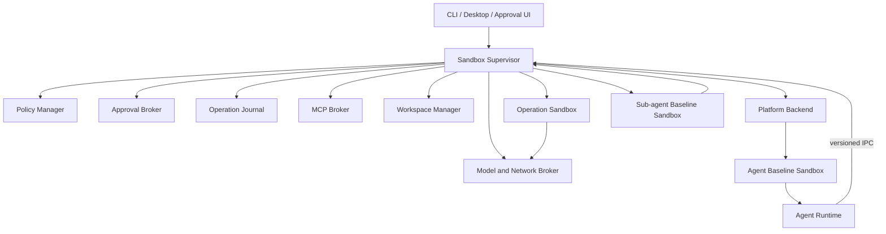
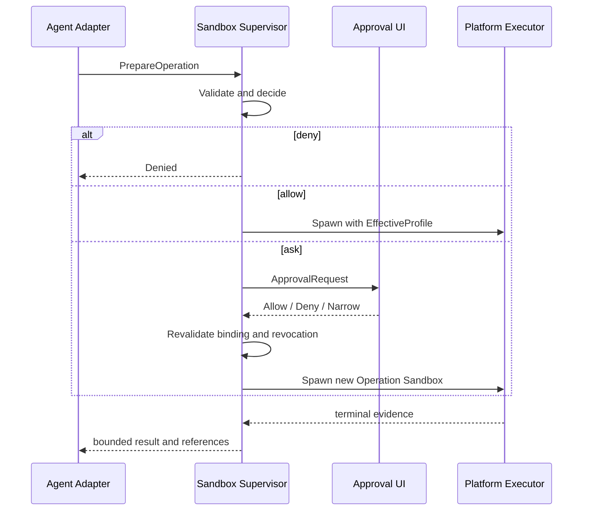

# 外置通用 Agent Sandbox Runtime：Grok、Codex 对比与 V2 设计
## 1. 文档定位
本文对比 Grok Build 与 Codex 当前源码中的沙箱机制，并设计一个位于 Agent 进程之外、可以承载不同 Agent Runtime 的通用沙箱系统。

源码范围：

+ Grok Build：`/Users/zhengguilin/Documents/个人项目/grodex/grok/grok-build`
+ Codex：`/Users/zhengguilin/Documents/个人项目/grodex/codex/codex/codex-rs`

本文提出的是后续方案，不代表任一项目已经完整实现。它作为 [Agent Loop V2](./09-agent-loop-v2-design.md)、[Tool/Skill/MCP V2](./10-tool-skill-mcp-v2-design.md) 和 [Sub-agent V2](./12-subagent-management-v2-design.md) 中 `SandboxBinding` 的外部执行后端。

## 2. 先看结论
两者最核心的差异是沙箱边界：

```latex
Grok Build
  Agent 主进程启动时进入基础沙箱
  -> 进程内文件 I/O 和 descendants 都受限制
  -> 文件权限稳定，但不能在审批后热放宽

Codex
  Agent 主进程位于 Tool 沙箱之外
  -> 每次 Tool exec 创建独立 sandboxed child
  -> 审批可以改变下一次 execution attempt
```

新方案同时保留二者：

```latex
Trusted Sandbox Supervisor（Agent 外部）
  |
  +-- 启动 Agent Baseline Sandbox
  |     Agent 本身、进程内 I/O、直接 descendants 受固定上界限制
  |
  +-- 提供 Exec / File / Network / MCP Broker
        每个受控操作按审批结果创建独立 Operation Sandbox
```

Agent 永远不能离开基础沙箱。需要更高权限时，也不是扩大 Agent，而是由外部 Supervisor 代表它启动一个参数、期限和资源范围都被绑定的新执行进程。

## 3. 威胁模型
需要防御：

+ prompt injection 诱导 Agent 读取密钥、SSH 配置或其他项目；
+ 恶意仓库通过脚本、Skill、MCP 配置或依赖安装扩大权限；
+ Agent 或 Tool 绕开统一执行器直接 `exec/spawn`；
+ child 连接未批准的网络地址，或绕过受控出口外传本地文件；
+ 审批后参数、路径、Schema 或策略变化，却复用旧批准；
+ Sub-agent 获得比 parent 更宽的文件、网络或 Tool 权限；
+ Agent 崩溃后重复执行已经产生副作用的操作；
+ 后端不可用时静默退化为无限制执行。

不承诺防御内核/root 漏洞、管理员主动启用 unrestricted、未纳入 Profile 的屏幕键盘等桌面侧信道。Model Gateway 也不能阻止已经 compromise 的 Agent 把其合法可读内容编码进模型 prompt；这一风险只能通过最小文件视图、敏感路径不可见、内容策略和审计降低，不能由网络代理消除。高风险多租户仍应使用 VM 或远程隔离执行环境。

## 4. Grok Build 当前机制
Grok 源码明确说明：沙箱在进程启动时应用一次，覆盖进程内 `tokio::fs` 和 child；主进程网络保留，Linux child 网络在 spawn 时单独限制，见 [xai-grok-sandbox/lib.rs](/Users/zhengguilin/Documents/个人项目/grodex/grok/grok-build/crates/codegen/xai-grok-sandbox/src/lib.rs:8)。

```latex
启动 Grok
  -> 解析 sandbox profile
  -> Linux 必要时 bubblewrap re-exec
  -> nono 构造 CapabilitySet
  -> macOS Seatbelt / Linux Landlock
  -> Grok 当前进程及后代继承文件限制
```

`SandboxManager::apply()` 标记为 irreversible，并调用 `Sandbox::apply(&caps)`，见 [lib.rs](/Users/zhengguilin/Documents/个人项目/grodex/grok/grok-build/crates/codegen/xai-grok-sandbox/src/lib.rs:160)。Profile 表达 `read_only`、`read_write`、`deny`、`write_deny`、`default_read` 和 `restrict_network`。

项目自定义 Profile 只能新增名称，不能覆盖同名全局 Profile，避免恶意仓库用可信名称掏空用户策略，见 [profiles.rs](/Users/zhengguilin/Documents/个人项目/grodex/grok/grok-build/crates/codegen/xai-grok-sandbox/src/profiles.rs:113)。

Linux 组合使用：

+ bubblewrap 建立 mount namespace，表达 read-deny/write-deny；
+ Landlock 收窄 Grok 当前进程和 descendants 的文件能力；
+ terminal child 的 `pre_exec` 安装 seccomp BPF，阻断网络系统调用，见 [terminal.rs](/Users/zhengguilin/Documents/个人项目/grodex/grok/grok-build/crates/codegen/xai-grok-tools/src/computer/local/terminal.rs:3118)。

优势：

+ Agent 进程内文件 I/O 也受限制；
+ child 自然继承文件系统权限上界；
+ 规则在 Agent 执行前固定，模型不能修改；
+ Profile 简单且容易解释。

不足：

+ Seatbelt/Landlock 生效后不能因审批而放宽；
+ Profile 过宽会永久授权进程内 I/O，过窄则需要重启；
+ 网络过滤依赖已知 Linux spawn 路径；
+ child 网络主要是全禁，缺少目标级动态租约；
+ 部分 apply 失败会警告后继续，fail-open 语义不统一；
+ Windows 后端较弱。

## 5. Codex 当前机制
Codex 的 `ToolOrchestrator` 先审批，再物化 `PermissionProfile`、选择平台沙箱并构造本次 `SandboxAttempt`，见 [orchestrator.rs](/Users/zhengguilin/Documents/个人项目/grodex/codex/codex/codex-rs/core/src/tools/orchestrator.rs:136)。

```latex
Tool Call
  -> Approval requirement
  -> User / Guardian / Policy decision
  -> PermissionProfile
  -> SandboxType
  -> SandboxManager.transform()
  -> 新 child process
```

平台类型包括 `MacosSeatbelt`、`LinuxSeccomp`、`WindowsRestrictedToken` 和 `None`，见 [manager.rs](/Users/zhengguilin/Documents/个人项目/grodex/codex/codex/codex-rs/sandboxing/src/manager.rs:35)。

第一次受限执行被拒绝后，Orchestrator 可以重新审批并构造第二个 `SandboxAttempt`。它不是修改运行中的沙箱，而是启动权限不同的新 child，见 [orchestrator.rs](/Users/zhengguilin/Documents/个人项目/grodex/codex/codex/codex-rs/core/src/tools/orchestrator.rs:331) 和 [orchestrator.rs](/Users/zhengguilin/Documents/个人项目/grodex/codex/codex/codex-rs/core/src/tools/orchestrator.rs:418)。

如果策略包含 denied-read，Codex 不允许通过无沙箱重试丢掉它，见 [sandboxing.rs](/Users/zhengguilin/Documents/个人项目/grodex/codex/codex/codex-rs/core/src/tools/sandboxing.rs:274)。网络还可以通过受控 loopback proxy 做目标级审批。

优势：

+ 每次操作可以使用不同的文件、网络和附加权限；
+ 审批与具体 execution attempt 直接绑定；
+ managed proxy 支持动态网络治理；
+ macOS、Linux、Windows 都有明确后端；
+ 失败、审批和重试处于统一 Tool 管线。

不足：

+ Agent 主进程通常不在 Tool 沙箱内，进程内直接 I/O 依赖代码约束；
+ 未接入 Tool Orchestrator 的执行路径可能绕过 per-call 沙箱；
+ 沙箱实现与 Codex core 耦合，难直接复用；
+ 动态审批、代理、denied-read 和 retry 的状态组合复杂。

## 6. 对比与融合点
| 维度 | Grok Build | Codex | 新方案 |
| --- | --- | --- | --- |
| 施加时机 | Agent 启动一次 | 每次 Tool exec | Agent 启动 + 每次 Operation |
| 保护对象 | Agent 及 descendants | 单次 child | Agent baseline + operation child |
| 进程内 I/O | 受限制 | 通常不受 Tool 沙箱限制 | 受 baseline 限制 |
| 动态权限 | 不能放宽 | 新 attempt 可变化 | 新 Operation 可变化，Agent 不变 |
| 审批联动 | 只决定是否执行 | 决定本次 attempt | 生成外部一次性 PermissionLease |
| 网络 | 主进程开放、child 多为全禁 | 禁网或 managed proxy | Model Gateway + Operation NetworkLease |
| 复用范围 | Grok 内部 | Codex 内部 | 多 Agent Adapter |


Grok 解决“Agent 本身是否可信”，Codex 解决“某一次副作用应获得什么权限”。通用 Runtime 必须同时回答这两个问题。

## 7. 设计原则
1. Supervisor 位于 Agent 外部，Agent 不能修改 Policy、审批、审计或 backend。
2. Agent 永远处在固定基础沙箱中，即使 Tool 绕开 Broker 也有系统上界。
3. 动态权限只授予新 Operation，不热放宽正在运行的 Agent 或 child。
4. 审批决定是否允许意图，沙箱仍约束实际影响范围。
5. 升级只增加批准的最小权限，原绝对 denied-read、网络 deny 和资源限制继续有效。
6. Agent 和 Sub-agent 都是不可信 workload；child ceiling 只能收窄。
7. 网络默认经过 Broker；目标批准用代理租约表达。
8. 外部 Journal 是宿主执行事实源，Agent rollout 只记录模型因果链。
9. required backend capability 缺失时 fail closed。
10. 跨平台发布能力报告，不假装各系统提供完全相同的强度。

## 8. 总体架构


### 8.1 Trusted Sandbox Supervisor
Supervisor 是唯一可信控制面，负责：

+ 解析有效 Policy，在 Agent 启动前构造基础 Profile；
+ 接收结构化 Operation 请求；
+ 执行 allow/deny/ask 判定并路由 UI；
+ 生成一次性 `PermissionLease`；
+ 创建、取消和回收 Operation Sandbox；
+ 管理网络代理、MCP、workspace 和 Sub-agent；
+ 写 append-only operation journal；
+ 实施进程、CPU、内存、时间和网络配额。

Policy 的规则语言、命令/路径/网络匹配、固定冲突裁决和 Session Grant 由 [Capability V2 §20](./10-tool-skill-mcp-v2-design.md#20-permission-policy-language-v2) 定义；Supervisor 负责把该决定编译为平台可强制的 Profile/Lease，不在 Sandbox 层再维护一套字符串匹配规则。

Supervisor 不解析模型自然语言，也不相信 Agent 声称“命令安全”。它只处理结构化资源请求和可验证策略。

### 8.2 Agent Baseline Sandbox
```latex
AgentBaselineProfile {
  readable_roots
  writable_roots
  denied_read_roots
  denied_write_roots
  allow_direct_exec
  broker_endpoint
  network_mode
  provider_endpoints
  environment_allowlist
  process_limit
  memory_limit
  cpu_limit
}
```

它借鉴 Grok，保护 Agent 进程内文件访问、直接 descendants、环境变量、设备、本地 socket 和直接网络。Profile 在 Agent 生命周期内只允许收紧，不能放宽。

必须把两个概念分开：

```latex
AgentBaselineProfile
  = Agent 进程当前拥有的 ambient authority，通常很窄

AgentAuthorityCeiling
  = Supervisor 允许该 Agent 通过审批请求的最大范围，通常比 baseline 宽
```

例如 Agent baseline 可以是 workspace 只读，但 authority ceiling 允许“经审批写 workspace”。审批不会扩大 Agent 进程，而是允许 Supervisor 在 ceiling 内创建一个 workspace-write Operation Sandbox。两者分别持久化 `baseline_profile_hash` 和 `authority_ceiling_hash`，不能共用一个含义模糊的 `sandbox_profile_hash`。

### 8.3 Operation Sandbox
```latex
PreparedOperation {
  operation_id
  agent_id
  task_run_id
  tool_call_id
  capability_id
  capability_revision
  requested_args_hash
  argv
  cwd
  env_allowlist
  filesystem_intent
  network_intent
  side_effect_class
  parent_ceiling_hash
  policy_generation
  backend_requirements
}
```

Supervisor 重新校验参数、路径、revision、策略和 Agent authority ceiling，再创建本次执行进程。Operation Sandbox 可以比 Agent baseline 暴露更多资源，但不能超过 authority ceiling；权限只存在于这个新进程，Agent 本身没有被放宽。

## 9. 三种接入等级
“适配任何 Agent”与“理解 Tool 语义并动态审批”不能零改造同时实现。

### 9.1 Level 0：透明静态包装
```bash
agent-sandbox run --profile workspace-ro -- agent-command ...
```

Level 0 主要面向**没有自带沙箱能力**的通用 CLI、脚本和简单第三方 Agent。它们无需修改即可获得固定文件、网络、进程和资源边界。Supervisor 不知道某次 `execve` 对应哪个 Tool Call，因此 Level 0 只有静态 allow/deny，不能声称支持语义化 ask-and-resume。

Grok、Codex、Claude Code 这类成熟 Agent 不应把 Level 0 当作默认迁移入口。它们已有自己的进程级或 per-exec 沙箱，外层再套一层会产生不可解释的双层求交：外层更严时内部 Tool 莫名失败，外层更松时又几乎没有新增保证。此类 Agent 应直接从 Level 1/2 接入，并在对应 capability 已由 Supervisor 接管后关闭 Agent 内置的同类沙箱后端。迁移期如果必须双层运行，只允许作为诊断模式，必须展示两套 Profile 和最终交集，不作为正式安全配置。

### 9.2 Level 1：Exec/Network Adapter
Agent 将 shell 调用通过 `prepare -> approval -> execute -> stream -> result` 协议交给 Supervisor，获得单次命令沙箱、参数绑定审批、目标级网络批准、取消和 Journal。

对现有成熟 Agent，Level 1 是实际起点：替换 shell/terminal launcher，关闭其原 per-exec sandbox，保留 Agent 原有进程内 File Tool 和 workspace 写权限。接入前必须清点所有 subprocess 路径；尚未 Broker 化的 helper 只能进入显式 allowlist，不能假设替换主 Bash Tool 就已经覆盖全部 exec。

### 9.3 Level 2：完整 Capability Adapter
File Tool、MCP、Sub-agent 和外部系统调用都走 Broker。此时 Agent baseline 才可以设为 workspace 只读，所有写入通过结构化 Broker，获得最强审计和动态审批。

文件侧 Level 2 是核心 Tool 的深度改造，不是薄 Adapter：Grok `apply_patch`、Codex file write、Claude Code Edit 等进程内实现都要改成“构造结构化请求 -> IPC -> Supervisor 执行 -> 返回 diff/hash/result”。Agent 侧仍负责 Tool Schema、用户可见语义和结果适配，Supervisor 负责路径解析、权限、原子写和事实记录。后文“Adapter 只做协议转换”仅适用于已经具有外部执行边界的能力，不适用于把进程内 File Tool 首次 Broker 化。

Read/Edit/Exec 的 Prepared plan、FileVersion、PatchPlan、ProcessHandle 和统一结果信封见 [内置 Tool 本体 V2](./15-built-in-tools-v2-design.md)。Sandbox Runtime 强制这些 plan 的权限上界，但不重新定义模型看到的 Tool 契约。

`PATH` shim、shell alias 和 `LD_PRELOAD` 只能用于迁移，不能作为安全边界；Agent 可以绕过它们。

## 10. Profile 与权限求交
```latex
HostMaximumPolicy
  ∩ UserPolicy
  ∩ WorkspaceTrustPolicy
  ∩ AgentAuthorityCeiling
  ∩ DelegationEnvelope
  ∩ OperationRequest
  ∩ LiveRevocationFence
  = EffectiveOperationProfile
```

`AgentBaselineProfile` 不进入 Operation 的权限求交；它约束的是 Agent 进程本身。任何 authority 层只能收窄上一层。项目配置不能覆盖用户或企业同名规则，继承 Grok 的 additive-only 原则。

建议 Profile：

| Profile | Agent baseline | Operation 默认 | 用途 |
| --- | --- | --- | --- |
| `inspect` | workspace 只读 | 读自动、写 ask | 审查分析 |
| `workspace` | workspace 可写 | command/network 走 Broker；进程内 workspace 写不做逐次审批 | 现有成熟 coding agent 的默认迁移 Profile |
| `brokered-workspace` | workspace 只读、session 可写 | 所有 workspace 写走 File/Exec Broker | Level 2 深度接入后的强化 Profile |
| `isolated-worktree` | 独立 worktree 可写 | 主 workspace 只读 | 并行 child |
| `networkless` | 无直接网络 | Operation 默认无网 | 离线任务 |
| `strict` | 最小只读；Agent baseline 禁止未 Broker 化 exec | Operation 在独立进程树中按批准 Profile 执行 | 不受信仓库、完整 Adapter |
| `off` | 无强制限制 | unsafe | 仅显式调试 |


对现有 Grok/Codex/Claude Code，`workspace` 是诚实的默认迁移 Profile：它不能强制 workspace 内每次进程内写入都经过审批，但仍能隐藏 workspace 外敏感路径、限制网络和把 shell 副作用交给 Broker。只有 File Tool 完成 Level 2 改造后，才能启用 `brokered-workspace` 并宣称 workspace 内细粒度写审批由系统边界强制。二者是不同能力等级，不是切换一个配置名就自动获得更强保证。

## 11. 审批协议
```latex
ApprovalBinding {
  approval_id
  operation_id
  agent_id
  task_run_id
  tool_call_id
  capability_id
  capability_revision
  requested_args_hash
  effective_args_hash
  filesystem_scope_hash
  network_scope_hash
  policy_generation
  parent_ceiling_hash
  expires_at
  max_uses = 1
}
```

参数、路径、Capability revision、Policy generation 或 parent ceiling 任一变化，旧批准失效。

`Narrow` 必须复用 [Agent Loop V2 §11.2](./09-agent-loop-v2-design.md#112-用户收窄执行范围) 的 `EffectiveToolCallRevision`。如果用户只收窄授权期限而不改 Tool 参数，`requested_args_hash == effective_args_hash`；如果 Tool 明确支持路径子集等约束变换，Supervisor 保存 `requested_args`、`effective_args`、`transform_kind` 和新 revision，重新执行 Schema、Policy、资源锁与沙箱判定。



放宽只生成新的 PermissionLease 和进程；收紧则递增 `revocation_epoch`，尚未产生副作用的 Operation 在 spawn/exec 前再次检查，必要时取消 child。已经发生但无法确认的外部副作用记录 `UnknownOutcome`。

执行完成后，Supervisor 必须把 `EffectiveToolCallRevision + effective_args + effective_args_hash` 随结构化结果返回 Agent Adapter。Agent transcript 保留模型原始 Tool Call，并在 Tool Result 中明确说明实际执行参数，使下一次模型采样知道用户修改了什么；Supervisor 不能只在外部 Journal 记录修订而让模型看到虚假的原参数执行结果。扩大范围、替换 Tool 或改变操作含义不能走 `Narrow`，必须拒绝原调用并由模型产生新的 Tool Call。

## 12. 文件系统
Agent 只看到最小文件视图：workspace/worktree、只读 runtime、专用 session/cache/tmp 和 Broker endpoint，不直接挂载 SSH、云凭据、浏览器数据或其他项目。敏感路径优先“不挂载”，其次才使用 deny。

不可逆内核沙箱不能热扩权。审批后的文件操作采用新进程：

```latex
Agent 请求写 /workspace/a.rs
  -> Supervisor 规范化路径、检查 symlink/mount
  -> 创建只暴露必要 root 的 Operation Sandbox
  -> 执行 write/apply_patch/command
  -> fsync + atomic rename
  -> 返回 hash、diff 和 changed-files manifest
```

关键规则：

+ denied-read 在任何升级 attempt 中继续存在；
+ 审批绑定 resolved target 和 parent identity；
+ 写入前重新检查路径，避免 TOCTOU；
+ 未知写集合的 shell 获得 workspace write Profile 和写 lease，不能靠字符串猜成只读；
+ 结构化 File Tool 才能按具体路径细分锁。

## 13. 网络
### 13.1 Agent 不直接出网
```latex
Agent -> local Broker -> Model Gateway -> Provider
Agent -> direct internet                    X
Operation -> Managed Proxy -> approved destination
```

模型和 MCP 凭据由 Broker 持有，Agent 只拿 session-scoped handle。

Model Gateway 的安全收益只包括：隐藏 provider credential、限制可连接端点、实施请求大小/速率/审计策略。模型响应仍然要回到 Agent，Agent 也必须能提交 prompt；因此 Gateway **不能**阻止 Agent 把它已经合法读到的数据编码进模型请求。数据外传的首要防线是 Agent baseline 的最小可读文件视图，Gateway 只是减少端点滥用和凭据窃取，不是内容保密边界。

### 13.2 动态网络审批
运行中的 Seatbelt/seccomp 不需要放宽。Operation Sandbox 始终只允许连接代理；Supervisor 动态发放：

```latex
NetworkLease {
  operation_id
  protocol
  host
  resolved_ips
  port
  dns_policy
  method_class
  byte_limit
  expires_at
  max_connections
}
```

批准目标只是允许代理转发该 Operation，不是授予 child 任意 socket 权限。DNS rebinding、redirect、CONNECT、IPv6、Unix socket、loopback 和 inbound listen 必须分别建模。

## 14. MCP、Skill 与 Hook
stdio MCP 不应由 Agent 随意 spawn。MCP Broker 负责解析受信配置、在独立 Service Sandbox 启动 server、持有 OAuth/token、执行 `tools/list/tools/call` 并绑定 Capability revision。Agent 只得到逻辑 handle。

Skill 是说明而不是权限。仓库 Skill 需要 workspace trust/content hash；无论正文写什么，都不能扩大 baseline 或 Operation Profile。

Hook 也是 Capability。host hook 和 workspace hook 使用独立 Hook Sandbox，声明文件/网络范围；Agent 不得覆写用户或企业 Hook。

## 15. Sub-agent
每个 AgentNode 都由 Supervisor 启动独立 baseline：

```latex
child_effective_ceiling
  = host policy
    ∩ parent authority ceiling
    ∩ DelegationEnvelope
    ∩ workspace assignment
    ∩ live revocation
```

+ researcher 共享 workspace 只读；
+ coding child 使用独立 worktree；
+ 高风险任务使用 ephemeral workspace；
+ MCP child 只拿 allowlist 中的逻辑 handle；
+ network lease 不能转交 sibling 或 descendant。

Sub-agent V2 的 `sandbox_ceiling_hash` 应明确改名或解释为 `authority_ceiling_hash`，指向 Supervisor 发布的不可变权限上界；child 自己另有更窄的 `baseline_profile_hash`。Supervisor 统一管理 cgroup/Job Object、process limit、wall time 和 kill tree。

## 16. IPC 与 Adapter
Unix 使用预创建 Unix socket 或继承的认证 FD；Windows 使用 ACL named pipe；远程 executor 才使用 mTLS。连接绑定 session capability token、peer credential、AgentId 和 nonce，socket 路径不是身份。

核心消息：

```latex
RegisterAgent
PrepareOperation
ApprovalRequired / ApprovalResolved
ExecuteOperation / OperationStarted
OperationOutputChunk
OperationExecutionFinished / OperationCommitted
CancelOperation
NetworkLeaseRequested
PolicyRevoked
AgentExit
```

所有消息携带 `protocol_version + request_id + agent_id + operation_id + sequence`。流输出可截断，但 terminal evidence、退出状态、资源统计和 result hash 必须持久化。

对已有外部执行边界的能力，Adapter 只做协议转换：

```latex
Grok Adapter   -> 替换 terminal/MCP spawn backend
Codex Adapter  -> 替换 SandboxManager/exec-server backend
Claude Adapter -> 替换 Bash/File/MCP execution boundary
Generic CLI    -> Level 0 static wrapper
```

Adapter 不持有审批权，也不能生成比 Supervisor Policy 更宽的 Profile。首次把进程内 File Tool、内嵌 MCP lifecycle 或特殊 Sub-agent launcher 外移时属于 Agent 核心改造，需要分别保持原 Tool 语义、错误协议和 transcript 契约，不能以“薄 Adapter”估算工作量。

## 17. 平台后端
### Linux
+ user/mount/pid/network namespace；
+ bubblewrap 或自有 namespace launcher；
+ Landlock 作为文件能力的附加收窄；
+ `no_new_privs + seccomp`；
+ cgroup v2、pidfd/parent-death signal；
+ managed proxy。

### macOS
+ Agent 和每个 Operation 分别生成 Seatbelt Profile；
+ 只允许受控路径、Broker endpoint 和代理端口；
+ 进程组回收 tree；
+ secrets 通过 Broker handle。

`deny_direct_exec` 只约束完成 Adapter 接入后的 **Agent baseline**：Agent 不得绕过 Broker 自行启动 Tool。它不表示 Operation Sandbox 内一律禁止 `process-exec`；编译、测试和 shell 命令通常需要受限地启动 descendants，Operation Profile 必须按可执行文件、文件视图、网络和进程树上界约束它们。macOS Seatbelt 如果不能可靠表达 Agent baseline 所需的直接执行限制，capability report 必须标记缺失，`strict` 拒绝启动；不能因为禁止所有 exec 会让命令失效，就静默允许 Agent 旁路执行。

### Windows
+ Restricted Token 或 AppContainer；
+ Job Object；
+ ACL/临时账户文件视图；
+ WFP 或 managed proxy；
+ 可选 private desktop。

Supervisor 发布 capability report，例如 `enforce_read_deny`、`deny_direct_exec`、`managed_proxy`、`restrict_unix_sockets`、`process_tree_kill`。Profile 区分 required/optional；required 缺失时 fail closed。

## 18. Journal、恢复与取消
Operation 状态：

```latex
Prepared -> AwaitingApproval -> Approved -> Starting -> Running
         -> ExecutionFinished -> Committed

任意未终态 -> Denied | Cancelled | Failed | UnknownOutcome
```

外部 append-only Journal 记录：

```latex
OperationPrepared
ApprovalRequested / ApprovalDecisionRecorded
PermissionLeaseIssued
SandboxSpawned
OperationExecutionFinished
OperationResultCommitted
OperationCancelled
PolicyRevoked
SandboxViolation
```

`OperationExecutionFinished` 必须携带结果或 blob ref。Supervisor 在执行完成、返回 Agent 前崩溃时可以恢复结果，而不是盲目重跑副作用。

取消流程关闭未使用 Lease 和 NetworkLease，先 TERM/CTRL_BREAK，宽限后 KILL/Job terminate，再收集 terminal evidence。取消不能删除 Journal；无法判断外部结果时记录 `UnknownOutcome`。

Supervisor 重启时：

+ 通过 pidfd/Job Object 和 operation token 重新关联，不接管任意同名进程；
+ 已完成未 commit 的结果从 blob 恢复；
+ 未使用审批 Lease 默认失效；
+ network lease 默认关闭；
+ Agent 失联按 Profile 进入 suspended 或 fail-stop。

运行中 Operation 的重启仲裁必须明确：成功通过 pidfd/Job Object、operation token、executable identity 和 Profile hash 重关联，且 PermissionLease 已在本次 spawn 原子消费的进程，可以在**不签发任何新 lease、不开启新网络目标**的条件下继续收敛；它原有的 NetworkLease 默认关闭，需要网络才能继续的 Operation 应被取消。无法完整重关联、Profile 无法复核或进程已经越过可观测边界时，Supervisor 终止可识别进程并提交 `UnknownOutcome`，不能重新授权或盲目重跑。

Agent rollout 记录模型因果链；Supervisor Journal 记录宿主执行事实。二者通过 `operation_id/tool_call_id` 关联，但互不替代。

## 19. 并发与资源
| Effective Profile | 默认并发等级 |
| --- | --- |
| 文件只读、无外部写网络 | parallel-safe |
| 结构化单路径写 | path lease |
| workspace 可写 shell | workspace write lease |
| external side effect | provider/global lease |
| unrestricted/unknown | 全局副作用锁或拒绝 |


Supervisor 还限制每 Agent/Task/Tree 的 operation、provider request、process、输出字节、wall time、CPU、memory、disk、网络连接和 pending approval。Agent 不能用并发创建绕过总预算。

## 20. 配置与信任
```latex
managed policy
  > user policy
  > workspace trust decision
  > workspace additive profile
  > Agent request
```

+ workspace 只能新增 Profile 或收窄；
+ 首次打开仓库记录 trust decision 和 config hash；
+ sandbox/Skill/MCP/Hook 文件变化后重新评估；
+ `off`、直接网络、宿主路径写不能由仓库开启；
+ secrets 使用引用，不能进入 Profile、命令行或 Journal；
+ Policy/backend generation 进入 Operation binding。

## 21. 核心不变量
1. Agent 只能由 Supervisor 启动，不能自行宣称进入沙箱；
2. AgentBaselineProfile 在进程生命周期内不可放宽；
3. 动态批准只产生新 PermissionLease 和新 Operation process；
4. Agent 不能修改 Policy、Approval、Journal、Proxy 或 backend；
5. Operation 参数、Capability revision 和 Profile 必须与审批一致；
6. denied-read 不能因升级或无沙箱重试而消失；
7. Sub-agent authority ceiling 永不宽于 parent authority ceiling；其 ambient baseline 也不得宽于自己的 ceiling；
8. revocation 在 spawn 和副作用 commit 前重新检查；
9. Agent 不持有 provider/MCP 原始 secrets；
10. NetworkLease 只能被绑定 Operation 使用；
11. required backend capability 缺失时 fail closed；
12. terminal evidence 持久化后才能向 Agent commit 结果；
13. 同一 OperationId 的重复副作用必须被识别或标记 UnknownOutcome；
14. Agent/child 退出后最终回收进程树和租约；
15. Level 0 不得宣称支持语义化动态审批；
16. workspace 配置不能扩大 managed/user policy；
17. 审批不能隐式变成 unrestricted execution；
18. `off/unsafe` 必须显式配置并产生高可见审计事件；
19. 成熟 Agent 的正式接入不能同时启用同一能力的内部沙箱和外部后端；双层模式只用于诊断并展示最终交集；
20. workspace 可写 baseline 不得宣称强制逐文件写审批，只有 File Tool 完成 Broker 化后才能启用该保证；
21. Model Gateway 只保护 credential 和目标端点，不得被视为合法模型通道的内容防泄露边界；
22. Platform Launcher 是 TCB 核心，其他进程拆分不能降低其审计和最小代码面要求；
23. Supervisor 重启后重关联的 Operation 不得获得新 PermissionLease 或 NetworkLease；无法复核身份/Profile 时必须终止并记录 `UnknownOutcome`。

## 22. 相对原实现的收益
### 相对 Grok Build
| 当前限制 | 新设计 | 收益 |
| --- | --- | --- |
| 沙箱编译进 Agent | 外部 Supervisor + Adapter | 可复用于多个 Agent |
| 启动后不能放宽 | 新 Operation Sandbox | 审批无需重启 Agent |
| 主进程直连模型 | Model Gateway | Agent 不持有 key、不能连接非批准端点；不宣称阻止合法模型通道的数据外传 |
| child 网络多为全禁 | NetworkLease | 按目标、期限和 Operation 批准 |
| 依赖已知 spawn 路径 | baseline 防旁路 + Broker | 新 Tool 不因漏 pre_exec 失去保护 |
| 失败语义不统一 | capability report + fail closed | strict policy 可验证 |


仍保留 Grok 的关键优势：Agent 主进程和进程内文件 I/O 始终处于基础沙箱内。

### 相对 Codex
| 当前限制 | 新设计 | 收益 |
| --- | --- | --- |
| Agent 主进程位于 Tool 沙箱外 | Agent baseline | 进程内 I/O 和旁路 spawn 有上界 |
| 沙箱属于 Codex core | 外部版本化 IPC | 可服务不同 Agent |
| Agent 持有部分凭据/控制 | Broker 持有 | 缩小 Agent compromise 影响 |
| rollout 承载 Agent 事实 | 外部 Journal | Agent 日志损坏不影响宿主审计 |


仍保留 Codex 的关键优势：每个操作按审批结果获得独立、可重试、可审计 Profile，网络可以动态批准。

### 关键设计决策的收益闭环
| 设计决策 | 解决的问题 | 为什么这样选 | 直接收益 | 验证指标 |
| --- | --- | --- | --- | --- |
| 外置可信 Supervisor | Agent 内部沙箱可被实现遗漏或难以复用 | 安全控制面不能由不可信 workload 持有 | 多 Agent 共用同一策略、审批和审计 | Adapter 等价测试、旁路阻断率 |
| Baseline 与 AuthorityCeiling 分离 | 只读 Agent 无法动态执行获批写操作 | ambient authority 与可申请上界语义不同 | Agent 始终低权限，Operation 仍可受控升级 | baseline escape、越 ceiling 拒绝率 |
| Baseline + Operation 两层沙箱 | Grok 动态性不足、Codex 主进程覆盖不足 | 两个生命周期解决两个不同威胁 | 进程内 I/O 有底线，单次副作用有精细权限 | 旁路访问阻断率、Operation 最小权限率 |
| PermissionLease 单次绑定 | 审批被参数变化或其他调用复用 | 授权必须绑定身份、参数、范围和期限 | 防止批准漂移与重放 | stale/replay 拒绝数 |
| Model Gateway/NetworkLease | Agent 必须联网导致端点滥用和密钥暴露 | 代理可动态改变转发权而不放宽进程 | Agent 不持有 key，网络可按目标审批；内容外传仍靠最小可读视图缓解 | 直接出网阻断率、目标越权率、敏感路径可见率 |
| required capability fail closed | 不同平台降级后产生虚假安全感 | 强约束缺失不能用日志代替 | strict Profile 的保证可验证 | 降级启动数应为零 |
| Supervisor Journal | Agent 崩溃或伪造 rollout 影响审计 | 宿主执行事实必须由宿主记录 | 副作用可恢复、可追责 | terminal evidence 完整率 |
| Level 0/1/2 明确分级 | “完全透明动态审批”及成熟 Agent 双层沙箱都不可落地 | 静态包装、shell 接管和 File Tool 重写是三种工程量 | 无自沙箱 CLI 从 Level 0 起步，成熟 Agent 直接从 Level 1 起步 | 各 Level 适配覆盖率、双层正式配置数应为零 |


## 23. 代价与风险
+ Supervisor 成为新的高价值安全组件；
+ Level 1/2 需要 Agent Adapter，不是完全零改造；
+ Model/MCP/Network Broker 增加延迟和故障面；
+ 三个平台无法做到每个约束完全等价；
+ `brokered-workspace` 需要重写现有进程内 File Tool，不是配置切换或薄 Adapter；
+ `workspace` 迁移 Profile 保留进程内写，因此无法提供 workspace 内逐操作写审批；
+ per-operation namespace/Seatbelt 有启动成本；
+ 外部 Journal 与 Agent rollout 需要稳定 ID 对齐。

Supervisor 应拆成不同信任角色，但拆分不等于消除单点。**Platform Launcher 是 TCB 核心**：它负责 namespace/mount、Seatbelt Profile、Restricted Token、进程身份和最终 `exec`，在部分平台上必须持有创建隔离边界所需的高权限或高影响能力。它应保持代码面最小、输入严格结构化、无网络、无业务解析并接受独立安全审计；Policy/Journal、Network Broker、MCP Broker 则各自使用最小权限。不能把 Launcher 描述成普通低权限 helper，也不能因为多进程拆分就声称不存在关键可信组件。

## 24. 分阶段实现
### Phase 0：威胁模型与 Eval
+ 固化 Profile、平台 capability matrix 和 fail-closed 规则；
+ 建立 symlink、mount、shell、network、socket、subprocess、MCP escape fixture；
+ 建立启动和 Tool 延迟基线；
+ 定义 IPC 与 Journal schema。

### Phase 1：透明基础沙箱
+ 实现 `agent-sandbox run`；
+ Linux、macOS、Windows 最小 backend；
+ environment scrub、tree kill、workspace Profile；
+ capability report 和 strict fail closed；
+ 先为无自沙箱 CLI/简单 Agent 交付 Level 0；不把 Grok、Codex、Claude Code 套双层沙箱作为验收目标。

### Phase 2：Exec Broker
+ versioned IPC 和 Agent registration；
+ PreparedOperation、ApprovalBinding、PermissionLease；
+ per-operation sandbox、stream、cancel、timeout；
+ Journal 和 UnknownOutcome；
+ Grok/Codex shell Adapter，并关闭被接管能力对应的内置沙箱后端；
+ 使用 workspace 可写 baseline，先不改写其进程内 File Tool。

### Phase 3：Network 与 File Broker
+ Model Gateway、secret handle 和 managed proxy；
+ NetworkLease、DNS/redirect policy；
+ 结构化 read/write/apply_patch；
+ changed-files manifest、path lease 和 TOCTOU 防护；
+ 对每个 Agent 深度改造 File Tool；改造和一致性测试完成后，显式从 `workspace` 升级到 `brokered-workspace`，不能全局默认切换。

### Phase 4：MCP、Sub-agent 与恢复
+ MCP Service Sandbox；
+ Sub-agent baseline、DelegationEnvelope 和 worktree；
+ Supervisor restart recovery；
+ 与 Loop/Capability/Sub-agent V2 的 generation 对齐。

### Phase 5：性能优化
+ 预热 worker pool，但每次清空 namespace、env、cwd 和 lease；
+ 批量 Journal flush，不降低 terminal durability；
+ proxy connection pooling；
+ Eval 证明后再自动选择 Profile。

## 25. 验收标准
1. Level 0 为无自沙箱 CLI/简单 Agent 提供固定强制边界，但不宣称动态审批，也不把成熟 Agent 的双层沙箱作为正式模式；
2. Grok/Codex/Claude Code 从 Level 1 起迁移：被接管的 shell 全走 Exec Broker，对应内置沙箱关闭，未接管 subprocess 有清单和显式策略；
3. Agent 不持有模型或 MCP 原始密钥；
4. 审批只对绑定 Operation、参数、范围和期限有效；
5. 文件升级通过新进程，网络升级通过 operation-scoped proxy lease；
6. Agent、Operation、Sub-agent 都能统一查询、取消和回收；
7. strict Profile 缺 required capability 时拒绝运行；
8. Journal 能重建申请、审批、实际 Profile、进程和结果；
9. Grok 与 Codex Adapter 通过同一协议完成等价 shell fixture；
10. Level 2 File Tool 的 Tool Result、diff、错误和 transcript 语义与改造前一致，只有通过后才允许启用 `brokered-workspace`；
11. Gateway 测试证明 key 和非批准端点不可达，但安全说明不声称阻止通过合法模型 prompt 外传可读数据；
12. Supervisor 重启时，可验证重关联的 Operation 只能收敛，不能获取新 lease；不可验证 Operation 进入 UnknownOutcome；
13. escape Eval 证明外置层没有新增可利用旁路。

## 26. 最终判断
新方案不是把 Grok 的 `SandboxManager` 搬进 daemon，也不是把 Codex 的 `SandboxAttempt` 包成 RPC。真正的融合点是两个生命周期：

```latex
Agent Baseline Sandbox
  生命周期 = Agent / AgentNode
  目的 = 防止 Agent 本身和旁路能力突破固定上界

Operation Sandbox
  生命周期 = 单次 Tool attempt
  目的 = 按审批、参数和资源范围控制具体副作用
```

外置 Supervisor 同时持有这两个边界，使 Grok 的“Agent 自身受限”和 Codex 的“每次操作动态受限”同时成立，并把实现从某一个 Agent 内部抽离为通用 Runtime。

最后必须坚持：静态沙箱可以完全透明；动态审批必须有协议。只在外面包一层、无需 Agent 配合，却声称能可靠识别并暂停每个 Tool 权限请求的实现，只能依赖不可验证的进程拦截或字符串猜测。
