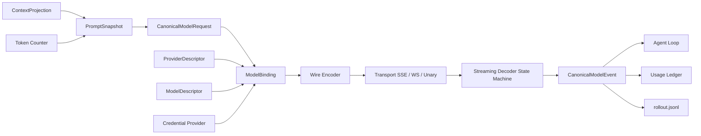

# Provider / Model 适配层对比与 V2 设计
## 1. 文档定位
本文补齐 [Agent Loop V2](./09-agent-loop-v2-design.md)、[上下文管理 V2](./11-context-management-v2-design.md) 和 [Sub-agent V2](./12-subagent-management-v2-design.md) 共同依赖、但此前没有独立设计的 Provider / Model 适配层。

它从 Grok Build 与 Codex 当前源码出发，回答六个具体问题：

1. 内部 `ContextItem` 怎样映射到 OpenAI Responses、Chat Completions 和 Anthropic Messages；
2. 不同流事件怎样还原为同一套文本、reasoning、Tool Call 和终态事件；
3. 哪些失败可以重试，什么时候重试会重复内容或 Tool Call；
4. token 如何预估、结算和驱动 compaction；
5. Session 中途换 Provider/Model 时，哪些状态可以继承；
6. usage 怎样进入 Session、Sub-agent 树和成本治理。

本文的核心立场是：

> 多 Provider 不是“换一个 base URL”，而是把多种不等价的 wire protocol 适配到稳定的内部模型协议。
>

## 2. 为什么现在必须独立设计
此前几篇设计已经消费了这些名字：

+ `ModelSampler`；
+ `ProviderAdapter`；
+ `ProviderReasoningEnvelope`；
+ `CompactionBackend`；
+ `tokenizer_version`；
+ Sub-agent `usage_delta`。

但如果没有统一适配层，实现者很容易在 Loop 中直接判断 Provider 类型：

```latex
if responses ...
else if chat_completions ...
else if messages ...
```

这样会产生三个问题：

+ Context、Loop、Compaction 各自维护一套 wire 分支；
+ Provider 新增字段时，内部事件和恢复语义随之漂移；
+ “OpenAI compatible”被误解为行为完全相同，直到流式 Tool Call、reasoning 或 usage 出错。

因此 Provider V2 是 Loop Phase 1 的硬依赖，不是后续性能优化。

## 3. Grok Build 当前实现
### 3.1 Provider 配置和模型配置分层
Grok 的 `ModelProviderConfig` 可以声明：

+ `base_url` / `api_base_url`；
+ `api_backend`；
+ `api_key` / `env_key`；
+ command-backed `auth`；
+ extra headers、environment headers 和 query params；
+ `context_window`。

Provider 默认值会合并到具体 model override，model 自己的字段优先。实现见 [model_providers.rs](/Users/zhengguilin/Documents/个人项目/grodex/grok/grok-build/crates/codegen/xai-grok-shell/src/agent/model_providers.rs)。

这意味着“供应商连接方式”和“模型能力”已经可以分别配置，而不是把每个模型完整复制一遍。

### 3.2 同时支持三种 wire backend
Grok 当前 `ApiBackend` 主链路包括：

| Backend | 典型协议 | 主要实现 |
| --- | --- | --- |
| `chat_completions` | OpenAI Chat Completions compatible | [chat_completions.rs](/Users/zhengguilin/Documents/个人项目/grodex/grok/grok-build/crates/codegen/xai-grok-sampler/src/stream/chat_completions.rs) |
| `responses` | OpenAI Responses | [responses.rs](/Users/zhengguilin/Documents/个人项目/grodex/grok/grok-build/crates/codegen/xai-grok-sampler/src/stream/responses.rs) |
| `messages` | Anthropic Messages compatible | [messages.rs](/Users/zhengguilin/Documents/个人项目/grodex/grok/grok-build/crates/codegen/xai-grok-sampler/src/stream/messages.rs) |


三个 decoder 都转换成统一 `SamplingEvent`。上层 Agent Loop 不需要直接消费每家 SSE 事件名。

### 3.3 Streaming 已经是显式聚合过程
以 Chat Completions 为例，decoder 按 Tool Call 的 positional index 累积：

```latex
tool_call[index]
  id        += delta.id
  name      += delta.function.name
  arguments += delta.function.arguments
```

Messages decoder 还分别处理 text、reasoning、tool use、usage 和 stop reason。流实现承诺每个请求恰好产生一个 `Completed` 或 `Failed` 终态。

Grok 也区分网络 idle 和 content-aware idle，避免 reasoning 或 Tool Call delta 正在流入时被错误判定为空闲。

### 3.4 错误和 usage 已经被规范化
`SamplingError` 能表达 retryable、rate limit、`retry_after` 和 Provider 的 retry hint。decoder 会归一化 prompt、completion、reasoning、cached prompt token 和 cost。实现见 [error.rs](/Users/zhengguilin/Documents/个人项目/grodex/grok/grok-build/crates/codegen/xai-grok-sampling-types/src/error.rs)。

Session 侧再把 usage 送入 chat state 和 compaction threshold。

### 3.5 Grok 的优势
+ 三种主流 wire backend 是真实实现，不只是配置枚举；
+ Provider 配置、认证和 model override 可组合；
+ 统一 `SamplingEvent` 已隔离大部分 Loop 与 wire 差异；
+ Tool Call delta、reasoning、usage、idle timeout 都有专门处理；
+ 同一套 sampler 可被正常采样、compaction、recap 和 memory dream 复用。

### 3.6 Grok 的不足
1. `api_backend` 仍承担了过多隐含能力。两个都叫 `responses` 的端点，可能在 reasoning、tool choice、parallel call、usage 或 schema 支持上不同。
2. 请求 encoder、流 decoder、token estimator、retry 和 model capability 的契约没有聚合成一个可冻结的 `ModelBinding`。
3. 模型切换兼容性主要由调用点处理，缺少统一 compatibility gate。
4. 本地 token 估算适合预算预警，但 tokenizer 与 Provider 实际计费的偏差没有成为一等诊断指标。
5. partial stream 的恢复边界虽有实现规则，但没有形成跨 backend 的统一状态协议。

## 4. Codex 当前实现
### 4.1 Provider registry 与认证能力较完整
Codex 的 `ModelProviderInfo` 包含 base URL、environment key、command auth、AWS SigV4、headers、query params、request/stream retry、idle timeout 和 WebSocket 能力。实现见 [model-provider-info/src/lib.rs](/Users/zhengguilin/Documents/个人项目/grodex/codex/codex/codex-rs/model-provider-info/src/lib.rs)。

Provider 定义既有编译时内置项，也允许用户配置扩展。

### 4.2 当前 wire 主链路已收敛到 Responses
当前源码中的 `WireApi` 只有 `Responses`。配置 `wire_api = "chat"` 会得到明确的 removed error，而不是走兼容分支。

这不是“Codex 不会做适配”，而是产品选择：

+ 内部 `ResponseItem` 与 Responses 的 item/event 模型天然接近；
+ reasoning item、Tool Call、remote compaction、WebSocket continuation 可以沿同一协议处理；
+ 减少兼容端点行为差异带来的测试矩阵。

代价是：只提供 Chat Completions 或 Anthropic Messages 的企业网关不能直接接入当前 Codex 主链路。

### 4.3 Session client 与 Turn client 分离
Codex 的 `ModelClient` 保存 Session 生命周期的稳定配置、认证、Provider、conversation id 和 transport fallback；每个 Turn 创建 `ModelClientSession`，维护：

+ Responses WebSocket 连接；
+ sticky routing 的 turn state；
+ prewarm 与 previous response id；
+ 本 Turn 的 transport fallback 状态。

实现见 [core/src/client.rs](/Users/zhengguilin/Documents/个人项目/grodex/codex/codex/codex-rs/core/src/client.rs)。

这种生命周期拆分比“每次请求临时拼 client”更适合长会话和 WebSocket 复用。

### 4.4 Responses 的流与恢复更产品化
Codex 同时支持 SSE 和 Responses WebSocket，并对：

+ connect/prewarm；
+ stream retry；
+ sticky turn state；
+ authentication recovery；
+ response metadata；
+ remote compact；
+ telemetry；

做了较深的产品化处理。

### 4.5 Token budget 与模型元数据结合
Codex 的 model info 可以提供 context window、parallel tool call、reasoning 和 token budget 默认值。Session 使用 Provider usage 与模型窗口计算剩余预算，并可注入 token reminder 或触发 compaction fallback。

### 4.6 Codex 的优势
+ Responses item 与内部上下文结构结合紧密；
+ SSE/WebSocket、prewarm、sticky routing 和认证恢复成熟；
+ Session/Turn client 生命周期清楚；
+ Provider retry 和 model metadata 的产品化程度高；
+ reasoning item 与 Responses continuation 的生命周期处理更完整。

### 4.7 Codex 的不足
1. 当前只接受 Responses wire，接入只提供 Chat Completions/Messages 的端点需要外部转换网关。
2. 内部模型与 Responses 较接近，若未来重新引入多 wire，需要防止 Responses 特性泄漏到 canonical IR。
3. 本地 tokenizer 与非 OpenAI Provider 的扩展不是当前主目标。
4. Provider 特定优化较多，通用 runtime 若直接照搬，会把 OpenAI sticky state 和 WebSocket 语义错误推广给所有 Provider。

## 5. 两者对比
| 维度 | Grok Build | Codex |
| --- | --- | --- |
| wire 覆盖 | Chat Completions、Responses、Messages | 当前仅 Responses |
| 内部统一事件 | `SamplingEvent` | `ResponseEvent` / `ResponseItem` |
| Tool Call 流拼接 | 三 backend 分别实现 | Responses item/event 原生映射 |
| Session/Turn client | 有 sampler actor/state，但边界较分散 | 生命周期明确，Turn session 支持 WS 复用 |
| 认证 | env/static/command auth | env/command/OpenAI login/AWS 等 |
| streaming transport | 以 HTTP stream 为主 | SSE + Responses WebSocket |
| token/usage | 统一 usage + 本地估算 | Provider usage + model token budget |
| 模型切换 | 可配置多 backend，统一切换协议不足 | 同 wire 更可控，跨 wire 不是当前范围 |
| 通用性 | 强 | 较弱 |
| 单协议深度 | 中高 | Responses 很强 |


融合方向不是“让 Codex 重新支持全部旧协议”或“把 Grok 的三个 decoder 原样留下”，而是：

> 使用 Grok 的多 wire 适配面，采用 Codex 的 Session/Turn Binding、Responses 深度和恢复纪律。
>

## 6. V2 设计目标
1. Loop 只消费 canonical request/event，不判断 wire backend。
2. Provider 与 Model 分开建模：Provider 描述连接，Model 描述能力。
3. 每个 Sampling Step 使用不可变 `ModelBinding`。
4. decoder 是显式状态机，并保证单一终态。
5. retry 绑定请求进度，不能只看 HTTP status。
6. token 预估和 Provider 结算分开，偏差可观测。
7. 模型切换必须通过兼容性检查，不能直接替换 model name。
8. usage 是审计事实，可进入 Session 和 Agent tree 预算。
9. Provider 特有状态保留在 opaque envelope，不能污染 canonical transcript。

## 7. 总体架构


分成六层：

1. **Canonical IR**：Runtime 自己的消息、Tool 和事件语义；
2. **Provider/Model Registry**：连接配置和能力描述；
3. **ModelBinding**：一次 Turn/Step 实际使用的不可变组合；
4. **Codec**：wire encode/decode；
5. **Transport**：SSE、WebSocket、unary 和认证；
6. **Accounting**：token、usage、rate limit、cost 和 trace。

## 8. Provider 与 Model 数据模型
### 8.1 ProviderDescriptor
```latex
ProviderDescriptor {
  provider_id
  display_name
  endpoint
  wire_protocol
  transport_capabilities
  auth_strategy_id
  headers_template
  query_params
  retry_policy_id
  privacy_boundary
  provider_revision
}
```

`provider_revision` 覆盖 endpoint、wire、认证策略和影响请求行为的 headers；API key 的实际值不进入 hash 和事件日志。

### 8.2 ModelDescriptor
```latex
ModelDescriptor {
  model_id
  provider_id
  wire_model_name
  context_window
  max_output_tokens
  tokenizer_id
  tokenizer_version
  supports_tools
  supports_parallel_tool_calls
  supports_reasoning
  reasoning_modes
  supports_images
  supports_prompt_cache
  supports_structured_output
  compaction_capabilities
  model_revision
}
```

不能根据 model name 字符串猜能力。用户自定义模型缺少字段时使用保守默认并记录 `capability_unknown`。

### 8.3 ModelBinding
```latex
ModelBinding {
  binding_id
  provider_descriptor_revision
  model_descriptor_revision
  wire_protocol
  encoder_revision
  decoder_revision
  tokenizer_id
  tokenizer_version
  credential_lease_id
  transport_session_id?
  reasoning_policy
  created_at
}
```

Turn 开始捕获基础 Binding；同一 Turn 默认不因配置 watcher 自动换 Provider/Model。认证刷新只替换 credential lease，不改变模型语义。模型显式切换、Provider failover 或 stale codec 必须创建新 Binding 和新 Step generation。

### 8.4 ModelRoute 与 Candidate
配置系统提供有序 `ModelRoute`，Provider Runtime 按列表从高到低选择候选：

```latex
ModelRoute {
  route_id
  candidates[]              // 顺序即优先级
  minimum_capabilities[]
  sticky_scope: step | turn | session
  retry_higher_priority
  route_attempt_budget
}

ModelCandidate {
  candidate_id
  provider_id / provider_revision
  model_id / model_revision
  account_id
  endpoint / region / wire_backend
  allowed_capability_degradations[]
  retry_policy_id
  circuit_breaker_policy_id
}
```

完整 TOML、熔断状态和采用边界见 [配置系统与多模型路由 V2 §9](./18-config-system-v2-design.md#9-多-providermodel-有序路由)。Adapter 负责判断某候选能否无损或按声明降级地承接 canonical request；配置层不根据 model name 猜能力。

## 9. Canonical Model IR
### 9.1 CanonicalModelRequest
```latex
CanonicalModelRequest {
  request_id
  session_id
  turn_id
  step_id
  model_binding_id
  prompt_snapshot_id
  instructions[]
  context_items[]
  tool_specs[]
  tool_choice
  parallel_tool_calls
  reasoning_request
  response_format
  max_output_tokens
  provider_state_in?
}
```

`provider_state_in` 是受控 opaque envelope，只能由同一 Provider family 的 adapter 读取。

### 9.2 ContextItem 到 wire 的映射
| Canonical item | Responses | Chat Completions | Messages |
| --- | --- | --- | --- |
| system/developer instruction | `instructions` 或对应 message item | `system`/`developer` message | 顶层 `system` |
| user text/image | input message content parts | user message content | user content blocks |
| assistant text | output/input message item | assistant message | assistant content block |
| Tool Call | function call item | assistant `tool_calls` | `tool_use` block |
| Tool Result | function call output item | `tool` message | `tool_result` block |
| reasoning envelope | encrypted/reasoning item | Provider 扩展字段或不可表达 | thinking/redacted thinking block |
| runtime control | canonical developer item 后确定性映射 | developer/system | system 或受控 user block |


映射失败不能静默丢字段。adapter 必须返回：

```latex
Supported
Lossy(reason)
Unsupported(reason)
```

只有 Model Switch Plan 明确允许的 lossy mapping 才能继续。

## 10. Streaming 解析状态机
### 10.1 统一事件
```latex
CanonicalModelEvent =
  StreamStarted
  ResponseMetadata
  TextDelta
  ReasoningDelta
  ReasoningEnvelopeCompleted
  ToolCallStarted
  ToolCallArgumentsDelta
  ToolCallCompleted
  UsageDelta
  RateLimitUpdated
  ResponseCompleted
  ResponseFailed
```

### 10.2 Decoder 状态
```latex
Created
  -> Started
  -> StreamingText / StreamingReasoning / StreamingToolCalls
  -> Completing
  -> Completed | Failed | Aborted
```

不变量：

1. 每个 request 恰好一个 terminal event；
2. terminal 后的迟到 delta 被丢弃并记录；
3. Tool Call 使用 provider item id 或稳定 index 聚合；
4. `ToolCallCompleted` 前必须得到完整 name、id 和可解析 JSON arguments；
5. JSON 不完整或 schema 不合法时不进入 Tool Pipeline；
6. partial assistant text 可以显示，但只有 commit 后才进入 canonical transcript；
7. reasoning opaque block 不写入普通文本字段；
8. usage 重复上报按 Provider event identity 去重。

### 10.3 增量 Tool 参数
Decoder 保存：

```latex
PendingToolCall {
  provider_item_key
  canonical_tool_call_id
  name_buffer
  args_buffer
  last_event_seq
  completed
}
```

流结束但 Tool Call 未完成时返回 `incomplete_tool_call`，不把残缺 JSON交给“修一修再执行”的启发式逻辑。若要修复，必须重新采样并产生新 ToolCallId。

## 11. Reasoning Envelope 生命周期
```latex
ProviderReasoningEnvelope {
  provider_family
  model_family
  wire_protocol
  envelope_kind
  encrypted_or_opaque_payload_ref
  visible_summary?
  created_turn_id
  valid_until
  compatibility_tag
}
```

规则：

+ 同一 Responses/Provider continuation 要求回传的 reasoning item，在 Turn 内原样保留；
+ compaction 或跨不兼容模型切换时只保留允许展示的 reasoning summary，不保留隐藏 CoT；
+ opaque payload 单独加密存储或只驻留内存，遵守 Provider retention policy；
+ Chat Completions 无法表达某类 envelope 时，不伪造成 assistant text；
+ compatibility tag 不匹配时丢弃 envelope，并在 Model Switch Plan 中记录原因。

这补齐 [上下文管理 V2 §15.1](./11-context-management-v2-design.md#151-a-档structured-verbatim) 中 Provider reasoning item 的生命周期。

## 12. Token 计数和预算
### 12.1 两套数字不能混用
```latex
EstimatedUsage
  请求前，由 tokenizer / estimator 生成
  用于 watermark、max output、是否 compaction

SettledUsage
  请求后，由 Provider usage 生成
  用于账单、Session 统计、Sub-agent tree accounting
```

Provider 未返回 usage 时，可以用估算值补记，但必须标记 `estimated=true`，不能冒充结算事实。

### 12.2 TokenCounter 接口
```latex
trait TokenCounter {
  id() -> TokenizerId
  version() -> TokenizerVersion
  count_context(items, tools, wire_overhead) -> TokenEstimate
  count_output(item) -> TokenEstimate
  confidence() -> Exact | ModelTokenizer | Approximate
}
```

计数必须覆盖：

+ message/item wrapper；
+ Tool schema；
+ image/media token；
+ reasoning envelope 可计费部分；
+ Provider 特有请求字段；
+ cache read/write token。

`PromptSnapshot` 记录 tokenizer id/version 和 estimate。Provider 结算后记录误差：

```latex
token_error_ratio = abs(settled_input - estimated_input) / settled_input
```

当 P95 误差超过阈值时，降低 effective context window 或禁用该 model 的精确 watermark 声明。

## 13. Retry、退避和认证恢复
### 13.1 先看请求进度，再看错误码
| 失败位置 | 默认动作 |
| --- | --- |
| 连接前/未收到任何语义事件 | retryable 时指数退避重试同一 request intent |
| 已收到 metadata、无正文/Tool delta | adapter 证明幂等时可重连 |
| 已输出 partial text | 默认中止本次采样；新请求必须新 attempt，partial 不喂回模型 |
| 已收到 partial Tool Call | 不透明重试和拼接；废弃旧 ToolCallId 后重新采样 |
| Provider 已标 Completed、客户端丢连接 | 优先按 response id 查询/恢复；无法确认则 `unknown_model_outcome` |
| 401/token invalid 且 auth 可刷新 | 单飞刷新 credential lease，再重试一次 |
| 403/policy/content restriction | 不刷新；交给错误分类和 route policy，默认不换源 |
| 429 | 尊重 `Retry-After`，受 Turn deadline 和 retry budget 限制 |
| 5xx/transport | jittered exponential backoff |
| idle timeout | 默认终止；只有 adapter 能证明 resume cursor 时才续流 |
| invalid request/context length | 不重试同请求，转 compaction/model compatibility 路径 |


### 13.2 RetryBudget
```latex
RetryBudget {
  max_attempts
  max_elapsed
  max_auth_refreshes
  max_stream_resumes
  base_delay
  max_delay
  jitter
  turn_deadline
}
```

Sub-agent 继承更窄预算。后台 child 不得因 Provider 持续 429 无限占用树级 lease。

### 13.3 attempt 事实记录
每次 attempt 写事件：

```latex
ModelAttemptStarted
ModelAttemptProgressed
ModelAttemptFailed
ModelAttemptRetried
ModelResponseCommitted
```

包含 request intent hash、binding id、attempt number、first semantic event、last provider event id 和 retry reason，但不记录 credential。

### 13.4 有序 Failover 与 Candidate Circuit Breaker
同一候选耗尽其有界 retry 后，只有 canonical error 标记为 `failover_eligible`，且当前 attempt 尚未越过 semantic commit fence，Route Manager 才尝试下一候选。

```latex
for candidate in route.candidates:
  skip if circuit == Open
  skip if CompatibilityGate(request, candidate) == Incompatible
  binding = bind(candidate)
  outcome = attempt(binding, remaining_route_budget)
  if committed: return outcome
  if !outcome.failover_eligible: return error
  if outcome.semantic_commit_fence_crossed: return aborted_or_unknown
return route_exhausted
```

语义提交栅栏在第一个 reasoning item、assistant content、refusal 或 Tool Call delta/canonical item 到达时越过。headers、空 keepalive、rate-limit metadata 不越过栅栏。越过后禁止把另一个模型的输出透明续接到当前响应，避免重复 Tool Call和双重副作用。

Candidate breaker key 至少包含 Provider、endpoint revision、wire backend、model revision、account 和 region。状态为 `Closed / Open / HalfOpen`：

+ transport timeout、连接失败、429/5xx 等可用性错误计入 breaker；
+ 400/codec bug、content refusal、用户 cancel 不计为源不可用；
+ Open 候选立即跳过；
+ cooldown 后只允许一个 HalfOpen probe，其余请求继续走低优先级；
+ probe 成功后恢复 Closed，新 Turn 再使用高优先级候选。

Route 有总 attempts/elapsed/auth-refresh 预算，不能让每个候选各自耗尽完整预算。一次 failover 后，当前 Turn 默认粘在已选候选，下一 Turn 才重新从高优先级开始；这避免每个 Tool round 都撞一次已坏主源，也避免 Provider reasoning state 来回切换。

### 13.5 能力降级不是无条件兜底
每个 canonical request 产生能力要求：

```latex
RequestCapabilityRequirement {
  required[]
  optional[]
  min_context_tokens
  allowed_degradation_transforms[]
}
```

fallback candidate 缺少 required capability 时直接跳过。例如图片是任务输入、Tool Calling 是 Agent Loop 必需能力、严格 JSON Schema 是调用契约时，都不能静默删除或改成普通文本。reasoning effort、parallel tools、prompt cache 等 optional capability 可以按 route 显式声明降级，并产生 `ModelCapabilityDegraded` 事件。窗口变小时先走 compaction compatibility，仍装不下则候选不兼容。

## 14. Model 切换协议
### 14.1 切换不是改一个字符串
```latex
ModelSwitchPlan {
  old_binding_id
  new_binding_candidate
  reason
  context_fit
  tool_schema_compatibility
  reasoning_compatibility
  modality_compatibility
  compaction_backend_compatibility
  provider_state_action
  required_compaction?
  lossy_mappings[]
}
```

### 14.2 Compatibility Gate
按顺序检查：

1. 新 model context window 能否容纳当前 `PromptSnapshot`；
2. 当前 Direct Tool schema 是否被新 wire/model 支持；
3. parallel Tool Call 语义是否兼容；
4. reasoning envelope 能否继续；
5. image/audio 等 modality 能否保留；
6. compaction backend 是否可用；
7. Provider state/response id 是否必须清空。

如果窗口不足，先按 [上下文管理 V2 §21](./11-context-management-v2-design.md#21-并发与一致性) 的旧模型优先规则压缩；旧模型不可用时使用新模型兼容输入或 deterministic fallback。

### 14.3 生效边界
+ 用户显式切换默认在下一个 Step 生效，并创建新 `ModelBinding`；
+ 正在流式采样时不热替换 decoder；
+ 当前流先按 steer/cancel 协议中止；
+ 新 Step 记录新的 PromptSnapshot hash；
+ Provider opaque state 不兼容时明确丢弃，不跨 Provider 透传。
+ 自动 failover 在 semantic commit fence 前可以为同一 Step 创建新 Binding/attempt；一旦成功选中低优先级候选，当前 Turn 默认保持该候选；
+ circuit half-open 恢复高优先级只影响新 Turn，不中途迁移正在采样或已经降级的 Turn。

## 15. Usage 与 Rate Limit 统一模型
```latex
UsageRecord {
  session_id
  turn_id
  step_id
  task_run_id?
  model_binding_id
  attempt_id
  input_tokens
  cached_input_tokens
  cache_creation_tokens
  output_tokens
  reasoning_tokens
  total_tokens
  cost?
  currency?
  estimated
  provider_request_id?
}
```

Tree accounting 规则：

1. 每个 attempt 的实际费用都记录，包括最终失败但 Provider 已计费的 attempt；
2. Session total 是 UsageRecord 投影，不另维护不可审计计数器；
3. child usage 带 `task_run_id` 上报 Supervisor；
4. Supervisor 在 child Turn 边界更新 observed/reserved/remaining；
5. Provider rate-limit snapshot 只用于调度提示，不作为权限事实；
6. usage event 去重键优先使用 provider request id + attempt id。

## 16. CompactionBackend 归属
`CompactionBackend` 不应绕过 Provider V2。它是 ModelBinding 上的一种受约束调用模式：

```latex
CompactionBackend
  -> build CanonicalCompactionRequest
  -> Provider Adapter encode
  -> transport
  -> canonical CompactionBackendOutput
  -> Context V2 verifier
```

remote `/responses/compact` 可以有专用 endpoint codec，但仍共享：

+ credential lease；
+ retry budget；
+ request/usage trace；
+ privacy boundary；
+ model/provider revision；
+ terminal event 和 error taxonomy。

## 17. 与其他 V2 文档的接口
| 消费方 | Provider V2 提供 |
| --- | --- |
| Agent Loop V2 | `ModelBinding`、canonical stream、retry outcome |
| Context V2 | wire encoder、token counter、reasoning lifecycle、compaction backend |
| Capability V2 | model 支持的 Tool schema/parallel call 能力 |
| Sub-agent V2 | usage delta、rate-limit hint、child model ceiling |
| Sandbox V2 | Model Gateway 请求边界、credential handle、endpoint allowlist |


Model Gateway 只能限制凭据和端点，不能阻止 Agent 通过合法模型 prompt 外传其已经可读的数据；这个边界继承 [外置 Sandbox V2 §13.1](./13-external-sandbox-runtime-v2-design.md#131-agent-不直接出网)。

## 18. 相对 Grok Build 的收益
| Grok 当前问题 | V2 改动 | 收益 |
| --- | --- | --- |
| `api_backend` 隐含大量能力 | Provider 与 Model descriptor 分离 | 同 wire 的不同模型能力可明确校验 |
| sampler/client 状态边界分散 | Session/Turn `ModelBinding` | 生命周期、缓存和切换更容易推理 |
| partial retry 规则未形成统一协议 | progress-aware retry matrix | 避免文本或 Tool Call 重复 |
| token 估算与结算偏差不突出 | Estimated/Settled 分账 | compaction watermark 可校准 |
| 模型切换由调用点处理 | Compatibility Gate | reasoning、Tool 和窗口不再静默丢失 |
| 高优先级模型源故障会终止请求 | 有序 ModelRoute + Candidate breaker | 按用户配置自动切换低优先级源 |
| usage 分散进入状态 | append-only UsageRecord | Sub-agent 树预算可审计重建 |


保留的 Grok 优点是三 wire codec、统一采样事件、command auth 和自定义 Provider 灵活性。

## 19. 相对 Codex 的收益
| Codex 当前限制 | V2 改动 | 收益 |
| --- | --- | --- |
| 当前只接受 Responses | codec 插件支持 Chat/Messages | 企业兼容网关无需强制外部转协议 |
| Responses 语义容易泄漏内部 IR | canonical item + lossiness gate | 新 wire 不必伪装成 Responses |
| Provider 特有状态较深 | opaque envelope + compatibility tag | 通用 Loop 不感知 sticky/response id 细节 |
| tokenizer 主要围绕支持模型 | TokenCounter registry + confidence | 自定义模型可以保守接入和校准 |
| 多 wire 不是当前测试目标 | contract test matrix | 兼容范围有明确质量门槛 |
| Provider failover 不是一等有序路由 | Route budget + Turn stickiness | 多源降级确定且不会来回抖动 |


保留的 Codex 优点是 Responses 深度、SSE/WS、Turn client、认证恢复和 Provider 元数据治理。

## 20. 关键决策的收益闭环
| 设计决策 | 为什么这样选 | 直接收益 | 验证指标 |
| --- | --- | --- | --- |
| Provider/Model 分离 | endpoint 与 model capability 变化频率不同 | 配置复用且不靠名称猜能力 | capability unknown 率 |
| Canonical IR 不等于 Responses | 通用 Runtime 不能绑定一家 wire | 新增 codec 不改 Loop | Loop 中 Provider 分支数应为 0 |
| 显式 stream state machine | delta 乱序、重复和残缺是常态风险 | Tool 参数完整后才执行 | terminal exactly-once、残缺调用执行数为 0 |
| progress-aware retry | HTTP 状态不足以判断重复风险 | 防止重复文本和副作用调用 | duplicate delta/tool-call 率 |
| Estimated/Settled usage 分离 | 请求前与请求后信息来源不同 | watermark 和账单都诚实 | token estimate P50/P95 error |
| Model Switch Plan | 模型差异不仅是窗口大小 | 切换失败可解释、可回滚 | silent field loss 为 0 |
| opaque reasoning envelope | 需要延续 Provider 状态但不能泄漏 CoT | 兼容 continuation 且保持隐私边界 | incompatible envelope 拒绝覆盖率 |
| UsageRecord 事件化 | 树级预算需要可恢复事实 | Session/child 成本可审计 | ledger/replay 一致率 |
| 有序 ModelRoute | 单源故障降低可用性 | 按用户顺序自动降级与恢复 | route success、主源恢复时延 |
| semantic commit fence | 半流后换源可能重复 Tool/文本 | 保证一次响应只有一个语义来源 | fence 后透明 failover 数为 0 |
| Candidate breaker | 每次请求都等待坏源超时 | 快速跳过并 HalfOpen 恢复 | Open 候选请求数、probe 成功率 |


## 21. 分阶段实现
### Phase 1：Canonical 协议和 Responses 主链路
1. 定义 Provider/Model descriptor 和不可变 ModelBinding；
2. 定义 canonical request/event/error/usage；
3. 把当前最成熟的 Responses SSE 路径接入；
4. 实现 stream state machine 和 terminal exactly-once；
5. 实现 Estimated/Settled usage；
6. 将 Loop 中 Provider 判断移入 adapter；
7. 建立录制 wire fixture 的 contract test。

### Phase 2：Chat Completions 与 Messages
1. 迁移 Grok 已有三个 decoder 的成熟语义；
2. 建立 ContextItem 映射和 lossiness gate；
3. 覆盖 tool delta、reasoning、usage、refusal 和 stop reason；
4. 兼容端点必须通过 fixture，不以“HTTP 200”作为接入成功。

### Phase 3：Retry、认证和模型切换
1. progress-aware retry budget；
2. credential refresh single-flight；
3. Model Switch Plan 和 Compatibility Gate；
4. reasoning envelope 生命周期；
5. SSE/WS transport fallback；
6. 有序 ModelRoute、Candidate Circuit Breaker 与 HalfOpen probe；
7. semantic commit fence、Turn stickiness 和 route 总预算；
8. required/optional capability degradation gate。

### Phase 4：计量和自适应
1. tokenizer registry 与偏差校准；
2. Sub-agent tree usage accounting；
3. rate-limit aware scheduling；
4. 基于 Eval 调整 breaker、retry 和 route 参数；自动 Provider failover 已在 Phase 3 作为配置能力交付，不以在线自适应排序替代用户配置顺序。

## 22. 测试与验收
### 22.1 Wire contract
+ 三种 backend 的同一 canonical fixture 得到语义等价结果；
+ unknown event 可记录并按兼容策略处理，不能 panic；
+ Tool Call 参数分任意 chunk 到达都能正确聚合；
+ stream 中断后不产生两个 terminal event；
+ reasoning 和 visible text 不串 channel。

### 22.2 Retry 和恢复
+ first byte 前 429/5xx 按预算重试；
+ partial text 后断流不会把两次输出拼成一个响应；
+ partial Tool Call 后断流不会执行残缺或重复调用；
+ auth refresh 并发只发生一次；
+ completed response 丢连接时优先按 Provider id 恢复或标 unknown。
+ primary 在连接失败、429、5xx 后按配置顺序尝试 secondary；
+ primary Open 后的新请求不再等待其连接 timeout；
+ HalfOpen 只有一个 probe，成功后新 Turn 恢复 primary；
+ 所有候选共享 route 总预算，不能各自用满整套 retry。

### 22.3 Token 和切换
+ tokenizer/version 变化会改变 PromptSnapshot hash；
+ Provider usage 重复事件不重复记账；
+ 小窗口模型切换先触发 compatibility/compaction；
+ Responses reasoning envelope 不会传给不兼容 Messages/Chat 模型；
+ Tool schema 不兼容时拒绝切换并给出具体原因。
+ fallback 缺少必需 modality、Tool Calling 或 response schema 时被跳过；
+ optional reasoning/parallel-tools 降级会产生显式事件；
+ 当前 Turn 降级后保持 candidate stickiness，下一 Turn 才重新尝试高优先级。

### 22.4 验收标准
1. Agent Loop、Context Reducer 和 Tool Pipeline 中不存在按 Provider 名称或 wire 类型分支。
2. 每次 Step 可由 `model_binding_id` 反查 endpoint revision、model capability、codec 和 tokenizer version。
3. 任意流式失败只有一个终态，未完成 Tool Call 永不进入执行器。
4. usage ledger 重放值与在线 Session/Agent tree 计数一致。
5. 自定义 Provider 缺少能力描述时保守降级并可诊断，不能猜测支持 reasoning 或 structured output。
6. 同一 canonical fixture 在支持的三个 backend 上通过契约测试；允许的差异必须进入 lossiness manifest。
7. 模型切换不会静默丢失 pending Tool Result、reasoning requirement、modality 或 compaction 状态。
8. token 估算偏差达到阈值时自动降低预算置信度，而不是继续宣称精确。
9. 用户配置的多个模型源严格按列表顺序选择，HashMap、健康检查完成时序不能改变优先级。
10. 只有 `failover_eligible` 且未越过 semantic commit fence 的失败才能透明切换模型源。
11. 自动能力降级不得丢弃当前请求的 required capability。
12. UI/rollout 能解释每次 failover 的原候选、目标候选、失败分类和 breaker 状态。

## 23. 最终判断
Grok 和 Codex 在 Provider 层的强项互补：

+ Grok 强在多协议、多自定义端点和统一采样事件；
+ Codex 强在 Responses 深度、Turn 生命周期、transport 恢复和产品化认证。

融合后的正确分层是：

```latex
Grok 风格的多 wire Adapter
              +
Codex 风格的 Session/Turn ModelBinding
              +
V2 新增的 canonical IR、有序 ModelRoute、兼容性 Gate 和可回放 usage
```

这样既不会为了通用性牺牲 Responses 的深度，也不会为了单一 Provider 优化把整个 Agent Runtime 绑定到一种 wire protocol。
