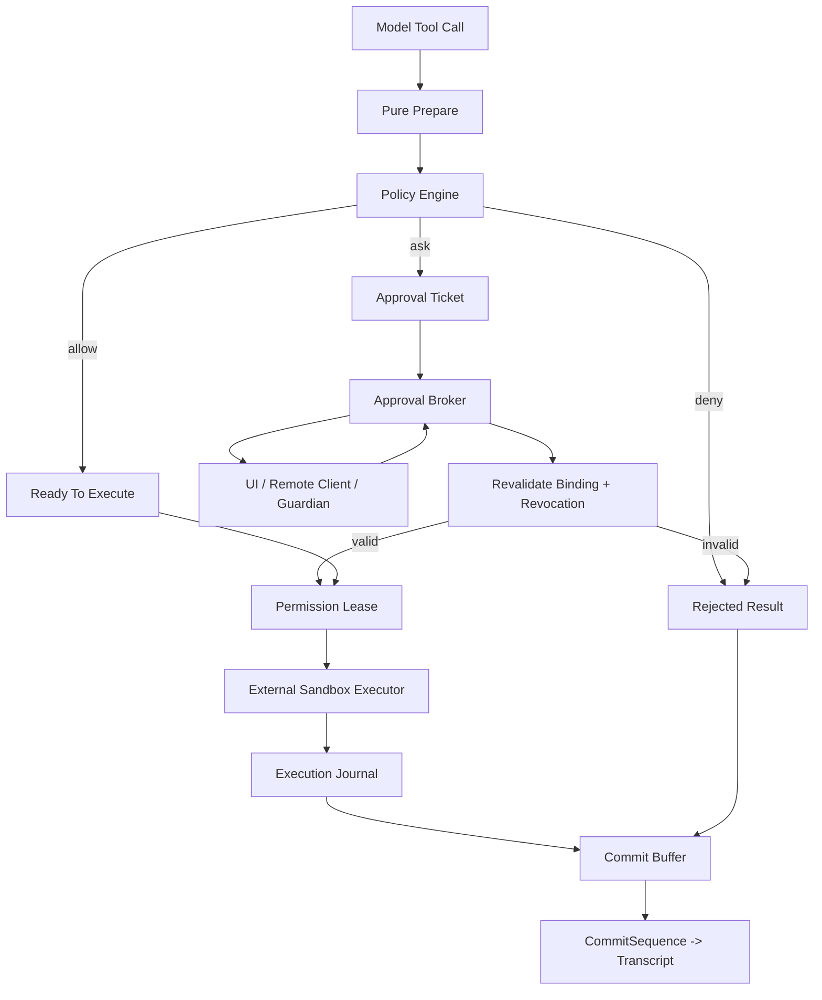
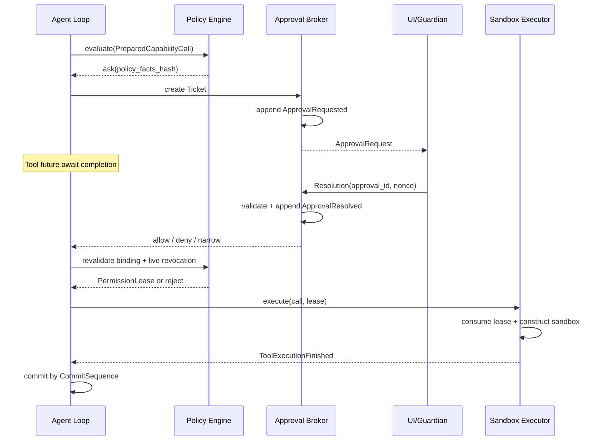

# 权限、审批与执行：Grok、Codex 对比与 V2 设计
## 1. 文档范围
本文只讨论一条运行时链路：模型产生 Tool Call 后，系统如何判定权限、向用户或自动审查器申请批准、暂停调用、恢复执行、进入沙箱并把结果交回 Agent Loop。

它与其他设计文档的边界如下：

+ [Capability V2 §20](./10-tool-skill-mcp-v2-design.md#20-permission-policy-language-v2) 定义规则如何计算 `allow / ask / deny`；
+ 本文定义这个决定如何变成一次可取消、可恢复、可审计的运行时流程；
+ [Agent Loop V2](./09-agent-loop-v2-design.md) 负责 Tool 并发、结果顺序提交和 Turn 生命周期；
+ [外置 Sandbox V2](./13-external-sandbox-runtime-v2-design.md) 负责在系统边界执行批准后的 Operation。

本文分析基于当前本地源码快照。Grok 与 Codex 都在快速演进，实验功能和 feature gate 不等同于默认主链路。

## 2. 先给结论
两者的基本原理相同：

```latex
Tool Call
  -> 静态权限判断
  -> 需要审批时创建一次性回复通道
  -> 发事件给前端/审查器
  -> Tool future await 回复
  -> allow 后执行，deny 后返回错误
```

这里的 `await` 不是把操作系统线程睡死。它只是挂起当前 Rust future，Tokio 仍可运行其他任务。真正需要区分的是四种不同范围的“阻塞”：

| 层次 | 含义 |
| --- | --- |
| Runtime 线程 | 是否阻塞 Tokio worker；两者都不会 |
| 当前 Tool future | 是否等到审批结果才继续；两者都会 |
| 同批其他 Tool | 能否在该审批期间准备或执行；两者不同 |
| 当前 Agent Step | 是否能进入下一次模型采样；两者通常都要等本批结果收敛 |


Grok 的优势是权限状态集中、ACP/Hub 协议完整、前后端分离自然；不足是单个 Permission actor 在 prompt 内等待，且 Tool prepare 串行，容易形成两层队头阻塞。

Codex 的优势是审批、沙箱选择、失败升级和重试集中在 `ToolOrchestrator`，并发 Tool future 的结果又能按模型顺序写回；不足是待审批状态主要属于当前 Turn 的内存状态，且非并发 Tool 在取得独占执行锁后才进入 handler/审批，可能让等待审批扩大为整个批次的执行门阻塞。

V2 保留两者的优点，但把“审批状态所有权”和“等待 UI”拆开：Approval Broker 管状态，每张 Ticket 使用独立 completion future；获准调用取得一次性 Permission Lease 后才交给外置 Sandbox。Tool 可以并行 prepare 和等待，结果仍按调用顺序 commit。

## 3. Grok 当前实现
### 3.1 权限对象与请求通道
Grok 使用 `PermissionHandle` 作为 Tool 侧入口。`request_with_edit_path_context()` 创建 `oneshot::channel<Decision>()`，把发送端装进 `PermissionCommand::Request`，通过 actor command channel 投递，然后等待接收端，见 [manager.rs](/Users/zhengguilin/Documents/个人项目/grodex/grok/grok-build/crates/codegen/xai-grok-workspace/src/permission/manager.rs:924) 和 [types.rs](/Users/zhengguilin/Documents/个人项目/grodex/grok/grok-build/crates/codegen/xai-grok-workspace/src/permission/types.rs:238)。

```latex
Tool future
  -> PermissionHandle.request(...)
  -> mpsc: PermissionCommand::Request { access, metadata, respond_to }
  -> Permission actor
  -> oneshot: Decision
  -> 原 Tool future 恢复
```

两个通道作用不同：

+ actor channel 是多生产者到单消费者的命令队列，负责把请求交给权限状态 owner；
+ `oneshot` 是这一次调用专属的完成信号，携带 `Decision`，不是共享信号量。

若 actor channel 已关闭，或 `oneshot` 发送端消失，Grok 返回 Reject，默认 fail closed。

### 3.2 Permission actor 如何判定
Permission actor 串行拥有并修改权限状态。一次 Request 大致经过：

```latex
固定本次 permission mode
  -> managed pin / yolo
  -> compiled policy 与 deny 规则
  -> session grant / always allow-or-reject
  -> safe list / auto classifier
  -> allow、reject，或进入人工 prompt
```

它同时维护 `allow_edits_for_session`、命令前缀、MCP server/tool、domain 等 grant。集中式 actor 的直接价值是这些状态只有一个 writer，不需要在多个 Tool handler 之间加复杂锁。

人工 prompt 期间，actor 使用 `respond_to.closed()` 监听请求方是否已经取消；调用方 future 被丢弃时，prompt 可以收敛为 Cancelled，而不是审批完成后继续一个已经不存在的 Tool Call，见 [manager.rs](/Users/zhengguilin/Documents/个人项目/grodex/grok/grok-build/crates/codegen/xai-grok-workspace/src/permission/manager.rs:2121)。

### 3.3 前端与远端审批
本地 ACP 路径由 `AcpPrompter` 把访问类型映射成审批选项。典型结果包括：

+ allow once；
+ reject once；
+ 本 Session 允许编辑；
+ 总是允许/拒绝某 Bash 命令前缀；
+ 总是允许某 MCP Tool、MCP Server 或 domain；
+ 拒绝并附带 follow-up message。

前后端分离时，Hub 路径把权限请求通过固定 transport 发给 chat/UI，再把 reply 映射回 `PromptOutcome`。未知响应、传输错误和超时都走拒绝或错误分支，见 [hub_permission.rs](/Users/zhengguilin/Documents/个人项目/grodex/grok/grok-build/crates/codegen/xai-grok-workspace/src/permission/hub_permission.rs:177)。

因此 Grok 不是要求 UI 和 Agent 共用内存。共享内存只存在于 workspace 内的 actor 与 Tool future；远端 UI 通过协议回包，workspace 再完成本地 `oneshot`。

### 3.4 Tool prepare 与执行
Grok 的 `execute_tool_calls()` 先遍历本批 Tool Call，逐个调用 `prepare_tool_call()`，见 [tool_calls.rs](/Users/zhengguilin/Documents/个人项目/grodex/grok/grok-build/crates/codegen/xai-grok-shell/src/session/acp_session_impl/tool_calls.rs:284)。prepare 包含：

```latex
参数解析与 ToolInput 构造
  -> plan-mode gate
  -> PreToolUse Hook
  -> PermissionHandle.request().await
  -> Decision 映射
  -> PreparedToolCall
```

只有 prepare 阶段结束后，获批调用才进入 `FuturesUnordered` 并发执行；冲突文件写还会使用路径锁，见 [tool_calls.rs](/Users/zhengguilin/Documents/个人项目/grodex/grok/grok-build/crates/codegen/xai-grok-shell/src/session/acp_session_impl/tool_calls.rs:485)。

这产生两层队头阻塞：

1. Permission actor 在一个 Request 分支中等待 prompt 时，后续发给同一 actor 的 Request 和状态命令仍在队列中；
2. Tool Call A 在 `prepare_tool_call(A).await` 等审批时，循环还没有 prepare B、C，更不可能执行它们。

它不会阻塞 Tokio 线程，也不会阻塞其他独立 Session 的 runtime，但会拖住当前 Session 的这批 Tool。

### 3.5 拒绝、取消与 follow-up
拒绝后，Grok 会把拒绝结果回填，并可取消同批后续 Tool，代码中有明确的 `Tool execution cancelled due to earlier permission rejection` 分支。`FollowupMessage` 则把用户说明转成后续 Agent 输入，而不是把它当成普通 Tool 成功。

这种批次语义偏保守：用户拒绝往往表示计划方向不对，继续启动后续副作用 Tool 风险较高。代价是同批相互独立的只读操作也可能失去并发机会。

### 3.6 Grok 的优点与不足
优点：

+ 权限状态由 actor 单 writer 管理，状态一致性清楚；
+ ACP 与 Hub 同时覆盖本地和前后端分离部署；
+ 请求方取消可通过 `respond_to.closed()` 传播到 prompt；
+ grant 类型覆盖 edit、Bash、MCP 和网络 domain；
+ 传输异常默认拒绝。

不足：

+ actor 在处理 Request 时直接等待 UI，状态 owner 与慢 I/O 耦合；
+ prepare 串行，一个审批阻止后续 Tool 进入权限判定；
+ 已获批 Tool 也要等整批 prepare 完成才开始执行；
+ 权限请求的 durable state 与崩溃恢复协议不够统一；
+ “允许一次”主要恢复内存中的 future，还没有独立、单次消费的执行 Lease。

## 4. Codex 当前实现
### 4.1 统一 Orchestrator
Codex 将审批、沙箱选择、首次执行、沙箱拒绝后的升级审批与重试集中在 `ToolOrchestrator`。`ToolRuntime` 同时实现 `Approvable` 与 `Sandboxable`，但真正的执行顺序由 Orchestrator 控制，而不是每个 Tool 自行决定，见 [orchestrator.rs](/Users/zhengguilin/Documents/个人项目/grodex/codex/codex/codex-rs/core/src/tools/orchestrator.rs:1) 和 [sandboxing.rs](/Users/zhengguilin/Documents/个人项目/grodex/codex/codex/codex-rs/core/src/tools/sandboxing.rs:318)。

主链路是：

```latex
ToolRuntime 给出请求元数据
  -> ExecPolicyRequirement: Skip / NeedsApproval / Forbidden
  -> PermissionRequest Hook
  -> Guardian 或 User reviewer
  -> 选择 SandboxAttempt
  -> ToolRuntime.run()
  -> 若沙箱拒绝且策略允许，重新审批并用新 attempt 重试
```

这是一种“集中式执行拦截 + Tool 提供工具级信息”的实现。Tool 不继承一个自动执行审批的基类；它通过 trait 提供 approval key、审批展示对象、sandbox preference 和具体 `run()`。

### 4.2 静态权限判定
命令先被 `ExecPolicyManager` 分段并匹配 policy rule，最终得到：

+ `Skip { bypass_sandbox, amendment }`；
+ `NeedsApproval { reason, amendment }`；
+ `Forbidden { reason }`。

复杂 shell 语法会影响可否自动生成持久规则；明确 deny 或当前 `AskForApproval` 模式不允许 prompt 时直接 Forbidden，见 [exec_policy.rs](/Users/zhengguilin/Documents/个人项目/grodex/codex/codex/codex-rs/core/src/exec_policy.rs:310)。

与 Grok 相比，Codex 更明确地把“规则是否允许询问”和“沙箱是否足够”合并进 execution requirement，而不是只返回一个抽象 Ask。

### 4.3 Hook、Guardian 与用户审批
`resolve_tool_approval()` 先执行 PermissionRequest Hook。Hook 可以直接 allow/deny；没有决定时，再路由到自动 Guardian 或用户，见 [approvals.rs](/Users/zhengguilin/Documents/个人项目/grodex/codex/codex/codex-rs/core/src/tools/approvals.rs:154)。

用户路径最终调用 `Session::request_command_approval()`：

1. 创建 `oneshot::channel<ReviewDecision>()`；
2. 以 `call_id` 或独立 `approval_id` 为键，将 sender 放入当前 `TurnState.pending_approvals`；
3. 向客户端发送 `ExecApprovalRequest` 事件；
4. await receiver；
5. UI 响应由 session handler 调用 `notify_approval()`，从 map 删除 sender 并发送 decision。

见 [session/mod.rs](/Users/zhengguilin/Documents/个人项目/grodex/codex/codex/codex-rs/core/src/session/mod.rs:2272)、[turn.rs](/Users/zhengguilin/Documents/个人项目/grodex/codex/codex/codex-rs/core/src/state/turn.rs:88) 和 [handlers.rs](/Users/zhengguilin/Documents/个人项目/grodex/codex/codex/codex-rs/core/src/session/handlers.rs:382)。

pending map 负责按 ID 找到正确 waiter；真正让 Tool future 暂停和恢复的仍是 `oneshot`。UI 列表是否 FIFO 是展示策略，不是安全事实源。

### 4.4 Session 审批缓存
Shell、unified exec 和 apply patch 可通过 `with_cached_approval()` 使用 Session 内 `ApprovalStore`。Tool 提供结构化 approval key；如果全部 key 已是 `ApprovedForSession`，后续调用跳过 prompt。apply patch 可以按多个文件 key 缓存，见 [sandboxing.rs](/Users/zhengguilin/Documents/个人项目/grodex/codex/codex/codex-rs/core/src/tools/sandboxing.rs:71)。

这个设计比只缓存命令展示字符串可靠，但仍要注意：key 的 canonicalization、cwd、环境、sandbox permissions 和 additional permissions 必须完整，否则会把一次批准错误复用到语义不同的调用。

### 4.5 审批与沙箱重试
审批通过不表示无限制执行。Orchestrator 随后根据 PermissionProfile、workspace roots、网络代理和 Tool preference 构造 `SandboxAttempt`。若首次受限执行因沙箱被拒，且 policy 允许升级，它会给出拒绝原因，再发起一次新的审批并创建另一个 attempt。

Codex 还专门防止 escalation 丢掉 denied-read：当文件策略包含 denied-read 时，不能简单通过 `SandboxType::None` 绕开，见 [sandboxing.rs](/Users/zhengguilin/Documents/个人项目/grodex/codex/codex/codex-rs/core/src/tools/sandboxing.rs:245)。

因此它实现的是：

```latex
批准意图
  != 关闭所有保护

批准意图
  -> 为这次 attempt 选择可表达批准范围的沙箱
```

### 4.6 Tool 并发和结果顺序
Codex 在模型流里为每个 Tool Call 创建独立 future。`ToolCallRuntime` 使用读写锁作为执行门：声明支持并发的 Tool 获取 read lock，不支持并发的 Tool 获取 write lock，见 [parallel.rs](/Users/zhengguilin/Documents/个人项目/grodex/codex/codex/codex-rs/core/src/tools/parallel.rs:113)。

这些 future 被放进 `FuturesOrdered`。它们可以并行运行和完成，但 `drain_in_flight()` 按模型产生顺序取结果并写入 history，见 [session/turn.rs](/Users/zhengguilin/Documents/个人项目/grodex/codex/codex/codex-rs/core/src/session/turn.rs:2108)。

这提供了确定性因果顺序：B 可以先完成，但不会越过仍在审批的 A 写入 transcript。

不过当前锁的获取发生在 router handler 之前，而审批位于 handler 内部的 Orchestrator：

+ 多个 parallel-safe Tool 可持有 read lock，各自等待审批或执行；
+ 一个 non-parallel Tool 获得 write lock 后再等待审批，会阻止其他 Tool 进入 handler；
+ 一个排队等待 write lock 的 non-parallel Tool，还可能受 Tokio `RwLock` 公平策略影响，阻止新的 reader 插队。

所以 Codex 比 Grok 更并行，但“审批等待完全不影响其他 Tool”并不成立。

### 4.7 取消如何解除等待
Turn interrupt 会先取消运行任务，让 Tool future 观察 cancellation，再清理 pending approvals。清理 map 会 drop `oneshot::Sender`，等待端得到 channel closed 并映射为 Abort；这样不会在 TurnAborted 前伪装成普通用户拒绝，见 [tasks/mod.rs](/Users/zhengguilin/Documents/个人项目/grodex/codex/codex/codex-rs/core/src/tasks/mod.rs:500)。

迟到的 UI response 找不到 pending key，只记录 warning，不会恢复已取消调用。`ReviewDecision::Abort` 还会直接触发 task interrupt，而不是只给某个 Tool 返回 deny。

### 4.8 Codex 的优点与不足
优点：

+ approval、sandbox 和 retry 位于统一 Orchestrator；
+ Hook、Guardian、User reviewer 使用同一解析出口；
+ Session grant 使用结构化 approval key；
+ Tool future 可并发，结果按调用顺序提交；
+ sandbox denial 可以带原因重新审批并创建新 attempt；
+ cancel 与 pending waiter 生命周期接通。

不足：

+ pending approval 和普通 Session approval cache 主要是 Turn/Session 内存状态；
+ UI 请求事件与可恢复审批 journal 尚未形成独立 durable state machine；
+ non-parallel Tool 在审批前取得独占执行锁，扩大队头阻塞；
+ approval binding 分散在各 Tool 的 key 与 event 字段中，缺少统一的 args/revision/policy binding；
+ 批准后的权限表达依赖 attempt 参数，没有统一的单次 Permission Lease；
+ 不同审批路径（exec、patch、MCP、request_permissions、network）仍有多套细节协议。

## 5. 两者逐项对比
| 维度 | Grok | Codex |
| --- | --- | --- |
| 权限状态 owner | 单 Permission actor | ExecPolicy + Session/Turn state + Orchestrator |
| 请求投递 | actor channel | 直接调用 Session 并发送客户端事件 |
| 单次恢复 | `oneshot<Decision>` | `oneshot<ReviewDecision>` |
| 本地/远端 UI | ACP + Hub 固定协议 | Session Event/Op 协议 |
| 自动判断 | policy、safe list、auto classifier | execpolicy、Hook、Guardian |
| Session grant | actor 内命令/MCP/domain/edit 状态 | 结构化 ApprovalStore key |
| Tool prepare | 批内逐个串行 | 每个 Tool 独立 future |
| 审批并发 | actor prompt 串行 | parallel-safe Tool 可并发；独占 Tool 可阻塞执行门 |
| Tool 执行 | 全部 prepare 后 `FuturesUnordered` | 调度锁控制并发 |
| 结果提交 | 当前实现更接近完成驱动 | `FuturesOrdered` 保调用顺序 |
| sandbox 联动 | 权限决定是否允许，沙箱生命周期更固定 | 每次 attempt 选择沙箱，可审批后升级重试 |
| 调用取消 | `respond_to.closed()` | cancellation token + drop pending sender |
| 崩溃恢复 | 审批事件存在，但 waiter 主要在内存 | pending map/cache 主要在内存 |


### 5.1 共同理念
两者都不是传统同步 RPC，也不是“前端消费完队列就自动唤醒 Agent”。准确模型是：

```latex
请求队列/事件 = 找到审批者
approval_id    = 找到正确的等待者
oneshot        = 把决定交回该等待者
await          = 挂起 Tool future
```

审批 UI 是人类消费者，但安全上的状态转移仍发生在 Runtime。UI 不能直接执行 Tool，也不能只凭“弹窗消失”视为批准。

## 6. V2 目标
1. `allow / ask / deny` 只有一个 Policy 解释器。
2. 审批等待不占用 Policy actor，也不占用副作用执行锁。
3. 多个审批可并发 pending，UI 可以 FIFO 展示。
4. 审批绑定模型实际看到的 Capability 和参数。
5. 批准只产生一次性、最小范围的 Permission Lease。
6. 执行只能由外置 Sandbox Runtime 消费有效 Lease。
7. Tool 可并行完成，但 transcript 按模型调用顺序提交。
8. deny、cancel、timeout、断连和崩溃都有确定终态。
9. 主 Agent、前台 child、后台 child 使用同一协议，但拥有不同 authority ceiling。

## 7. 总体架构


职责必须分开：

+ Policy Engine 只计算决定，不等待 UI、不执行 Tool；
+ Approval Broker 只管理 Ticket、Resolution 和 waiter，不解释 shell、不启动进程；
+ Sandbox Executor 只验证并消费 Lease，不自行把 deny 改成 ask；
+ Loop 只管理 cancellation、并发与 commit sequence，不保存另一套权限规则；
+ UI 只展示和提交选择，不是审批事实源。

## 8. 核心数据模型
### 8.1 PreparedCapabilityCall
```latex
PreparedCapabilityCall {
  tool_call_id
  operation_id
  turn_id / step_id / generation
  capability_id
  capability_revision
  requested_args
  requested_args_hash
  resolved_resources
  caller_agent_id / task_id
  authority_ceiling_hash
  policy_generation
  revocation_epoch
  requested_sandbox_profile
  commit_sequence
}
```

prepare 必须是无副作用的：Schema 校验、路径规范化、命令结构化解析、资源解析和 Hook 判定都可进行，但不能为了“检查一下”先执行命令。

### 8.2 ApprovalTicket
```latex
ApprovalTicket {
  approval_id
  operation_id
  tool_call_id
  snapshot_id
  capability_id / capability_revision
  requested_args_hash
  policy_facts_hash
  policy_generation
  authority_ceiling_hash
  requested_scope
  source_agent_id / task_id
  reason
  available_decisions
  created_at / deadline
  state
}
```

Ticket 必须先写入 rollout，再向 UI 发通知。否则进程在“弹窗已显示、状态未保存”之间崩溃，恢复器无法解释这个弹窗。

### 8.3 ApprovalResolution
```latex
ApprovalResolution {
  approval_id
  resolution_nonce
  decision: allow | deny | narrow | cancel
  effective_scope?
  effective_args?
  user_message?
  actor_identity
  resolved_at
}
```

同一 `approval_id` 只接受第一个合法 Resolution。nonce 防止前端重试或网络重放造成二次决议。

### 8.4 PermissionLease
```latex
PermissionLease {
  lease_id
  operation_id
  capability_id / revision
  effective_args_hash
  filesystem_scope_hash
  network_scope_hash
  process_scope_hash
  policy_generation
  revocation_epoch
  authority_ceiling_hash
  max_uses: 1
  expires_at
}
```

Lease 是审批与沙箱之间的唯一授权载体。它不能转给另一个 Tool Call，不能跨 operation 使用，不能因为“同一个命令看起来差不多”复用。

## 9. 状态机
```latex
Parsed
  -> Prepared
  -> PolicyDenied ------------------------------> Rejected
  -> PolicyAllowed -> Revalidating
  -> ApprovalPending
       -> Approved -> Revalidating
       -> Denied --------------------------------> Rejected
       -> Cancelled -----------------------------> Cancelled
       -> Expired -------------------------------> Expired

Revalidating
  -> Stale / Revoked ----------------------------> Rejected
  -> LeaseIssued -> Scheduled -> Executing
       -> ExecutionFinished -> CommitPending -> Committed
       -> ExecutionCancelled --------------------> Cancelled
       -> OutcomeUnknown ------------------------> UnknownOutcome
```

终态不可复活。Tool 已 Cancelled 或 Expired 后到达的 allow 只能记录为 late resolution，不能重新执行。

## 10. 完整审批时序


如果用户选择 Narrow，并改变路径子集或参数，必须生成 [Agent Loop V2 §11.2](./09-agent-loop-v2-design.md#112-用户收窄执行范围) 定义的 `EffectiveToolCallRevision`，重新做 Schema、Policy、资源锁和 Sandbox 计算。模型最终收到的 Tool Result 必须说明实际执行参数，不能让它误以为原请求完整执行。

## 11. 新等待模型：状态 owner 不等待 UI
V2 不采用“单 Permission actor 在 Request 分支中 await UI”的结构。Approval Broker 可以是 actor，但其处理逻辑是：

1. 接收 Ticket；
2. 持久化；
3. 注册独立 waiter；
4. 发 UI notification；
5. 立即返回 actor loop，继续处理下一张 Ticket、取消或策略撤销；
6. Resolution 作为另一条 Broker command 返回；
7. Broker 校验并完成对应 waiter。

```latex
错误：Broker actor -> await UI -> 才能收下一条 command

正确：Broker actor -> 保存 waiter -> 发通知 -> 继续 recv
                                  ^
                                  └ Resolution command 稍后完成 waiter
```

这保留 Grok 单 owner 的一致性，又消除其 prompt 队头阻塞；同时保留 Codex 每调用独立 `oneshot` 的简单恢复语义。

## 12. Tool 批次、并发与顺序提交
### 12.1 调度顺序
```latex
本批所有 Tool 并行做 pure prepare
  -> 各自得到 allow / deny / ask
  -> ask 各自独立 pending
  -> allow 的 Tool 再申请执行资源锁
  -> 执行完成进入 Commit Buffer
  -> 按 CommitSequence 写入 transcript
```

审批不能在持有 workspace write lock 或全局副作用锁时等待。锁的顺序必须是：

```latex
approval resolved
  -> live revalidation
  -> PermissionLease
  -> acquire execution/resource lock
  -> execute
```

这直接修复 Codex 非并发 Tool 在独占锁内等待审批的问题。

### 12.2 A 等审批，B/C 怎么办
假设模型按 A、B、C 顺序产生调用：

+ A 等审批；
+ B 是只读且 policy allow，可以立即执行；
+ C 是无冲突写且 policy allow，可按 Sandbox profile 和资源锁执行；
+ B/C 完成结果进入 commit buffer，但不能越过 A 写入 transcript；
+ UI 可以显示 B/C 已完成；
+ A 最终 allow/deny/cancel 后，三个结果按 A、B、C 提交。

这样同时得到 Codex 的确定性提交和比 Grok 更低的批次延迟。

### 12.3 慢队首处理
长期等待型 Tool（如 `task_wait`）必须有短、可配置 timeout，返回“尚未完成 + 当前状态”，不能永久占据 CommitSequence 队首。UI 还应提供“取消 A 并提交 cancelled 结果”，不能直接跳号提交 B、C，留下模型 Tool Call 没有对应 result。

## 13. 拒绝、取消、超时与断连
### 13.1 拒绝传播
用户拒绝 A 时：

+ A 终态为 Rejected；
+ 同批尚未启动的有副作用 Tool 默认取消；
+ 已执行完成的 Tool 不伪装成未执行，按事实提交；
+ 已运行副作用 Tool 按 Interjection/cancellation 协议尽力终止；
+ “拒绝并说明”将说明作为下一 Step 的 runtime/user steer 输入。

只读 Tool 是否继续可由产品策略配置，但默认允许已经启动的只读操作收敛。

### 13.2 Cancel
取消必须同时作用于：

+ Approval Ticket；
+ Tool invocation cancellation token；
+ 尚未消费的 Lease；
+ 正在执行的 Operation process tree；
+ commit buffer 中尚未提交的状态。

顺序是先写 `ApprovalCancelled/ToolCancellationRequested`，再完成 waiter 或终止进程。不能只从 UI 队列删除卡片。

### 13.3 Timeout 与 UI disconnect
+ Ticket 到 deadline 未解决：Expired，默认 deny；
+ UI 断连：不自动 allow；短断线可保持 pending，超过 Session policy deadline 后 Expired；
+ transport 返回未知 decision：Rejected；
+ Broker 重启：以 rollout 状态恢复，不以 UI 当前卡片列表恢复。

## 14. 审批与沙箱联动
审批回答“用户是否同意这次意图”，沙箱回答“即使同意，系统最多允许它影响什么”。二者是串联关系：

```latex
Policy allow/用户 approve
  -> 产生最小 PermissionLease
  -> 外置 Supervisor 校验 Lease
  -> 构造新的 Operation Sandbox
  -> 执行
```

关键规则：

1. 审批不能修改已经运行的 Seatbelt/Landlock profile；需要不同权限时启动新的 Operation；
2. denied-read 永远不能因 escalation 消失；
3. 放宽只影响新 Lease，实时 revocation 可以让尚未消费的旧 Lease 失效；
4. Sandbox 实际 profile 不能宽于 Lease、authority ceiling 或 HostMaximumPolicy；
5. Executor 必须原子地验证并消费 `max_uses=1`，防止并发重放；
6. network approval 只开放绑定 host/port/protocol 的代理 Lease，不给 Agent 普通直连能力。

具体平台隔离由 [外置 Sandbox V2](./13-external-sandbox-runtime-v2-design.md) 实现。本文不在 Agent 内再造一个 sandbox backend。

## 15. Session Grant 与持久规则
审批选项要分清三个层级：

| 类型 | 生命周期 | 事实源 |
| --- | --- | --- |
| Allow once | 单 Operation | PermissionLease |
| Allow for session | 当前 Session | SessionGrant event/projection |
| Remember rule | 跨 Session | Policy 文件/管理面事务 |


`Allow for session` 不应只是内存 HashMap。V2 将它写成 `SessionGrantCreated` 事件，再由投影缓存加速。持久规则必须走 Policy 更新事务，产生新 `policy_generation`；写入失败时只能降级为本次 allow，不能先执行再假装已经记住。

Session grant 的 key 至少绑定：

```latex
subject + capability_id + canonical operation shape
+ cwd/environment + resource scope + sandbox class
+ authority ceiling
```

Capability revision 不直接作为长期身份，但 Schema 或安全语义 revision 变化时，旧 grant 必须经过 compatibility 检查。

## 16. Sub-agent 审批
child 的 authority ceiling 必须等于或窄于 parent delegation envelope。审批不能突破 ceiling。

+ 前台 child 可以 ask，Ticket/UI 必须标注 `agent_id`、`task_id`、parent Turn 和调用目的；
+ V1 后台 child 不允许交互式 ask，遇到 ask 返回 `approval_required_in_background`；
+ 用户将 child 提升到前台后，模型使用新 ToolCallId 重试，不能重放旧的已失败调用；
+ child cancel、parent cancel 或 delegation revocation 都使未消费 Lease 失效。

这与 [Sub-agent V2](./12-subagent-management-v2-design.md) 的审批路由保持一致。

## 17. Journal 与崩溃恢复
审批与执行事件复用唯一事实源 `rollout.jsonl`：

```latex
ApprovalRequested
ApprovalDisplayed
ApprovalResolved
ApprovalExpired / ApprovalCancelled
SessionGrantCreated
PermissionLeaseIssued
PermissionLeaseConsumed
ToolExecutionScheduled
ToolExecutionStarted
ToolExecutionFinished { result | blob_ref }
ToolResultCommitted
```

恢复规则：

| 已有事件 | 恢复动作 |
| --- | --- |
| Requested，无 Resolution | 恢复 pending；过 deadline 则 Expired |
| Resolved=allow，无 Lease | 重新校验 binding/revocation，再决定是否签发 |
| LeaseIssued，未 Consumed | 未过期且策略未撤销时可继续；否则作废 |
| Consumed/Started，无 Finished | `UnknownOutcome`；副作用 Tool 不自动重放 |
| Finished，无 Committed | 从持久 result/blob 重建 commit buffer |
| Cancelled 后迟到 allow | 记录 late response，不改变终态 |


`ToolExecutionFinished` 必须持久化结果本体或 blob 引用，否则 B 已完成、A 仍审批时崩溃，B 会被无谓降级为 UnknownOutcome。

## 18. 安全与因果不变量
1. Tool 未通过 Policy/审批不得启动副作用执行。
2. Approval 必须绑定 ToolCallId、OperationId、CapabilityId/revision、args hash、policy generation 和 authority ceiling。
3. 审批后、执行前必须重查 live revocation。
4. UI queue 不是事实源，Ticket/Resolution rollout 才是。
5. 第一个合法 Resolution 决定终态，迟到响应不能复活调用。
6. PermissionLease 单次、短期、不可转让。
7. Executor 不能自行签发 Lease，Broker 不能执行 Tool。
8. deny、timeout、transport error 和 channel close 默认 fail closed。
9. 审批等待期间不持有副作用资源锁。
10. 并行完成不能改变 transcript 的 Tool Call/Result 顺序。
11. 用户 Narrow 后实际参数必须对模型可见。
12. 策略放宽不追溯授权旧调用；策略收紧可立即撤销未消费 Lease。
13. 后台 child 的 ask 不弹出无来源审批框。
14. `Started` 无 `Finished` 的副作用调用不得自动重试。

## 19. 相对 Grok 的升级收益
| Grok 当前限制 | V2 改动 | 收益 |
| --- | --- | --- |
| Permission actor 内等待 prompt | actor 只保存 Ticket/waiter，Resolution 另行回传 | 消除权限控制面的队头阻塞 |
| Tool prepare 逐个 await | pure prepare 与审批并发 | A 等审批时 B/C 可继续 |
| 全部 prepare 后才执行 | allow 后立即进入调度 | 降低批次尾延迟 |
| 允许一次直接恢复 Tool | 签发单次 PermissionLease | 防止批准被参数漂移或重放 |
| 权限等待主要依赖内存 future | Ticket/Resolution/Lease 进入 rollout | 崩溃后可解释和恢复 |
| 权限与固定沙箱联动较弱 | Lease 驱动外置 Operation Sandbox | 审批可落实为最小系统权限 |
| 完成顺序更易影响回填 | CommitSequence | 并发不破坏确定性上下文 |


保留的 Grok 优势：集中状态 owner、ACP/Hub 前后端分离协议、取消感知、丰富的 grant scope 和 fail-closed 行为。

## 20. 相对 Codex 的升级收益
| Codex 当前限制 | V2 改动 | 收益 |
| --- | --- | --- |
| non-parallel Tool 在 handler/审批前取得独占锁 | 审批完成后才取资源锁 | 慢审批不冻结无关 Tool |
| pending approval 主要在 Turn 内存 map | durable ApprovalTicket state machine | 进程崩溃后不丢审批因果 |
| binding 分散在 Tool approval key | 统一 PreparedCall/Ticket binding | stale、参数漂移可统一拒绝 |
| 批准直接影响某次 attempt | 显式单次 Lease | 审批与 Executor 形成可验证契约 |
| exec/patch/MCP/network 多套细节 | 统一 Ticket/Resolution 外壳，保留 typed payload | UI、审计和恢复语义一致 |
| Orchestrator 属于 Codex core | Approval Broker + Sandbox Supervisor 外置协议 | 可服务 Grok、Codex 和其他 Agent |


保留的 Codex 优势：统一 Orchestrator、Hook/Guardian/User 路由、结构化 Session key、沙箱失败升级重试、并发执行和顺序提交。

## 21. 关键决策的收益闭环
| 设计决策 | 解决的问题 | 为什么这样选 | 直接收益 | 验证指标 |
| --- | --- | --- | --- | --- |
| Broker 管状态但不 await UI | Grok actor 队头阻塞 | 状态串行与慢等待是两个职责 | 多 Ticket 并发、控制面低延迟 | pending 时 Broker command P99 |
| 审批后再取执行锁 | Codex 独占锁内等待 | 未获准调用不应占执行资源 | 无关 Tool 可继续 | 审批期间可运行 Tool 比例 |
| 独立 completion future | 轮询和共享队列难精确恢复 | 每个调用只有一个终态 | 实现简单、取消边界清楚 | waiter 泄漏数、错配数 |
| Ticket/Resolution durable | 崩溃丢 pending 因果 | UI 不是事实源 | 可恢复、可审计 | 恢复一致率 |
| PermissionLease | 批准与执行参数漂移 | 授权必须可由 Executor 验证 | 防重放、最小权限 | stale/replay 拒绝数 |
| 并行完成、顺序 commit | 性能与确定性冲突 | 执行时序不应改写模型历史 | 更快且可回放 | 墙钟收益、projection hash 一致率 |
| deny 默认取消未启动副作用 | 用户拒绝通常否定计划方向 | 避免拒绝后继续制造副作用 | 更符合用户预期 | 拒绝后副作用启动数 |
| rollout 统一审批与执行 | 多套日志无法恢复 | 因果链必须处于同一 seq 空间 | 端到端诊断 | 无法归因事件比例 |


## 22. 实施阶段
### Phase 1：统一语义与可观测性
+ 定义 `PreparedCapabilityCall`、Ticket、Resolution 和 Lease schema；
+ 保留现有执行器，先记录统一事件；
+ 将 Grok/Codex decision 映射到统一 `allow/ask/deny`；
+ 建立 CommitSequence 与 approval latency 指标；
+ 不改变现有审批 UI。

### Phase 2：Approval Broker
+ durable Ticket store/reducer；
+ 独立 waiter 与 nonce；
+ timeout、disconnect、cancel 和 late response；
+ Grok actor 改为不在 command handler 内 await prompt；
+ Codex pending approval 通过 Adapter 接入 Broker。

### Phase 3：并发 prepare 与执行锁后移
+ pure prepare 并行；
+ approval 后再申请 Sandbox profile 对应的资源锁；
+ Commit Buffer 按序提交；
+ 拒绝传播与 steer 接通。

### Phase 4：外置 Lease/Sandbox
+ Executor 原子消费 Lease；
+ shell、network、File Tool 分阶段 Broker 化；
+ denied-read、revocation 和 UnknownOutcome 恢复；
+ 前台 child 审批路由，后台 child 固定 fail-on-ask。

## 23. 测试与验收
至少覆盖：

1. A 等审批时，B/C 能执行但不能越序 commit；
2. 一个 pending Ticket 不阻塞 Broker 接收第二个 Ticket、cancel 或 revoke；
3. non-parallel Tool 等审批时不持有 workspace/global execution lock；
4. UI allow、deny、narrow、cancel、timeout、断连都有唯一终态；
5. cancel 后迟到 allow 不执行；
6. args、Capability revision、policy generation 任一变化使旧审批失效；
7. Lease 只能消费一次，跨 operation 重放失败；
8. denied-read 在 escalation 后仍有效；
9. Finished 未 Committed 的结果可在崩溃后恢复；
10. Started 未 Finished 的副作用调用进入 UnknownOutcome，不自动重试；
11. Session grant 重启后可从 rollout 投影恢复，Session 结束后失效；
12. 持久 Policy 写失败不会被误报为“已记住”；
13. parent cancel/revoke 使 child 未消费 Lease 失效；
14. 后台 child ask 不弹 UI；
15. 相同 rollout 重放得到相同审批状态和 transcript projection hash。

并发测试不能只写固定 happy path。必须使用确定性调度器或 Loom 风格测试覆盖：Resolution 与 Cancel 竞态、Lease Issue 与 Revoke 竞态、ExecutionFinished 与进程崩溃、多个 Tool 完成顺序排列等交错。

## 24. 最终建议
不要把融合实现理解成“把 Grok 的 actor 换成 Codex 的 map”，也不要把 Codex 的 Orchestrator整体搬进 Grok。真正值得融合的是四个不同层次的能力：

```latex
Grok：集中权限状态 + ACP/Hub 协议
Codex：统一 approval/sandbox/retry + 顺序提交
Loop V2：generation、cancel、commit 和 journal
Sandbox V2：外置强制边界 + 一次性 Lease
```

最终运行时应做到：Policy 决定是否需要问，Broker 可靠地等到答案，Lease 把答案约束成一次最小授权，Sandbox 执行该授权，Loop 按确定顺序把事实交回模型。只有这五步都闭合，“审批完才执行”才不只是一个悬挂 Promise 或 `oneshot`，而是一条可恢复、可审计、不可越权的执行协议。
