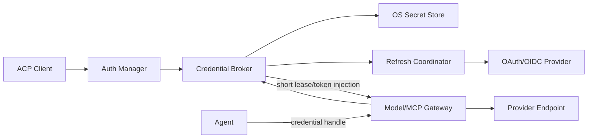

# 认证与凭据：Grok、Codex 对比及 V2 设计
## 1. 目标与威胁模型
认证层必须支持 API key、OAuth browser/device flow、token refresh、多 Provider 多账号、MCP OAuth 和企业身份，同时保证 Agent/Sandboxed Tool 不直接持有长期凭据。

主要风险：明文落盘、日志泄露、跨 Provider/账号误用、refresh stampede、401 无限重试、恶意 workspace 改认证端点、Agent 借合法模型通道外传数据，以及 logout 后旧进程继续使用 token。

## 2. Grok 当前实现
Grok 认证模块包含 auth manager、OIDC/device flow、external auth、refresh backend、single-flight、磁盘 storage、reactive managed reauth 和 Hub credential provider。HTTP 层通过 credential provider 与 auth retry middleware 获取当前 token，401 可触发刷新。

值得保留的点：

+ 刷新 single-flight，避免并发请求同时刷新；
+ 区分 auth 失败与普通 403/policy denial；
+ Session 能响应 managed reauth；
+ device code、外部 auth 和团队 principal 路径完整；
+ Hub 拒绝向非 loopback 明文 `ws://` 发送 credential；
+ managed config 同步与团队身份绑定。

入口见 [auth/manager.rs](/Users/zhengguilin/Documents/个人项目/grodex/grok/grok-build/crates/codegen/xai-grok-shell/src/auth/manager.rs:1)、[single_flight.rs](/Users/zhengguilin/Documents/个人项目/grodex/grok/grok-build/crates/codegen/xai-grok-shell/src/auth/single_flight.rs:1) 和 [storage.rs](/Users/zhengguilin/Documents/个人项目/grodex/grok/grok-build/crates/codegen/xai-grok-shell/src/auth/storage.rs:1)。

不足：长期 token 的文件/平台 secret backend 抽象与外置 Broker 目标还未完全统一；模型、Hub、MCP 等 credential 生命周期分布在多个模块；多 Provider 多账号的选择与 scope/audience 约束需要更明确。

## 3. Codex 当前实现
Codex login 支持 API key、ChatGPT OAuth、device code、external bearer、Agent Identity、PAT 和 Bedrock key。`AuthManager` 负责加载/刷新当前认证，storage 可根据配置选择 auth.json 或 secret/keyring backend；bootstrap 阶段可以先解析最小配置决定 credential backend，见 [storage.rs](/Users/zhengguilin/Documents/个人项目/grodex/codex/codex/codex-rs/login/src/auth/storage.rs:1)、[manager.rs](/Users/zhengguilin/Documents/个人项目/grodex/codex/codex/codex-rs/login/src/auth/manager.rs:1) 和 [auth_keyring.rs](/Users/zhengguilin/Documents/个人项目/grodex/codex/codex/codex-rs/core/src/config/auth_keyring.rs:18)。

Codex 对 refresh failure 有较细分类，device flow 有超时和 workspace binding 校验，部分 Agent Identity bootstrap failure 还有 cooldown，防止持续失败反复请求。

优点是认证类型、平台存储和 Provider 产品化成熟。不足是 credential 仍主要服务 Codex core；MCP、Model、App/connector 各有各的调用面；要成为通用外置 Sandbox/Model Gateway 的凭据服务，还需要稳定的 handle/lease 协议和跨 Agent 隔离。

## 4. V2 架构


Credential Broker 位于 Agent 外部可信控制面。Agent 只看见逻辑 account/provider 状态和 opaque handle；实际 token 只在 Broker、Gateway 和必要的 transport connector 内短暂存在。

## 5. 数据模型
### 5.1 AccountDescriptor
```latex
AccountDescriptor {
  account_id
  provider_id
  principal_display
  auth_method
  tenant/workspace_id?
  region?
  scopes[]
  audiences[]
  status
  secret_ref
  metadata_generation
}
```

SQLite/config 只存 descriptor 和 secret reference，不存 token 正文。

### 5.2 CredentialHandle
```latex
CredentialHandle {
  handle_id
  account_id
  provider_id
  audience
  scope_ceiling
  session_id
  expires_at
}
```

Handle 可在 Agent 协议中出现，但不能直接变成 Authorization header。

### 5.3 CredentialLease
Gateway 向 Broker 兑换短期 Lease：

```latex
CredentialLease {
  lease_id
  handle_id
  endpoint_binding
  audience/scopes
  issued_to_process_identity
  max_uses / expires_at
  revocation_epoch
}
```

Lease 与模型 PermissionLease 不同：前者授权使用凭据访问指定服务，后者授权执行系统副作用。两者可以在一次 Operation 上同时求交，但不能合并成一个模糊 token。

## 6. Secret Storage
优先级：

1. macOS Keychain / Windows Credential Manager / Linux Secret Service；
2. 企业提供的 external credential provider；
3. 仅在用户明确选择且 managed policy 允许时，使用权限严格的加密/受保护文件；
4. 环境变量/API key import 默认只在当前进程内存使用，不自动落盘。

禁止：

+ token 写入 TOML、rollout、telemetry、crash dump；
+ secret value 参与 config fingerprint；
+ 用 workspace 文件指定 keyring item name 后读取任意用户 secret；
+ secret backend 不可用时自动降级明文。

日志只记录 `account_id`、provider、token suffix 的不可逆诊断摘要和 refresh outcome。

## 7. Login Flow
### 7.1 Browser OAuth + PKCE
+ Runtime 生成 state、nonce、PKCE；
+ loopback callback 只监听随机端口和短期限；
+ 校验 state、issuer、audience、tenant/workspace；
+ token 直接写 Secret Store；
+ UI 只收到 login completed account descriptor。

### 7.2 Device Code
+ UI 展示 verification URI、短 code 和 expiry；
+ polling 遵守 server interval、backoff 和总 deadline；
+ Session cancel 会停止 polling；
+ code 只能完成发起它的 login transaction；
+ 成功后仍校验 workspace/tenant binding。

### 7.3 API Key
+ 从交互输入时使用 secret input，不回显；
+ 可选择 memory-only 或 secret-store；
+ 调用 Provider 的最小验证 endpoint；
+ 不把完整 key放进 shell env；
+ key rotation 原子替换 secret version，旧 Lease 按 revocation policy 失效。

## 8. 多 Provider 与多账号选择
选择是显式 Binding：

```latex
ModelBinding -> provider_id + model_id + account_id + credential_handle_id
McpBinding   -> server_id + account_id + credential_handle_id
```

规则：

+ 同一 Provider 可以有多个 account；
+ workspace 可以 pin account，但 workspace config 只能引用允许暴露的 account alias，不能读取 secret；
+ 未显式配置时使用 user default account；
+ ModelRoute 可以在用户/管理员**预先显式配置**的候选之间自动切换账号，但每个候选必须通过 tenant、region、billing 和数据策略校验；
+ Route 之外临时发现的其他账号不得作为隐式 fallback；
+ 切换 account 产生新 binding/generation，并向 UI 明示；
+ child 只能继承 parent delegation envelope 允许的 handle，不能枚举所有账号。

## 9. Refresh 协议
按 `(account_id, audience, scope_set)` single-flight：

```latex
request sees expiring/401
  -> join or create refresh future
  -> refresh once
  -> compare-and-swap secret version
  -> issue new lease
  -> eligible request retry once
```

错误规则：

| 错误 | 动作 |
| --- | --- |
| access token 接近过期 | 提前刷新 |
| 401/token_invalid | single-flight refresh，最多重试一次 |
| 403/policy/content restriction | 不刷新，直接返回原错误 |
| refresh token revoked/expired | 标记 ReauthRequired，打开 breaker |
| transient network/5xx | 有界退避，保留未过期 token |
| account mismatch | 拒绝覆盖当前 secret，要求重新登录 |


只有 401 不能简单一概刷新；Provider Adapter 负责把 wire error 归一为 auth taxonomy。

## 10. 认证熔断与降级
每个 account/audience 有状态：

```latex
Healthy -> Refreshing -> Healthy
                     -> Degraded -> HalfOpen -> Healthy
                     -> ReauthRequired
                     -> Revoked
```

+ 永久 refresh failure 进入 ReauthRequired，不重复刷新；
+ transient failure 使用 circuit breaker/cooldown；
+ half-open 只允许一个 probe；
+ 同账号已有未过期 token 可在 policy 允许的 grace 内继续；
+ 允许使用 ModelRoute 中已配置、已授权并已向用户展示的低优先级账号；不允许在 Route 之外静默寻找另一个账号付费或发送数据；
+ MCP auth 失败只隔离对应 server；
+ 主模型凭据失效时，当前 Tool/文件状态仍可保存，Turn 以可恢复 auth-required 状态结束。

## 11. 配置与认证启动循环
认证 backend 可能由 managed config 约束，而 managed config 又需要认证下载。采用两阶段 bootstrap：

```latex
Phase A BootstrapConfig
  signed built-in defaults + local system/MDM minimum
  -> auth endpoint allowlist, secret backend, managed service identity

load/refresh credential
  -> fetch and verify managed bundle

Phase B FullConfig
  -> provider, model, MCP, policy and workspace values
```

BootstrapConfig 字段极少、strict validate、不能由 workspace 覆盖。managed bundle 获取失败时使用最后验证 bundle；无 LKG 且要求 fail-closed 时不启动受管高风险能力。

## 12. Gateway 注入与 Sandbox
Agent 调模型/MCP时发送 handle，Gateway 校验：

+ Agent/Session peer identity；
+ endpoint 是否属于 binding；
+ scope/audience；
+ rate/cost budget；
+ revocation epoch；
+ request size 和允许 header。

通过后 Gateway 在出站边界注入 Authorization。Agent baseline 禁止直接连接 provider endpoint，避免绕过 Gateway。

但必须承认边界：Gateway 能防 credential 泄露和连接非允许端点，**不能阻止 Agent 把已经合法读到的文件内容放进模型 prompt**。内容外传仍靠最小文件可见性、workspace trust 和数据策略缓解。

## 13. MCP 与第三方 OAuth
每个 MCP server 使用独立 audience 和 secret namespace：

```latex
mcp/<server_id>/<account_alias>
```

+ dynamic client registration、PKCE 和 refresh token 由 MCP Broker 管理；
+ MCP server 进程拿不到模型 Provider token；
+ server URL/revision 变化使旧 handle stale；
+ stdio MCP 不需要 OAuth 时也只获得最小环境变量视图；
+ workspace 提供的 OAuth client secret 必须引用 managed/user secret alias，不能把值写在仓库。

## 14. Logout、撤销与删除
logout 事务：

1. 增加 account revocation epoch；
2. 停止新 Lease；
3. cancel refresh/login transaction；
4. 尽力调用 provider revoke endpoint；
5. 删除 Secret Store item；
6. 更新 descriptor 为 signed_out/revoked；
7. 通知相关 Session binding stale；
8. 清理不再有引用的 managed/account cache。

远端 revoke 失败不能阻止本地删除，但必须提示 token 可能在服务端仍有效。删除账号不删除 Session rollout；历史只保留 account opaque id 与 auth outcome。

## 15. ACP/UI 协议
通过 [ACP V2](./17-frontend-acp-protocol-v2-design.md) 扩展表达：

+ auth methods/capabilities；
+ login transaction started/action required/completed；
+ account list（无 secret）；
+ refresh degraded/reauth required；
+ account switch confirmation；
+ logout/revoke result。

浏览器 URL、device code 属于短期敏感 UI payload，不进入长期 rollout正文；只记录 transaction id、method、时间和结果。

## 16. 安全不变量
1. Agent、Tool 和 workspace 文件不能读取长期 secret。
2. Credential 只发送到绑定 endpoint/audience。
3. refresh single-flight，单次请求最多因 auth 重试一次。
4. 403 不触发盲目 refresh。
5. secret backend 故障不降级明文。
6. account 自动 failover 不跨信任、计费或数据边界。
7. logout/revoke 后新 Lease 一律拒绝。
8. credential/refresh token 不进入 config hash、rollout、日志或 crash dump。
9. child 的 credential authority 不宽于 parent。
10. workspace 只能引用批准的 account alias，不能定义 auth endpoint 或 secret locator 覆盖 managed policy。

## 17. 相对原实现的收益
### 相对 Grok
| 当前问题 | V2 | 收益 |
| --- | --- | --- |
| 模型/Hub/MCP credential 管理分布 | 外置 Credential Broker | 单一生命周期与审计 |
| 文件 storage 与平台 secret 策略不统一 | OS secret first + strict fallback | 降低明文泄露 |
| 多账号 Binding 不够显式 | account/handle 进入 Provider/MCP Binding | 不会误用账号 |
| Agent 可更接近实际 token | Gateway handle/lease | 被攻陷 Agent 难窃取 key |


保留 Grok 的 single-flight、device/external auth、reactive reauth、401/403 区分和团队 managed 联动。

### 相对 Codex
| 当前问题 | V2 | 收益 |
| --- | --- | --- |
| AuthManager 服务单一产品 core | 稳定 Broker API | 多 Agent Runtime 共用 |
| 不同 connector/MCP credential 面 | audience 隔离 namespace | 防止跨服务 token 混用 |
| credential 主要由客户端消费 | Gateway 注入 | Agent 不持有长期 secret |
| account failover 边界隐式 | 显式 binding/confirmation | 防计费与数据区域漂移 |


保留 Codex 的多认证类型、Keychain/secret backend、bootstrap 配置、细粒度 refresh error 和 workspace binding 校验。

## 18. 关键决策收益闭环
| 决策 | 解决的问题 | 收益 | 指标 |
| --- | --- | --- | --- |
| 外置 Broker | 每个 Agent 重写认证且持 key | 统一安全边界 | Agent secret 可见数应为零 |
| Handle + short Lease | token 长期暴露 | 最小时间/端点权限 | lease 重放拒绝数 |
| OS Secret Store first | auth.json 泄露 | 静态凭据保护 | 明文 credential 数 |
| refresh single-flight | 并发 401 风暴 | 降低刷新失败和 token reuse | 每账号并发 refresh 峰值=1 |
| 401/403 taxonomy | 无效刷新掩盖真实错误 | 错误可操作 | 403 refresh 次数应为零 |
| 显式 account binding | 静默跨账号 | 数据/计费可控 | 未确认 account switch 数=0 |
| 两阶段 bootstrap | config/auth 循环依赖 | managed 策略可安全加载 | bootstrap failure 恢复率 |


## 19. 实施与验收
Phase 1：AccountDescriptor、SecretStore abstraction、API key/OAuth import、日志脱敏。

Phase 2：single-flight refresh、error taxonomy、auth circuit breaker、ACP login events。

Phase 3：CredentialHandle/Lease、Model Gateway 和 MCP Broker 注入，多账号 binding。

验收包括：

1. token 不出现在日志、rollout、config dump、crash fixture；
2. 100 个并发 401 只触发一次 refresh；
3. 403 不刷新；
4. permanent refresh failure 进入 ReauthRequired 且不循环；
5. keyring 不可用时不写明文；
6. handle 不能访问不同 endpoint/audience；
7. logout 后旧 Lease 无法使用；
8. workspace 不能选择未授权账号或覆盖 auth endpoint；
9. child 不能获得 parent 未委派 handle；
10. managed config/auth bootstrap 在断网、过期和无 LKG 场景符合 fail-closed 规则。
